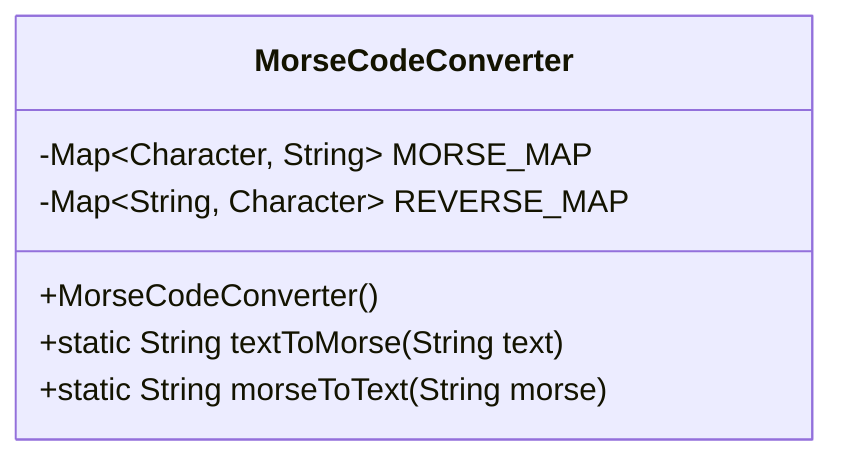
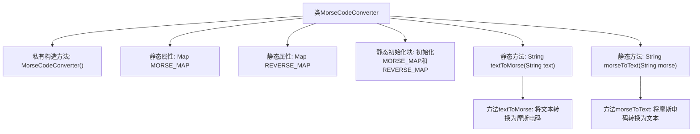

# 基础信息

|      |      |
|------|------|
| 名称 | MorseCodeConverter |
| 编码语言 | .java |
| 代码路径 | Java/src/main/java/com/thealgorithms/conversions/MorseCodeConverter.java |
| 包名 | com.thealgorithms.conversions |
| 依赖项 | ['java.util.HashMap', 'java.util.Map'] |
| 概述说明 | MorseCodeConverter类支持文本与摩斯码的双向转换。 |

# 说明

MorseCodeConverter类是一个用于实现文本与摩斯码双向转换的工具。它能够将普通文本转换为摩斯电码，同时也支持将摩斯电码解码为可读的文本。该类通过定义明确的转换规则和方法，确保转换过程的准确性和可靠性。用户可以通过调用该类的方法，轻松实现文本与摩斯码之间的互转，适用于需要处理摩斯码的各种应用场景。

# 类列表 Class Summary

| 名称   | 类型  | 说明 |
|-------|------|-------------|
| MorseCodeConverter | class | MorseCodeConverter类实现文本与摩斯码的双向转换。 |

## 类 MorseCodeConverter

|      |      |
|------|------|
| 访问范围 | public final |
| 类型 | class |
| 名称 | MorseCodeConverter |
| 说明 | MorseCodeConverter类实现文本与摩斯码的双向转换。 |

### UML类图

**描述：**  
`MorseCodeConverter` 是一个工具类，用于将文本转换为摩斯电码以及将摩斯电码转换回文本。该类包含两个静态的 `Map` 成员变量 `MORSE_MAP` 和 `REVERSE_MAP`，分别用于存储字符到摩斯电码的映射和摩斯电码到字符的映射。`textToMorse` 方法将输入的文本转换为摩斯电码，每个字母之间用空格分隔，每个单词之间用 `|` 分隔。`morseToText` 方法则将摩斯电码转换回文本，处理方式与 `textToMorse` 相反。该类通过静态初始化块来初始化这两个映射表，并提供了私有的构造函数以防止实例化。

### 内部方法调用关系图

这段代码定义了一个`MorseCodeConverter`类，用于在文本和摩斯电码之间进行转换。类中包含两个静态属性`MORSE_MAP`和`REVERSE_MAP`，分别用于存储字符到摩斯电码和摩斯电码到字符的映射。静态初始化块负责初始化这两个映射表。类中还提供了两个静态方法`textToMorse`和`morseToText`，分别用于将文本转换为摩斯电码和将摩斯电码转换为文本。

### 字段列表 Field List

| 名称  | 类型  | 说明 |
|-------|-------|------|
| MORSE_MAP = new HashMap<>() | Map<Character, String> | 定义了一个静态不可变的字符到字符串的映射变量MORSE_MAP。 |
| REVERSE_MAP = new HashMap<>() | Map<String, Character> | 定义了一个私有的静态常量映射，用于存储字符串与字符的对应关系。 |

### 方法列表 Method List

| 名称  | 类型  | 说明 |
|-------|-------|------|
| morseToText | String | 将摩斯码转换为文本，按单词和字符分割并映射。 |
| textToMorse | String | 将文本转换为摩斯电码，用空格分隔单词，用竖线分隔不同单词。 |

