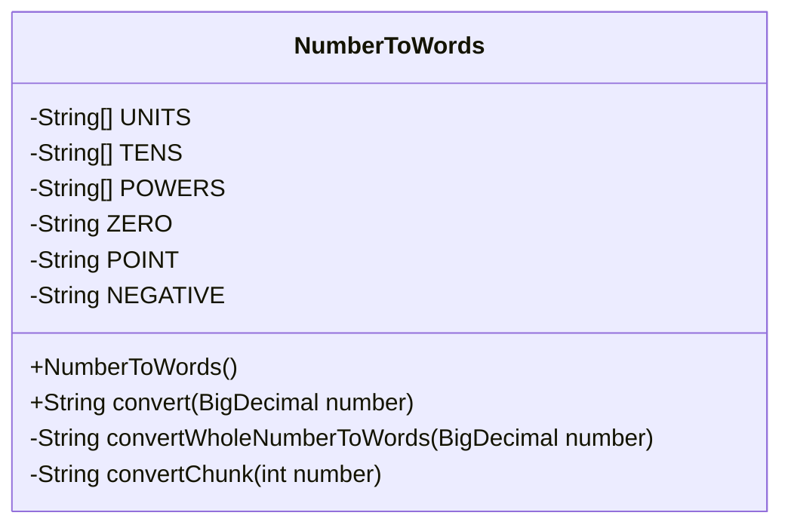
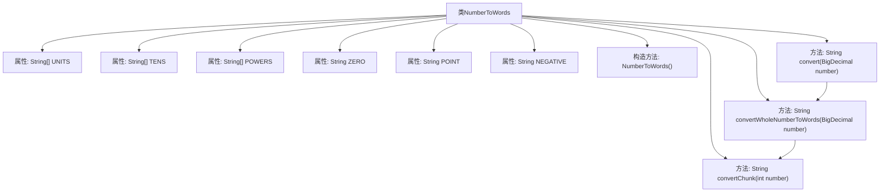

# 基础信息

|      |      |
|------|------|
| 名称 | NumberToWords |
| 编码语言 | .java |
| 代码路径 | Java/src/main/java/com/thealgorithms/conversions/NumberToWords.java |
| 包名 | com.thealgorithms.conversions |
| 依赖项 | ['java.math.BigDecimal'] |
| 概述说明 | Java类实现数字转英文单词，支持整数和小数转换。 |

# 说明

这是一个用于将数字转换为英文单词的Java类，支持整数和小数。该类的功能包括将整数和小数分别转换为对应的英文单词表示。对于整数部分，它会将数字逐位转换为单词，例如将123转换为"one hundred twenty-three"。对于小数部分，它会将小数点后的数字转换为单词，例如将0.45转换为"point four five"。该类的设计旨在处理各种数字格式，确保转换结果的准确性和可读性。通过这个类，用户可以轻松地将数字转换为英文单词，适用于需要将数字表示为文本的场景。

# 类列表 Class Summary

| 名称   | 类型  | 说明 |
|-------|------|-------------|
| NumberToWords | class | 将数字转换为英文单词的Java类，支持整数和小数。 |

## 类 NumberToWords

|      |      |
|------|------|
| 访问范围 | public final |
| 类型 | class |
| 名称 | NumberToWords |
| 说明 | 将数字转换为英文单词的Java类，支持整数和小数。 |

### UML类图

**类图描述：**

`NumberToWords` 类是一个工具类，用于将 `BigDecimal` 类型的数字转换为英文单词表示。该类包含三个私有静态数组 `UNITS`、`TENS` 和 `POWERS`，分别用于存储个位数、十位数和大数单位的单词。类中还定义了三个常量 `ZERO`、`POINT` 和 `NEGATIVE`，分别表示零、小数点和负数的单词。类的主要方法 `convert` 用于将数字转换为单词，内部调用了 `convertWholeNumberToWords` 和 `convertChunk` 方法来完成具体的转换逻辑。

### 内部方法调用关系图

这段代码实现了一个将数字转换为英文单词的功能。类`NumberToWords`包含三个主要方法：`convert`、`convertWholeNumberToWords`和`convertChunk`。`convert`方法负责处理输入的数字，将其拆分为整数部分和小数部分，并分别转换为单词。`convertWholeNumberToWords`方法将整数部分转换为单词，而`convertChunk`方法则将三位数以内的数字转换为单词。代码通过递归和循环的方式处理不同位数的数字，并最终将结果拼接成完整的英文单词描述。

### 字段列表 Field List

| 名称  | 类型  | 说明 |
|-------|-------|------|
| TENS = {"", "", "Twenty", "Thirty", "Forty", "Fifty", "Sixty", "Seventy", "Eighty", "Ninety"} | String[] | 定义了一个包含英文十位数的字符串数组TENS。 |
| ZERO = "Zero" | String | 定义私有静态常量ZERO，值为"Zero"。 |
| UNITS = {"", "One", "Two", "Three", "Four", "Five", "Six", "Seven", "Eight", "Nine", "Ten", "Eleven", "Twelve", "Thirteen", "Fourteen", "Fifteen", "Sixteen", "Seventeen", "Eighteen", "Nineteen"} | String[] | 定义了一个包含数字1到19英文单词的字符串数组。 |
| POWERS = {"", "Thousand", "Million", "Billion", "Trillion"} | String[] | 定义包含空字符串及数量级名称的静态字符串数组。 |
| NEGATIVE = "Negative " | String | 定义了一个私有静态常量字符串NEGATIVE，值为"Negative"。 |
| POINT = " Point" | String | 定义私有静态常量字符串POINT，值为" Point"。 |

### 方法列表 Method List

| 名称  | 类型  | 说明 |
|-------|-------|------|
| convertWholeNumberToWords | String | 将大整数转换为英文单词表示。 |
| convert | String | 将BigDecimal数字转换为英文单词，处理负数和小数部分。 |
| convertChunk | String | 将数字转换为英文单词，支持20以下、100以下及百位数。 |

