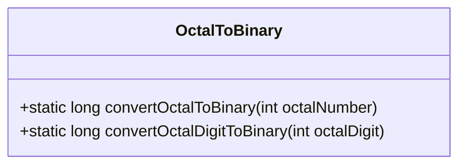
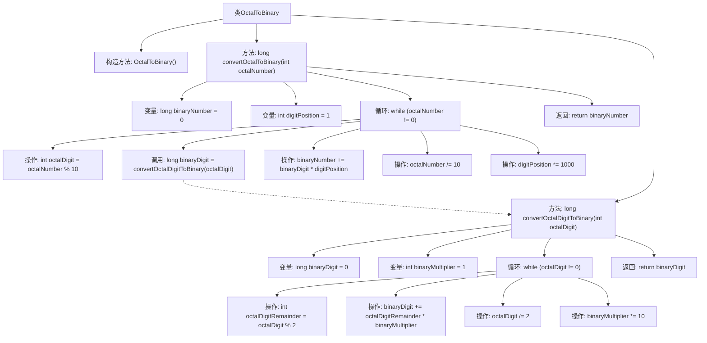

# 基础信息

|      |      |
|------|------|
| 名称 | OctalToBinary |
| 编码语言 | .java |
| 代码路径 | Java/src/main/java/com/thealgorithms/conversions/OctalToBinary.java |
| 包名 | com.thealgorithms.conversions |
| 依赖项 | [] |
| 概述说明 | 八进制数逐位转换为二进制数后拼接结果。 |

# 说明

将八进制数转换为二进制数的方法是通过逐位转换并拼接结果来实现的。具体步骤是先将八进制数的每一位分别转换为对应的三位二进制数，然后将这些二进制数按顺序拼接在一起，最终得到完整的二进制数表示。这种方法利用了八进制和二进制之间的简单对应关系，确保了转换过程的准确性和高效性。

# 类列表 Class Summary

| 名称   | 类型  | 说明 |
|-------|------|-------------|
| OctalToBinary | class | 将八进制数转换为二进制数，逐位转换并拼接结果。 |

## 类 OctalToBinary

|      |      |
|------|------|
| 访问范围 | public final |
| 类型 | class |
| 名称 | OctalToBinary |
| 说明 | 将八进制数转换为二进制数，逐位转换并拼接结果。 |

### UML类图

类图描述：
`OctalToBinary` 类是一个工具类，提供了两个静态方法用于将八进制数转换为二进制数。`convertOctalToBinary` 方法将整个八进制数转换为二进制数，而 `convertOctalDigitToBinary` 方法则将单个八进制数字转换为二进制数。该类通过逐位处理八进制数，并利用位运算和乘法操作来实现转换。

### 内部方法调用关系图

该流程图描述了`OctalToBinary`类的工作流程，主要展示了`convertOctalToBinary`和`convertOctalDigitToBinary`两个方法的调用关系。`convertOctalToBinary`方法通过循环将八进制数逐位转换为二进制，并调用`convertOctalDigitToBinary`方法将每个八进制数字转换为对应的二进制数字。最终，这些二进制数字被拼接成完整的二进制数并返回。

### 字段列表 Field List

| 名称  | 类型  | 说明 |
|-------|-------|------|

### 方法列表 Method List

| 名称  | 类型  | 说明 |
|-------|-------|------|
| convertOctalToBinary | long | 将八进制数逐位转换为二进制并拼接结果。 |
| convertOctalDigitToBinary | long | 将八进制数字转换为二进制数字的函数。 |

