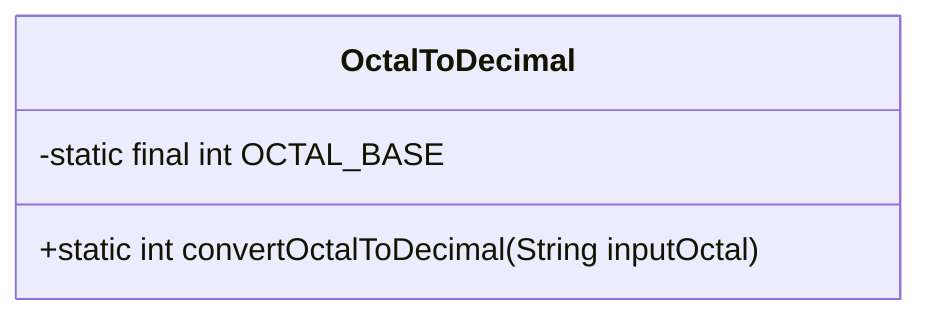
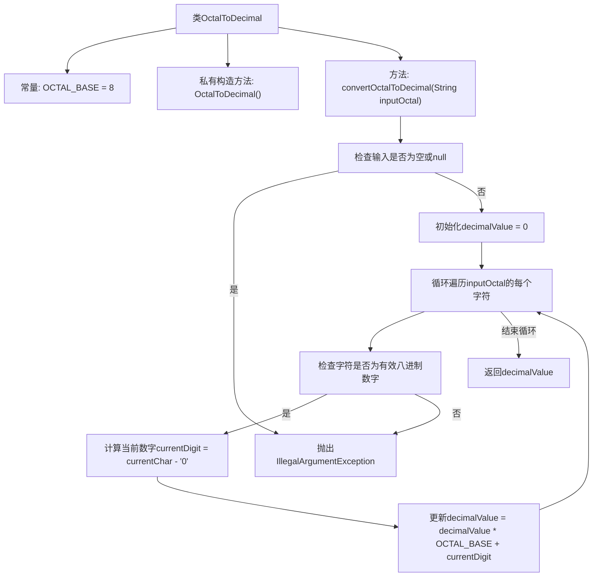

# 基础信息

|      |      |
|------|------|
| 名称 | OctalToDecimal |
| 编码语言 | .java |
| 代码路径 | Java/src/main/java/com/thealgorithms/conversions/OctalToDecimal.java |
| 包名 | com.thealgorithms.conversions |
| 依赖项 | [] |
| 概述说明 | OctalToDecimal类将八进制转十进制，无效输入抛出异常。 |

# 说明

OctalToDecimal类的主要功能是将八进制字符串转换为十进制数。该类在接收到输入时，会首先验证字符串的有效性。如果输入的字符串不符合八进制格式，类将抛出异常，以确保程序的健壮性和数据的准确性。通过这种方式，OctalToDecimal类能够安全且可靠地处理八进制到十进制的转换任务。

# 类列表 Class Summary

| 名称   | 类型  | 说明 |
|-------|------|-------------|
| OctalToDecimal | class | OctalToDecimal类将八进制字符串转换为十进制数，输入无效时抛出异常。 |

## 类 OctalToDecimal

|      |      |
|------|------|
| 访问范围 | public final |
| 类型 | class |
| 名称 | OctalToDecimal |
| 说明 | OctalToDecimal类将八进制字符串转换为十进制数，输入无效时抛出异常。 |

### UML类图

这段代码定义了一个名为 `OctalToDecimal` 的类，该类包含一个静态方法 `convertOctalToDecimal`，用于将输入的八进制字符串转换为十进制整数。方法首先检查输入是否为空或无效，然后遍历字符串中的每个字符，确保它们都是有效的八进制数字（0-7）。如果输入无效，方法会抛出 `IllegalArgumentException`。最终，方法通过逐位计算将八进制字符串转换为十进制整数并返回。类图展示了 `OctalToDecimal` 类的结构，包括其私有常量 `OCTAL_BASE` 和公有静态方法 `convertOctalToDecimal`。

### 内部方法调用关系图

**描述：**  
该流程图描述了`OctalToDecimal`类中`convertOctalToDecimal`方法的执行流程。首先，检查输入字符串是否为空或null，如果是则抛出异常。否则，初始化`decimalValue`为0，然后遍历输入字符串的每个字符，检查是否为有效的八进制数字。如果是，则计算当前数字并更新`decimalValue`；如果不是，则抛出异常。最终，返回计算得到的`decimalValue`。

### 字段列表 Field List

| 名称  | 类型  | 说明 |
|-------|-------|------|
| OCTAL_BASE = 8 | int | 定义了一个私有的静态常量OCTAL_BASE，值为8。 |

### 方法列表 Method List

| 名称  | 类型  | 说明 |
|-------|-------|------|
| convertOctalToDecimal | int | 将八进制字符串转换为十进制数，检查输入有效性并抛出异常。 |

