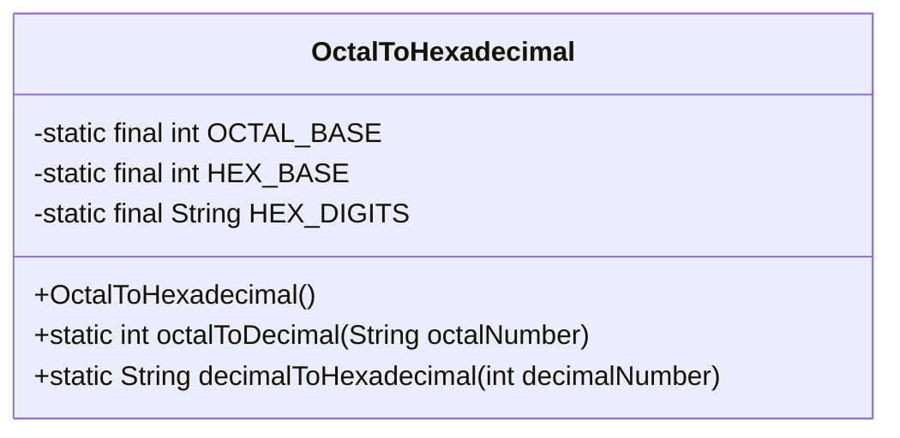
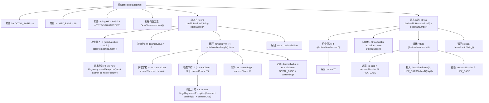

# 基础信息

|      |      |
|------|------|
| 名称 | OctalToHexadecimal |
| 编码语言 | .java |
| 代码路径 | Java/src/main/java/com/thealgorithms/conversions/OctalToHexadecimal.java |
| 包名 | com.thealgorithms.conversions |
| 依赖项 | [] |
| 概述说明 | 八进制转十进制，再转十六进制。 |

# 说明

该过程涉及将八进制字符串转换为十进制数值，再将十进制数值转换为十六进制表示。首先，八进制字符串通过基数8转换为十进制数值，然后该十进制数值通过基数16转换为十六进制字符串。整个转换过程确保了数值在不同进制之间的准确转换，最终得到十六进制结果。

# 类列表 Class Summary

| 名称   | 类型  | 说明 |
|-------|------|-------------|
| OctalToHexadecimal | class | 将八进制字符串转换为十进制，再将十进制转换为十六进制。 |

## 类 OctalToHexadecimal

|      |      |
|------|------|
| 访问范围 | public final |
| 类型 | class |
| 名称 | OctalToHexadecimal |
| 说明 | 将八进制字符串转换为十进制，再将十进制转换为十六进制。 |

### UML类图

这段代码定义了一个名为 `OctalToHexadecimal` 的工具类，用于将八进制数转换为十六进制数。该类包含两个静态方法：`octalToDecimal` 和 `decimalToHexadecimal`。`octalToDecimal` 方法将八进制字符串转换为十进制整数，并处理无效输入的异常情况。`decimalToHexadecimal` 方法将十进制整数转换为十六进制字符串。该类通过私有构造函数防止实例化，确保其作为工具类的纯粹性。

### 内部方法调用关系图

这段代码定义了一个名为`OctalToHexadecimal`的类，包含两个静态方法：`octalToDecimal`和`decimalToHexadecimal`。`octalToDecimal`方法将八进制字符串转换为十进制整数，并处理无效输入。`decimalToHexadecimal`方法将十进制整数转换为十六进制字符串。代码通过循环和数学运算实现转换，并在每个步骤中检查输入的有效性，确保转换的准确性。

### 字段列表 Field List

| 名称  | 类型  | 说明 |
|-------|-------|------|
| HEX_BASE = 16 | int | 定义了一个私有的静态常量HEX_BASE，值为16。 |
| HEX_DIGITS = "0123456789ABCDEF" | String | 定义包含十六进制数字的常量字符串。 |
| OCTAL_BASE = 8 | int | 定义了一个静态常量OCTAL_BASE，其值为8，表示八进制基数。 |

### 方法列表 Method List

| 名称  | 类型  | 说明 |
|-------|-------|------|
| decimalToHexadecimal | String | 将十进制数转换为十六进制字符串的Java方法。 |
| octalToDecimal | int | 将八进制字符串转换为十进制数，处理空值及非法字符。 |

