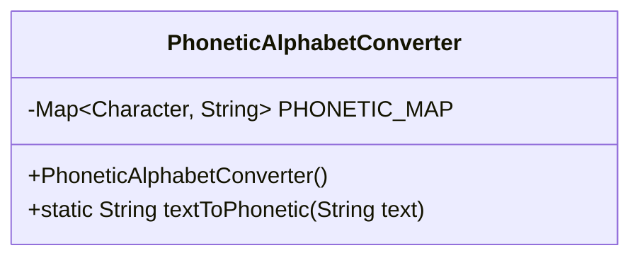
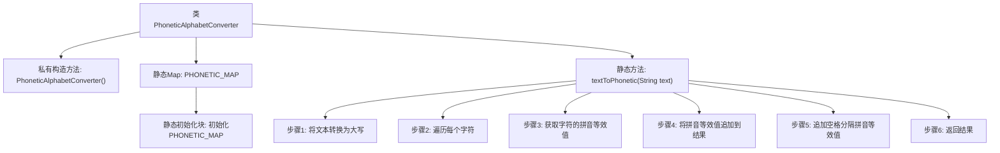

# 基础信息

|      |      |
|------|------|
| 名称 | PhoneticAlphabetConverter |
| 编码语言 | .java |
| 代码路径 | Java/src/main/java/com/thealgorithms/conversions/PhoneticAlphabetConverter.java |
| 包名 | com.thealgorithms.conversions |
| 依赖项 | ['java.util.HashMap', 'java.util.Map'] |
| 概述说明 | PhoneticAlphabetConverter类实现文本转北约音标字母。 |

# 说明

PhoneticAlphabetConverter类的主要功能是将输入的文本转换为北约音标字母。北约音标字母是一种标准化的字母发音系统，通常用于通信中确保字母的清晰传达，特别是在军事、航空和紧急服务等领域。该类的设计旨在提供一种简便的方法，将普通文本中的字母逐一映射为对应的音标字母，从而提高信息传递的准确性和可靠性。通过使用该类，用户可以轻松地将任何文本转换为音标形式，确保在嘈杂或复杂的通信环境中信息的准确传达。

# 类列表 Class Summary

| 名称   | 类型  | 说明 |
|-------|------|-------------|
| PhoneticAlphabetConverter | class | PhoneticAlphabetConverter类将文本转换为北约音标字母。 |

## 类 PhoneticAlphabetConverter

|      |      |
|------|------|
| 访问范围 | public final |
| 类型 | class |
| 名称 | PhoneticAlphabetConverter |
| 说明 | PhoneticAlphabetConverter类将文本转换为北约音标字母。 |

### UML类图

### 描述
`PhoneticAlphabetConverter` 类是一个工具类，用于将普通文本转换为北约音标字母。该类包含一个静态的 `PHONETIC_MAP`，用于存储字符与音标之间的映射关系。`textToPhonetic` 方法接收一个字符串参数，将其转换为大写后，逐个字符查找对应的音标，并将结果拼接成字符串返回。该类设计为不可实例化，所有方法均为静态方法，确保工具类的单一职责和不可变性。

### 内部方法调用关系图

这段代码定义了一个名为 `PhoneticAlphabetConverter` 的类，用于将输入的文本转换为北约音标字母。类中包含一个静态的 `PHONETIC_MAP`，用于存储字符到音标字母的映射关系。`textToPhonetic` 方法实现了将文本转换为音标字母的逻辑，包括将文本转换为大写、遍历每个字符、获取字符的音标等效值、并将结果拼接返回。

### 字段列表 Field List

| 名称  | 类型  | 说明 |
|-------|-------|------|
| PHONETIC_MAP = new HashMap<>() | Map<Character, String> | 定义静态常量PHONETIC_MAP，用于存储字符与字符串的映射关系。 |

### 方法列表 Method List

| 名称  | 类型  | 说明 |
|-------|-------|------|
| textToPhonetic | String | 将文本转换为音标字符串，忽略空格。 |

