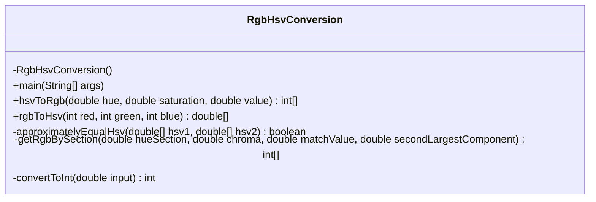
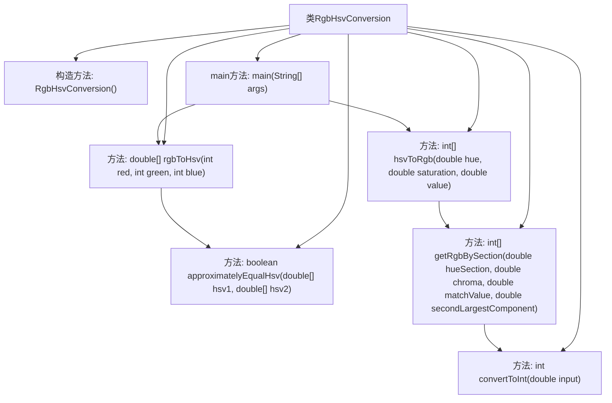

# 基础信息

|      |      |
|------|------|
| 名称 | RgbHsvConversion |
| 编码语言 | .java |
| 代码路径 | Java/src/main/java/com/thealgorithms/conversions/RgbHsvConversion.java |
| 包名 | com.thealgorithms.conversions |
| 依赖项 | ['java.util.Arrays'] |
| 概述说明 | RGB与HSV颜色双向转换工具，附带测试用例。 |

# 说明

RGB与HSV颜色转换工具是一款支持双向颜色转换的实用工具，能够将RGB颜色模式转换为HSV颜色模式，同时也能将HSV颜色模式转换回RGB颜色模式。该工具不仅提供了核心的转换方法，还包含了详细的测试用例，确保转换结果的准确性和可靠性。通过该工具，用户可以方便地在两种颜色模式之间进行切换，满足不同场景下的颜色处理需求。

# 类列表 Class Summary

| 名称   | 类型  | 说明 |
|-------|------|-------------|
| RgbHsvConversion | class | RGB与HSV颜色转换工具，包含双向转换方法及测试用例。 |

## 类 RgbHsvConversion

|      |      |
|------|------|
| 访问范围 | public final |
| 类型 | class |
| 名称 | RgbHsvConversion |
| 说明 | RGB与HSV颜色转换工具，包含双向转换方法及测试用例。 |

### UML类图

**描述：**
`RgbHsvConversion` 类是一个工具类，提供了 HSV（色相、饱和度、亮度）与 RGB（红、绿、蓝）颜色表示之间的转换功能。该类包含两个主要的公有静态方法：`hsvToRgb` 和 `rgbToHsv`，分别用于将 HSV 转换为 RGB 和将 RGB 转换为 HSV。此外，类中还包含了一些私有辅助方法，如 `approximatelyEqualHsv` 用于近似比较两个 HSV 值，`getRgbBySection` 用于根据色相区间计算 RGB 值，`convertToInt` 用于将双精度浮点数转换为整数。该类通过静态方法提供功能，因此无法实例化。

### 内部方法调用关系图

这段代码定义了一个用于RGB和HSV颜色空间之间转换的工具类 `RgbHsvConversion`。它包含两个主要的转换方法：`hsvToRgb` 和 `rgbToHsv`，分别用于将HSV颜色值转换为RGB颜色值，以及将RGB颜色值转换为HSV颜色值。此外，代码还包含辅助方法 `approximatelyEqualHsv` 用于比较两个HSV值的近似相等性，以及 `getRgbBySection` 和 `convertToInt` 用于内部计算和类型转换。`main` 方法中通过断言测试了这些转换方法的正确性。

### 字段列表 Field List

| 名称  | 类型  | 说明 |
|-------|-------|------|

### 方法列表 Method List

| 名称  | 类型  | 说明 |
|-------|-------|------|
| main | void | 测试HSV与RGB转换方法，验证多种颜色值准确性。 |
| getRgbBySection | int[] | 根据色相区间计算RGB值，返回红绿蓝数组。 |
| convertToInt | int | 将双精度浮点数转换为0到255的整数值。 |
| rgbToHsv | double[] | 将RGB值转换为HSV值，检查输入范围并计算色相、饱和度和亮度。 |
| approximatelyEqualHsv | boolean | 比较两个HSV颜色值的色相、饱和度和亮度是否近似相等。 |
| hsvToRgb | int[] | 将HSV颜色值转换为RGB数组，验证输入范围并计算最终结果。 |

