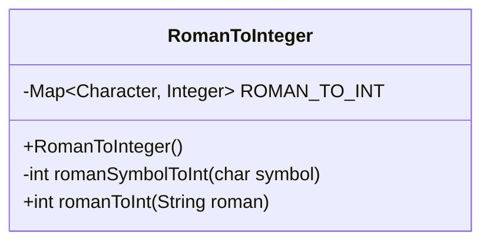
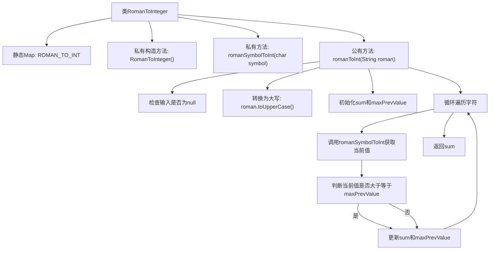

# 基础信息

|      |      |
|------|------|
| 名称 | RomanToInteger |
| 编码语言 | .java |
| 代码路径 | Java/src/main/java/com/thealgorithms/conversions/RomanToInteger.java |
| 包名 | com.thealgorithms.conversions |
| 依赖项 | ['java.util.HashMap', 'java.util.Map'] |
| 概述说明 | 罗马数字转整数工具类，支持字符验证与异常处理。 |

# 说明

该工具类用于将罗马数字字符串转换为整数，具备字符验证功能，确保输入的罗马数字字符合法。同时，工具类还包含异常处理机制，能够有效捕获和处理在转换过程中可能出现的错误或异常情况，确保程序的健壮性和可靠性。

# 类列表 Class Summary

| 名称   | 类型  | 说明 |
|-------|------|-------------|
| RomanToInteger | class | 将罗马数字字符串转换为整数的工具类，支持字符验证和异常处理。 |

## 类 RomanToInteger

|      |      |
|------|------|
| 访问范围 | public final |
| 类型 | class |
| 名称 | RomanToInteger |
| 说明 | 将罗马数字字符串转换为整数的工具类，支持字符验证和异常处理。 |

### UML类图

### 描述
`RomanToInteger` 类用于将罗马数字字符串转换为整数。该类包含一个私有的静态映射 `ROMAN_TO_INT`，用于存储罗马数字字符到整数的映射关系。类中定义了一个私有构造函数以防止实例化，并提供了两个方法：`romanSymbolToInt` 用于将单个罗马数字字符转换为整数，`romanToInt` 用于将整个罗马数字字符串转换为整数。`romanToInt` 方法通过从右到左遍历字符串，并根据字符的值进行加法或减法操作来计算最终结果。

### 内部方法调用关系图

这段代码定义了一个`RomanToInteger`类，用于将罗马数字字符串转换为整数。类中包含一个静态的`ROMAN_TO_INT`映射表，用于存储罗马字符与对应整数的关系。`romanSymbolToInt`方法用于将单个罗马字符转换为整数，若字符无效则抛出异常。`romanToInt`方法通过从右到左遍历字符串，根据字符值的大小决定是加还是减，最终返回转换后的整数。

### 字段列表 Field List

| 名称  | 类型  | 说明 |
|-------|-------|------|
| ROMAN_TO_INT = new HashMap<>() {        {            put('I', 1);            put('V', 5);            put('X', 10);            put('L', 50);            put('C', 100);            put('D', 500);            put('M', 1000);        }    } | Map<Character, Integer> | 定义罗马字符到整数的映射表。 |

### 方法列表 Method List

| 名称  | 类型  | 说明 |
|-------|-------|------|
| romanSymbolToInt | int | 将罗马符号转换为整数，未知符号抛出异常。 |
| romanToInt | int | 将罗马数字字符串转换为整数，从右至左遍历并累加或减。 |

