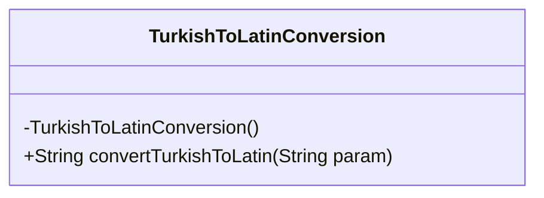
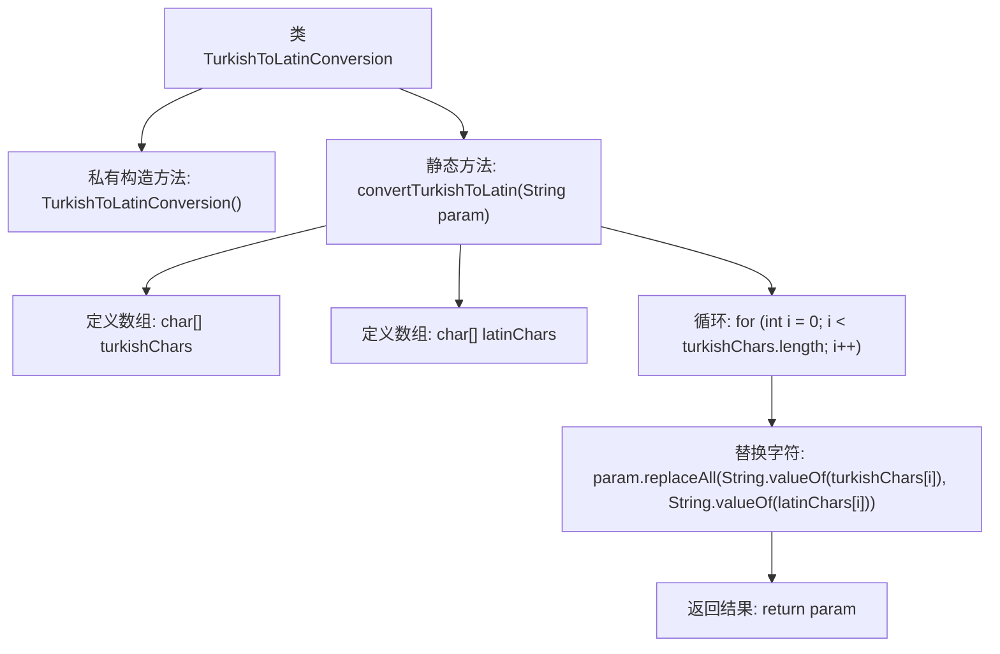

# 基础信息

|      |      |
|------|------|
| 名称 | TurkishToLatinConversion |
| 编码语言 | .java |
| 代码路径 | Java/src/main/java/com/thealgorithms/conversions/TurkishToLatinConversion.java |
| 包名 | com.thealgorithms.conversions |
| 依赖项 | [] |
| 概述说明 | 将土耳其字符转换为拉丁字符并返回结果。 |

# 说明

该内容描述了一个功能，即将包含土耳其字符的字符串转换为对应的拉丁字符，并返回转换后的字符串。这一过程涉及字符映射，确保土耳其语中的特殊字符被准确地替换为相应的拉丁字母，从而实现字符集的转换。该功能适用于需要处理土耳其语文本并将其转换为拉丁字符的场景。

# 类列表 Class Summary

| 名称   | 类型  | 说明 |
|-------|------|-------------|
| TurkishToLatinConversion | class | 将土耳其字符转换为对应的拉丁字符并返回转换后的字符串。 |

## 类 TurkishToLatinConversion

|      |      |
|------|------|
| 访问范围 | public final |
| 类型 | class |
| 名称 | TurkishToLatinConversion |
| 说明 | 将土耳其字符转换为对应的拉丁字符并返回转换后的字符串。 |

### UML类图

**描述：**  
`TurkishToLatinConversion` 类是一个工具类，用于将土耳其字符转换为对应的拉丁字符。该类包含一个私有的构造函数，防止实例化，以及一个公有的静态方法 `convertTurkishToLatin`，该方法接收一个字符串参数，将其中的土耳其字符替换为对应的拉丁字符，并返回转换后的字符串。该方法通过遍历预定义的土耳其字符数组和对应的拉丁字符数组，使用 `replaceAll` 方法进行替换操作。

### 内部方法调用关系图

这段代码定义了一个名为 `TurkishToLatinConversion` 的类，其中包含一个私有构造方法和一个静态方法 `convertTurkishToLatin`。该方法将土耳其字符转换为对应的拉丁字符。首先，定义了两个字符数组 `turkishChars` 和 `latinChars`，分别存储土耳其字符和对应的拉丁字符。然后，通过循环遍历 `turkishChars` 数组，使用 `replaceAll` 方法将输入字符串中的土耳其字符替换为对应的拉丁字符。最后，返回转换后的字符串。

### 字段列表 Field List

| 名称  | 类型  | 说明 |
|-------|-------|------|

### 方法列表 Method List

| 名称  | 类型  | 说明 |
|-------|-------|------|
| convertTurkishToLatin | String | 将土耳其字符转换为对应的拉丁字符并返回结果。 |

