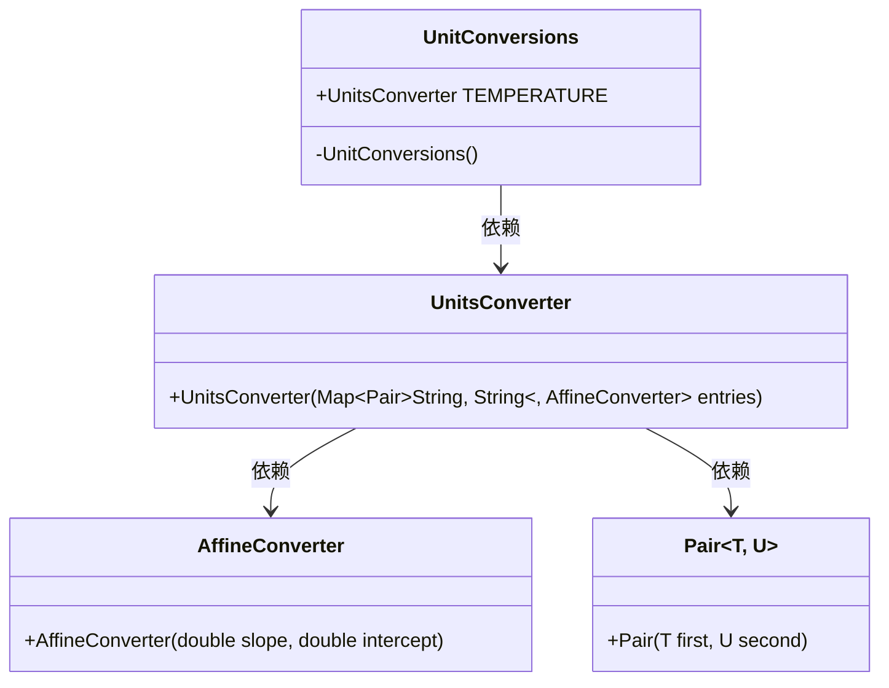
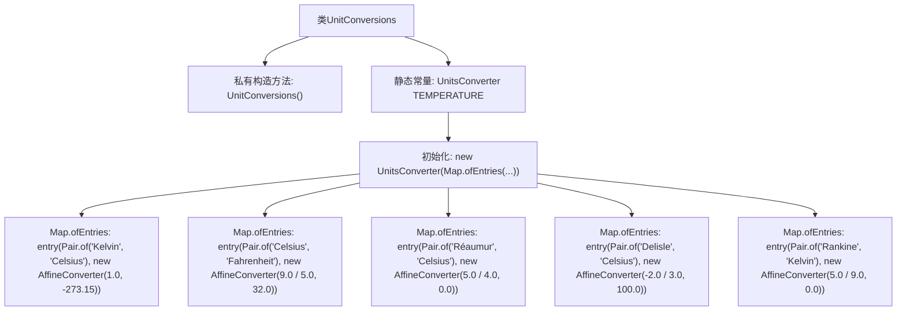

# 基础信息

|      |      |
|------|------|
| 名称 | UnitConversions |
| 编码语言 | .java |
| 代码路径 | Java/src/main/java/com/thealgorithms/conversions/UnitConversions.java |
| 包名 | com.thealgorithms.conversions |
| 依赖项 | ['java.util.Map.entry', 'java.util.Map', 'org.apache.commons.lang3.tuple.Pair'] |
| 概述说明 | UnitConversions类实现多温度单位间转换功能。 |

# 说明

UnitConversions类是一个用于温度单位转换的工具，它支持在多种温度单位之间进行转换。该类的功能涵盖了常见的温度单位，如摄氏度、华氏度、开尔文等，用户可以通过调用该类的方法实现不同单位之间的精确转换。该类设计旨在简化温度转换的复杂性，提供高效且准确的转换服务，适用于需要频繁进行温度单位转换的应用场景。

# 类列表 Class Summary

| 名称   | 类型  | 说明 |
|-------|------|-------------|
| UnitConversions | class | UnitConversions类提供温度单位转换功能，支持多种温度单位间转换。 |

## 类 UnitConversions

|      |      |
|------|------|
| 访问范围 | public final |
| 类型 | class |
| 名称 | UnitConversions |
| 说明 | UnitConversions类提供温度单位转换功能，支持多种温度单位间转换。 |

### UML类图

这段代码定义了一个`UnitConversions`类，其中包含一个静态的`UnitsConverter`实例`TEMPERATURE`，用于处理温度单位之间的转换。`UnitsConverter`类依赖于`AffineConverter`和`Pair`类来实现具体的转换逻辑。`AffineConverter`类通过斜率和截距来定义线性转换，而`Pair`类用于存储单位对。整个设计通过组合和依赖关系实现了灵活的单位转换功能。

### 内部方法调用关系图

这段代码定义了一个名为 `UnitConversions` 的不可变类，该类包含一个私有构造方法和一个静态常量 `TEMPERATURE`。`TEMPERATURE` 是一个预配置的 `UnitsConverter` 实例，用于处理不同温度单位之间的转换。该转换器通过 `Map.ofEntries` 方法初始化，包含多个 `Pair` 和 `AffineConverter` 实例，分别对应不同的温度单位转换规则。

### 字段列表 Field List

| 名称  | 类型  | 说明 |
|-------|-------|------|
| TEMPERATURE = new UnitsConverter(Map.ofEntries(entry(Pair.of("Kelvin", "Celsius"), new AffineConverter(1.0, -273.15)), entry(Pair.of("Celsius", "Fahrenheit"), new AffineConverter(9.0 / 5.0, 32.0)),        entry(Pair.of("Réaumur", "Celsius"), new AffineConverter(5.0 / 4.0, 0.0)), entry(Pair.of("Delisle", "Celsius"), new AffineConverter(-2.0 / 3.0, 100.0)), entry(Pair.of("Rankine", "Kelvin"), new AffineConverter(5.0 / 9.0, 0.0)))) | UnitsConverter | 温度单位转换器，支持开尔文、摄氏度、华氏度等转换。 |

### 方法列表 Method List

| 名称  | 类型  | 说明 |
|-------|-------|------|

