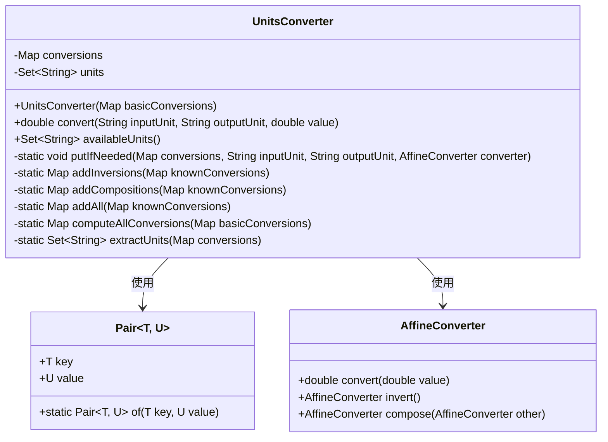
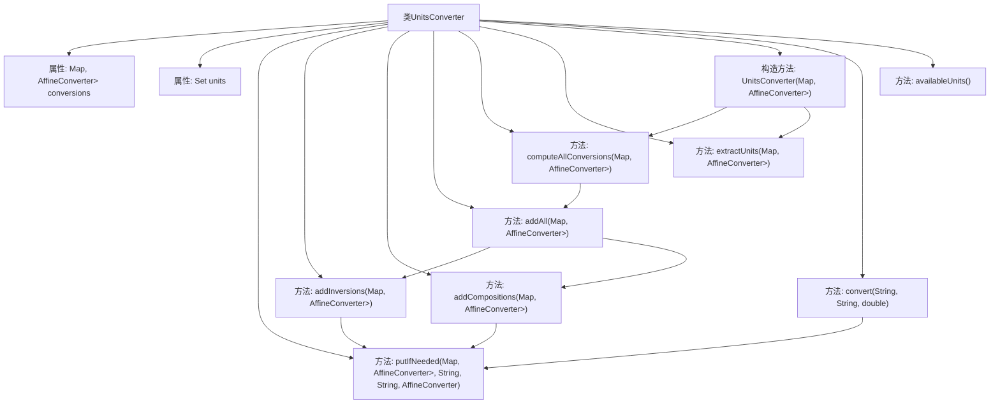

# 基础信息

|      |      |
|------|------|
| 名称 | UnitsConverter |
| 编码语言 | .java |
| 代码路径 | Java/src/main/java/com/thealgorithms/conversions/UnitsConverter.java |
| 包名 | com.thealgorithms.conversions |
| 依赖项 | ['java.util.HashMap', 'java.util.HashSet', 'java.util.Map', 'java.util.NoSuchElementException', 'java.util.Set', 'org.apache.commons.lang3.tuple.Pair'] |
| 概述说明 | UnitsConverter类支持单位转换、逆转换、组合转换及单位列表查询。 |

# 说明

UnitsConverter类设计用于实现单位转换功能，支持逆转换和组合转换操作，并提供了单位列表查询功能。该类的核心在于灵活处理不同单位之间的转换，包括正向和反向转换，以及多个单位的组合转换。此外，用户可以通过单位列表查询功能获取当前支持的所有单位信息，确保转换过程的准确性和便捷性。

# 类列表 Class Summary

| 名称   | 类型  | 说明 |
|-------|------|-------------|
| UnitsConverter | class | UnitsConverter类实现单位转换，支持逆转换和组合转换，提供单位列表查询。 |

## 类 UnitsConverter

|      |      |
|------|------|
| 访问范围 | public final |
| 类型 | class |
| 名称 | UnitsConverter |
| 说明 | UnitsConverter类实现单位转换，支持逆转换和组合转换，提供单位列表查询。 |

### UML类图

**描述：**
`UnitsConverter` 类用于处理单位转换，支持通过 `AffineConverter` 进行线性转换。该类通过 `Pair` 类表示单位对，并使用 `Map` 存储单位之间的转换关系。构造函数接受初始转换映射，并自动生成逆转换和组合转换。`convert` 方法用于执行单位转换，`availableUnits` 方法返回所有支持的单位。私有方法用于处理转换的添加、逆转换和组合转换的逻辑。

### 内部方法调用关系图

**描述：**  
`UnitsConverter` 类用于处理单位转换，通过初始的基本转换关系自动生成逆转换和组合转换。类中包含多个私有方法用于管理转换关系，如 `putIfNeeded`、`addInversions`、`addCompositions` 等。构造方法 `UnitsConverter` 接受基本转换关系并计算所有可能的转换。`convert` 方法用于执行单位转换，`availableUnits` 方法返回所有支持的单位集合。

### 字段列表 Field List

| 名称  | 类型  | 说明 |
|-------|-------|------|
| units | Set<String> | 私有不可变字符串集合。 |
| conversions | Map<Pair<String, String>, AffineConverter> | 私有映射存储字符串对与仿射转换器的对应关系。 |

### 方法列表 Method List

| 名称  | 类型  | 说明 |
|-------|-------|------|
| availableUnits | Set<String> | 返回可用单位集合。 |
| extractUnits | Set<String> | 从转换映射中提取所有唯一单位名称。 |
| addAll | Map<Pair<String, String>, AffineConverter> | 静态方法合并转换映射并返回结果。 |
| putIfNeeded | void | 若输入输出单位不同，将转换器存入映射。 |
| addCompositions | Map<Pair<String, String>, AffineConverter> | 方法`addCompositions`组合已知转换并返回新映射。 |
| addInversions | Map<Pair<String, String>, AffineConverter> | 为已知转换映射添加逆转换，生成包含正逆转换的新映射。 |
| computeAllConversions | Map<Pair<String, String>, AffineConverter> | 该方法通过迭代扩展基本转换映射，直到无法新增转换为止。 |
| convert | double | 该方法将输入单位转换为输出单位，若相同则抛出异常，否则查找转换器并执行转换。 |

