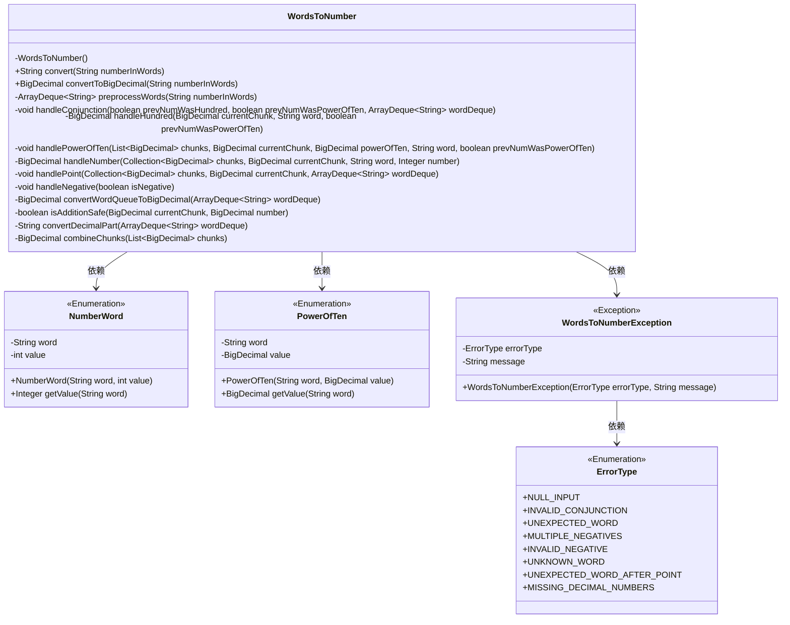
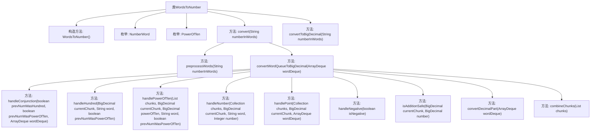
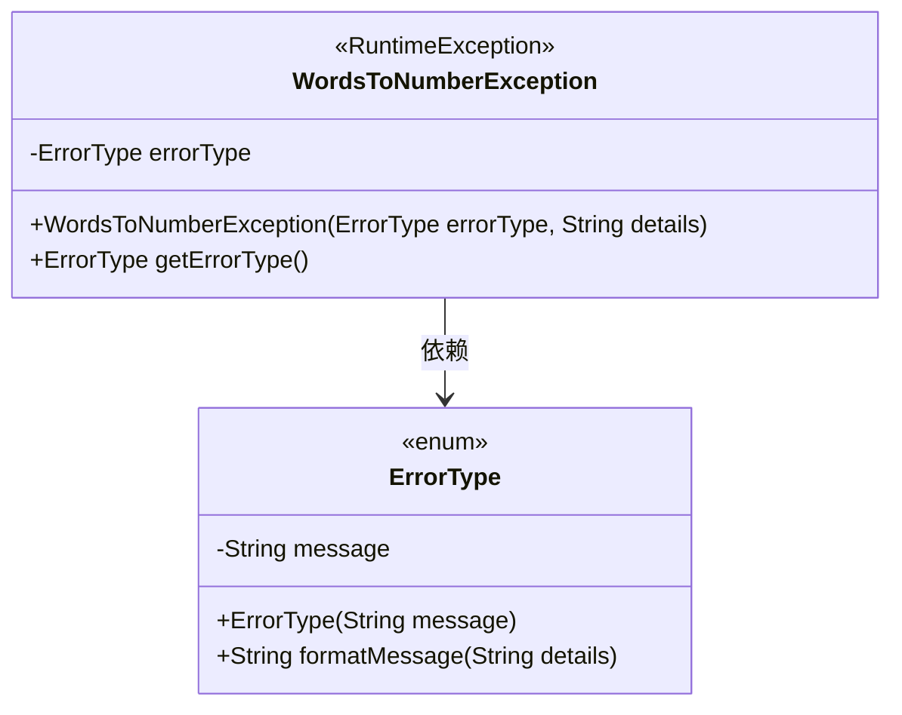
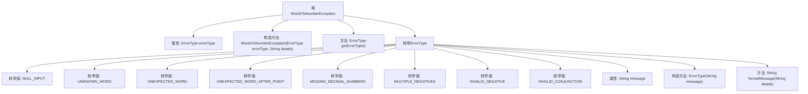

# 基础信息

|      |      |
|------|------|
| 名称 | WordsToNumber |
| 编码语言 | .java |
| 代码路径 | Java/src/main/java/com/thealgorithms/conversions/WordsToNumber.java |
| 包名 | com.thealgorithms.conversions |
| 依赖项 | ['java.io.Serial', 'java.math.BigDecimal', 'java.util.ArrayDeque', 'java.util.ArrayList', 'java.util.Collection', 'java.util.List'] |
| 概述说明 | WordsToNumber类转换英文数字为数字，支持多种格式。WordsToNumberException处理错误信息。 |

# 说明

WordsToNumber类用于将英文数字单词转换为数字，支持整数、小数和负数的转换。WordsToNumberException类继承自RuntimeException，包含多种错误类型，并提供格式化错误信息的方法。

# 类列表 Class Summary

| 名称   | 类型  | 说明 |
|-------|------|-------------|
| WordsToNumber | class | WordsToNumber类将英文数字单词转换为数字，支持整数、小数及负数。 |
| WordsToNumberException | class | WordsToNumberException类继承RuntimeException，包含多种错误类型和格式化错误信息的方法。 |

## 类 WordsToNumber

|      |      |
|------|------|
| 访问范围 | public final |
| 类型 | class |
| 名称 | WordsToNumber |
| 说明 | WordsToNumber类将英文数字单词转换为数字，支持整数、小数及负数。 |

### UML类图

### 描述
`WordsToNumber` 类是一个工具类，用于将英文单词形式的数字转换为数字字符串或 `BigDecimal` 对象。它依赖于 `NumberWord` 和 `PowerOfTen` 两个枚举类来映射单词和数字，并通过 `WordsToNumberException` 处理异常情况。`NumberWord` 枚举类定义了基本数字单词及其对应的整数值，而 `PowerOfTen` 枚举类定义了表示大数单位的单词及其对应的 `BigDecimal` 值。`WordsToNumberException` 类用于处理转换过程中可能出现的各种错误情况。

### 内部方法调用关系图

这段代码实现了一个将英文单词表示的数字转换为数字字符串的功能。它通过定义两个枚举类型 `NumberWord` 和 `PowerOfTen` 来映射单词和数字之间的关系。`convert` 方法负责处理输入字符串，将其拆分为单词队列，并通过 `convertWordQueueToBigDecimal` 方法将单词队列转换为 `BigDecimal` 类型的数字。代码中包含了多种异常处理逻辑，确保输入的有效性和转换的准确性。

### 字段列表 Field List

| 名称  | 类型  | 说明 |
|-------|-------|------|

### 方法列表 Method List

| 名称  | 类型  | 说明 |
|-------|-------|------|
| convert | String | 将英文数字词转换为数字字符串，处理空输入异常。 |
| isAdditionSafe | boolean | 检查大数相加是否安全的静态方法，比较两数位数。 |
| convertToBigDecimal | BigDecimal | 将字符串数字转换为BigDecimal对象。 |
| handlePoint | void | 处理小数部分，将非零值加入集合，转换小数部分并添加。 |
| convertDecimalPart | String | 方法将单词队列转换为小数部分，处理异常情况并返回结果。 |
| handleNegative | void | 处理负数时，若为真则抛多重负数异常，否则抛无效负数异常。 |
| handleHundred | BigDecimal | 处理百位数值，检查并更新当前数值块。 |
| handleConjunction | void | 处理连词，验证前一词和后一词的有效性，否则抛出异常。 |
| handleNumber | BigDecimal | 处理数字方法，验证并安全累加BigDecimal值，异常时抛出错误。 |
| combineChunks | BigDecimal | 合并BigDecimal列表中的数值并返回总和。 |
| preprocessWords | ArrayDeque<String> | 预处理字符串，分割并转为小写，存入队列，空输入抛出异常。 |
| handlePowerOfTen | void | 处理十的幂次方，检查当前块是否为零或前一个数为幂次方，抛出异常或计算下一块并添加到列表中。 |
| convertWordQueueToBigDecimal | BigDecimal | 将单词队列转换为BigDecimal，处理负数、百位、十次方等特殊情况，最终合并结果。 |

## 类 WordsToNumberException

|      |      |
|------|------|
| 访问范围 | None |
| 类型 | class |
| 名称 | WordsToNumberException |
| 说明 | WordsToNumberException类继承RuntimeException，包含多种错误类型和格式化错误信息的方法。 |

### UML类图

这段代码定义了一个自定义异常类 `WordsToNumberException`，它继承自 `RuntimeException`。该类包含一个枚举类型 `ErrorType`，用于表示不同类型的错误，并提供了格式化错误信息的方法。`WordsToNumberException` 类的构造函数接受一个 `ErrorType` 和一个字符串 `details`，用于生成异常信息。通过这种方式，代码能够更精确地处理不同类型的输入错误，并提供详细的错误信息。

### 内部方法调用关系图

这段代码定义了一个自定义异常类`WordsToNumberException`，继承自`RuntimeException`。该类包含一个枚举类型`ErrorType`，用于定义不同的错误类型及其对应的错误信息。`WordsToNumberException`类通过构造函数接收错误类型和详细信息，并生成相应的异常消息。`ErrorType`枚举中的`formatMessage`方法用于格式化错误信息，确保错误信息清晰且易于理解。

### 字段列表 Field List

| 名称  | 类型  | 说明 |
|-------|-------|------|
| serialVersionUID = 1L | long | 私有静态长整型常量serialVersionUID，值为1L。 |
| errorType | ErrorType | 定义了一个不可变的错误类型变量。 |

### 方法列表 Method List

| 名称  | 类型  | 说明 |
|-------|-------|------|
| getErrorType | ErrorType | 获取错误类型的方法。 |

