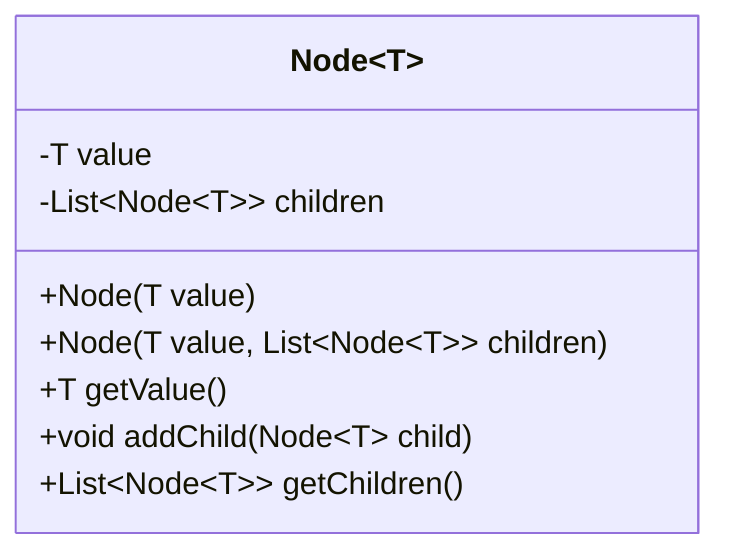
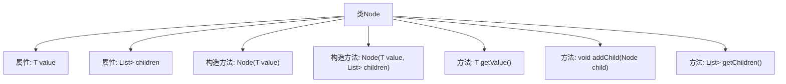

# 基础信息

|      |      |
|------|------|
| 名称 | Node |
| 编码语言 | .java |
| 代码路径 | Java/src/main/java/com/thealgorithms/datastructures/Node.java |
| 包名 | com.thealgorithms.datastructures |
| 依赖项 | ['java.util.ArrayList', 'java.util.List'] |
| 概述说明 | Node类表示树节点，包含值、子节点列表，支持添加和获取子节点及值。 |

# 说明

Node类用于表示树结构中的节点，每个节点包含一个值和子节点列表。该类支持添加子节点的功能，允许用户动态扩展树结构。此外，Node类还提供了获取节点值和子节点列表的方法，便于用户查询和操作节点信息。通过这些功能，Node类能够有效地管理和维护树结构的数据。

# 类列表 Class Summary

| 名称   | 类型  | 说明 |
|-------|------|-------------|
| Node | class | Node类用于表示树结构节点，包含值和子节点列表，支持添加子节点和获取值及子节点。 |

## 类 Node

|      |      |
|------|------|
| 访问范围 | public |
| 类型 | class |
| 名称 | Node |
| 说明 | Node类用于表示树结构节点，包含值和子节点列表，支持添加子节点和获取值及子节点。 |

### UML类图

这段代码定义了一个泛型类 `Node<T>`，用于表示树结构中的节点。每个节点包含一个值 `value` 和一个子节点列表 `children`。类提供了两个构造函数，分别用于创建带有初始值和子节点列表的节点。此外，类还提供了获取节点值、添加子节点以及获取子节点列表的方法。这个类可以用于构建和操作树形数据结构。

### 内部方法调用关系图

这段代码定义了一个泛型类 `Node<T>`，用于表示树结构中的节点。类中包含两个属性：`value` 存储节点的值，`children` 存储子节点列表。提供了两个构造方法，一个用于初始化节点值并创建空子节点列表，另一个用于初始化节点值并指定子节点列表。类中还提供了获取节点值、添加子节点和获取子节点列表的方法。

### 字段列表 Field List

| 名称  | 类型  | 说明 |
|-------|-------|------|
| value | T | 私有不可变的T类型变量value。 |
| children | List<Node<T>> | 私有成员变量，存储子节点列表。 |

### 方法列表 Method List

| 名称  | 类型  | 说明 |
|-------|-------|------|
| getValue | T | 该方法返回私有变量value的值。 |
| getChildren | List<Node<T>> | 该方法返回子节点列表。 |
| addChild | void | 该方法用于向节点添加子节点。 |

