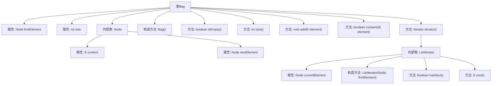

# 基础信息

|      |      |
|------|------|
| 名称 | Bag |
| 编码语言 | .java |
| 代码路径 | Java/src/main/java/com/thealgorithms/datastructures/bags/Bag.java |
| 包名 | com.thealgorithms.datastructures.bags |
| 依赖项 | ['java.util.Iterator', 'java.util.NoSuchElementException'] |
| 概述说明 | Bag类实现Iterable，支持添加、检查和遍历元素。 |

# 说明

Bag类实现了Iterable接口，具备添加元素、检查元素存在性以及遍历集合的功能。该类允许用户通过迭代器访问集合中的元素，支持动态添加新元素，并提供方法用于检查特定元素是否存在于集合中。Bag类的设计旨在提供灵活且高效的集合操作，适用于需要频繁添加和遍历元素的场景。

# 类列表 Class Summary

| 名称   | 类型  | 说明 |
|-------|------|-------------|
| Bag | class | Bag类实现Iterable，支持添加、检查元素和遍历功能。 |


## 类 Bag

|      |      |
|------|------|
| 访问范围 | public |
| 类型 | class |
| 名称 | Bag |
| 说明 | Bag类实现Iterable，支持添加、检查元素和遍历功能。 |


### UML类图

```mermaid
classDiagram
    class Bag~E~ {
        -Node~E~ firstElement
        -int size
        +Bag()
        +boolean isEmpty()
        +int size()
        +void add(E element)
        +boolean contains(E element)
        +Iterator~E~ iterator()
    }

    class Node~E~ {
        -E content
        -Node~E~ nextElement
    }

    class ListIterator~E~ {
        -Node~E~ currentElement
        +ListIterator(Node~E~ firstElement)
        +boolean hasNext()
        +E next()
    }

    class <<Interface>> Iterable~E~ {
        <<Interface>>
        +Iterator~E~ iterator()
    }

    class <<Interface>> Iterator~E~ {
        <<Interface>>
        +boolean hasNext()
        +E next()
    }

    Bag~E~ --> Node~E~ : 包含
    Bag~E~ --> ListIterator~E~ : 使用
    Bag~E~ ..|> Iterable~E~ : 实现
    ListIterator~E~ ..|> Iterator~E~ : 实现
```

这段代码定义了一个泛型类 `Bag<E>`，它实现了 `Iterable<E>` 接口，用于存储和遍历元素。`Bag` 类内部使用 `Node<E>` 类来表示每个元素，并通过链表结构来维护元素的顺序。`ListIterator<E>` 类实现了 `Iterator<E>` 接口，用于遍历 `Bag` 中的元素。`Bag` 类提供了添加元素、检查是否包含某个元素、获取元素数量等基本操作。整个设计通过迭代器模式实现了对元素的遍历，确保了代码的灵活性和可扩展性。


### 内部方法调用关系图



这段代码定义了一个泛型类 `Bag<E>`，实现了 `Iterable<E>` 接口，用于表示一个可以存储任意类型元素的集合。类内部使用链表结构来存储元素，并提供了添加元素、检查是否为空、获取大小、检查是否包含某元素以及遍历元素的功能。内部类 `Node<E>` 用于表示链表中的每个节点，而 `ListIterator<E>` 类则实现了迭代器接口，用于遍历链表中的元素。

### 字段列表 Field List

| 名称  | 类型  | 说明 |
|-------|-------|------|
| firstElement | Node<E> | 类中定义了一个私有节点类型的变量firstElement。 |
| size | int | 声明一个私有整型变量size。 |

### 方法列表 Method List

| 名称  | 类型  | 说明 |
|-------|-------|------|
| size | int | 返回当前集合的大小。 |
| add | void | 在链表头部添加元素，更新首节点并增加链表大小。 |
| iterator | Iterator<E> | 重写iterator方法，返回ListIterator实例。 |
| contains | boolean | 检查集合中是否包含指定元素，存在返回true，否则返回false。 |
| isEmpty | boolean | 判断集合是否为空，返回布尔值。 |


