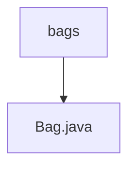

# 基础信息

|      |      |
|------|------|
| 名称 | bags |
| 编码语言 | .java |
| 代码路径 | Java/src/main/java/com/thealgorithms/datastructures/bags |
| 包名 | Java.src.main.java.com.thealgorithms.datastructures.bags |
| 概述说明 | Bag类实现Iterable，支持添加、检查和遍历元素。 |

# 说明

Bag类实现了Iterable接口，具备添加元素、检查元素存在性以及遍历集合的功能。该类允许用户通过迭代器访问集合中的元素，支持动态添加新元素，并提供方法用于检查特定元素是否存在于集合中。Bag类的设计旨在提供灵活且高效的集合操作，适用于需要频繁添加和遍历元素的场景。

### 包内部结构视图

该流程图展示了路径的层级关系，`bags` 是文件夹，`Bag.java` 是文件，文件位于文件夹内。

# 文件列表 File List

| 名称   | 类型  | 说明 |
|-------|------|-------------|
| [Bag.java](Bag.md) | file | Bag类实现Iterable，支持添加、检查和遍历元素。 |

