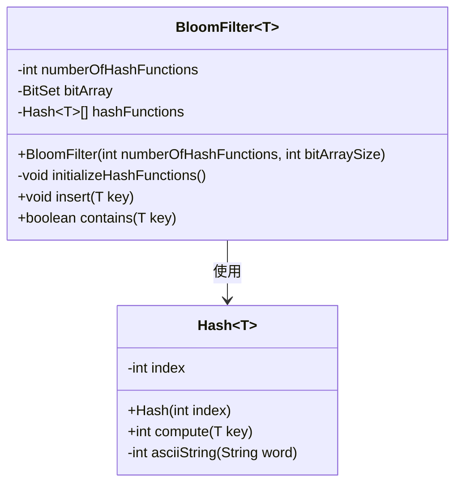
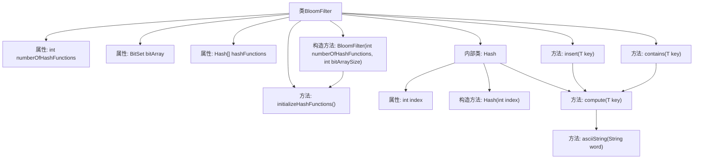

# 基础信息

|      |      |
|------|------|
| 名称 | BloomFilter |
| 编码语言 | .java |
| 代码路径 | Java/src/main/java/com/thealgorithms/datastructures/bloomfilter/BloomFilter.java |
| 包名 | com.thealgorithms.datastructures.bloomfilter |
| 依赖项 | ['java.util.BitSet'] |
| 概述说明 | 布隆过滤器类支持元素插入与查询，利用多哈希函数和位数组实现。 |

# 说明

布隆过滤器类是一种数据结构，支持插入和查询元素的功能。它通过使用多个哈希函数和一个位数组来实现高效的成员检查。布隆过滤器的主要特点是能够在空间和时间上实现高效的查询，但可能存在一定的误判率。该类的核心机制是利用哈希函数将元素映射到位数组的多个位置，并在查询时检查这些位置是否都被置位，从而判断元素是否可能存在。

# 类列表 Class Summary

| 名称   | 类型  | 说明 |
|-------|------|-------------|
| BloomFilter | class | 布隆过滤器类，支持插入和查询元素，使用多个哈希函数和位数组实现。 |

## 类 BloomFilter

|      |      |
|------|------|
| 访问范围 | public |
| 类型 | class |
| 名称 | BloomFilter |
| 说明 | 布隆过滤器类，支持插入和查询元素，使用多个哈希函数和位数组实现。 |

### UML类图

**描述**：  
`BloomFilter` 是一个泛型类，用于实现布隆过滤器数据结构。它包含一个位数组 `bitArray` 和多个哈希函数 `hashFunctions`。`BloomFilter` 通过 `insert` 方法将元素插入过滤器，并通过 `contains` 方法检查元素是否可能存在于过滤器中。`Hash` 是 `BloomFilter` 的内部类，用于表示不同的哈希函数，每个哈希函数通过索引生成唯一的哈希值。`BloomFilter` 依赖于 `Hash` 类来实现哈希计算。

### 内部方法调用关系图

这段代码实现了一个布隆过滤器（Bloom Filter），用于快速检查一个元素是否可能存在于集合中。布隆过滤器通过多个哈希函数将元素映射到位数组中的多个位置，并在插入和查询时操作这些位。代码中包含一个内部类 `Hash<T>`，用于生成不同的哈希值。流程图展示了类的结构、属性和方法之间的调用关系，帮助理解布隆过滤器的工作原理。

### 字段列表 Field List

| 名称  | 类型  | 说明 |
|-------|-------|------|
| numberOfHashFunctions | int | 私有整型变量numberOfHashFunctions用于存储哈希函数的数量。 |
| hashFunctions | Hash<T>[] | 私有哈希函数数组用于存储多个哈希函数实例。 |
| bitArray | BitSet | 私有不可变的位集变量bitArray。 |

### 方法列表 Method List

| 名称  | 类型  | 说明 |
|-------|-------|------|
| contains | boolean | 该方法检查布隆过滤器中是否存在指定键。 |
| initializeHashFunctions | void | 初始化哈希函数数组，每个元素为新的哈希对象。 |
| insert | void | 该方法使用多个哈希函数计算键的位置，并在位数组中标记这些位置。 |

