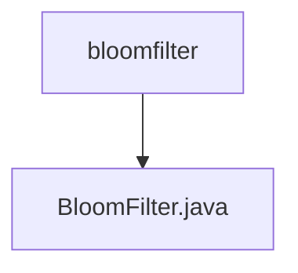

# 基础信息

|      |      |
|------|------|
| 名称 | bloomfilter |
| 编码语言 | .java |
| 代码路径 | Java/src/main/java/com/thealgorithms/datastructures/bloomfilter |
| 包名 | Java.src.main.java.com.thealgorithms.datastructures.bloomfilter |
| 概述说明 | 布隆过滤器类支持元素插入与查询，利用多哈希函数和位数组实现。 |

# 说明

布隆过滤器类是一种数据结构，支持插入和查询元素的功能。它通过使用多个哈希函数和一个位数组来实现高效的成员检查。布隆过滤器的主要特点是能够在空间和时间上实现高效的查询，但可能存在一定的误判率。该类的核心机制是利用哈希函数将元素映射到位数组的多个位置，并在查询时检查这些位置是否都被置位，从而判断元素是否可能存在。

### 包内部结构视图

该流程图展示了 `bloomfilter` 文件夹与 `BloomFilter.java` 文件之间的层级关系。`bloomfilter` 是父节点，而 `BloomFilter.java` 是其子节点，表示该文件位于 `bloomfilter` 文件夹中。这种结构清晰地反映了文件在项目中的组织方式。

# 文件列表 File List

| 名称   | 类型  | 说明 |
|-------|------|-------------|
| [BloomFilter.java](BloomFilter.md) | file | 布隆过滤器类支持元素插入与查询，利用多哈希函数和位数组实现。 |

