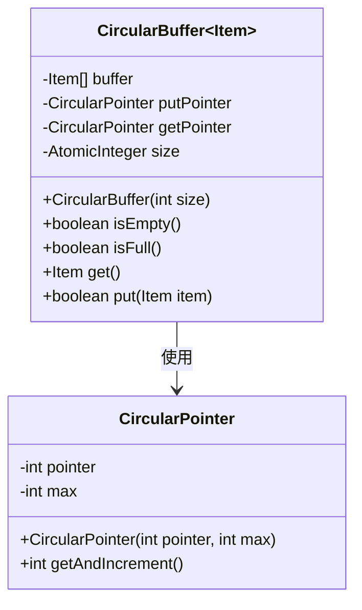

# 基础信息

|      |      |
|------|------|
| 名称 | CircularBuffer |
| 编码语言 | .java |
| 代码路径 | Java/src/main/java/com/thealgorithms/datastructures/buffers/CircularBuffer.java |
| 包名 | com.thealgorithms.datastructures.buffers |
| 依赖项 | ['java.util.concurrent.atomic.AtomicInteger'] |
| 概述说明 | 实现线程安全的循环缓冲区，支持添加和获取操作，指针自动回绕。 |

# 说明

实现一个循环缓冲区，该缓冲区支持线程安全的添加和获取操作。通过使用指针自动回绕机制，确保在缓冲区满时能够循环使用空间，避免数据覆盖或丢失。该设计适用于多线程环境，保证数据操作的并发安全性和高效性。

# 类列表 Class Summary

| 名称   | 类型  | 说明 |
|-------|------|-------------|
| CircularBuffer | class | 实现循环缓冲区，支持线程安全的添加和获取操作，使用指针自动回绕。 |

## 类 CircularBuffer

|      |      |
|------|------|
| 访问范围 | public |
| 类型 | class |
| 名称 | CircularBuffer |
| 说明 | 实现循环缓冲区，支持线程安全的添加和获取操作，使用指针自动回绕。 |

### UML类图

**描述：**  
`CircularBuffer` 是一个泛型类，用于实现一个循环缓冲区，支持 FIFO（先进先出）操作。它包含一个内部类 `CircularPointer`，用于管理缓冲区的读写指针。`CircularBuffer` 提供了 `put` 和 `get` 方法分别用于添加和获取元素，并提供了 `isEmpty` 和 `isFull` 方法用于检查缓冲区状态。`CircularPointer` 类确保指针在达到缓冲区容量时自动回绕到起始位置，保证指针始终在有效范围内。

### 内部方法调用关系图

```mermaid
graph TD
    A["类CircularBuffer<Item>"]
    B["属性: Item[] buffer"]
    C["属性: CircularPointer putPointer"]
    D["属性: CircularPointer getPointer"]
    E["属性: AtomicInteger size"]
    F["构造方法: CircularBuffer(int size)"]
    G["方法: boolean isEmpty()"]
    H["方法: boolean isFull()"]
    I["方法: Item get()"]
    J["方法: boolean put(Item item)"]
    K["内部类CircularPointer"]
    L["属性: int pointer"]
    M["属性: int max"]
    N["构造方法: CircularPointer(int pointer, int max)"]
    O["方法: int getAndIncrement()"]

    A --> B
    A --> C
    A --> D
    A --> E
    A --> F
    A --> G
    A --> H
    A --> I
    A --> J
    A --> K
    K --> L
    K --> M
    K --> N
    K --> O
    F -->|"检查size <= 0"| F1["抛出IllegalArgumentException"]
    F -->|"初始化buffer"| F2["this.buffer = (Item[]) new Object[size]"]
    F -->|"初始化putPointer"| F3["this.putPointer = new CircularPointer(0, size)"]
    F -->|"初始化getPointer"| F4["this.getPointer = new CircularPointer(0, size)"]
    G -->|"检查size.get() == 0"| G1["返回true或false"]
    H -->|"检查size.get() == buffer.length"| H1["返回true或false"]
    I -->|"检查isEmpty()"| I1["返回null"]
    I -->|"获取buffer[getPointer.getAndIncrement()]"| I2["返回item"]
    I -->|"size.decrementAndGet()"| I3["更新size"]
    J -->|"检查item == null"| J1["抛出IllegalArgumentException"]
    J -->|"检查isEmpty()"| J2["记录wasEmpty"]
    J -->|"检查isFull()"| J3["getPointer.getAndIncrement()"]
    J -->|"size.incrementAndGet()"| J4["更新size"]
    J -->|"buffer[putPointer.getAndIncrement()] = item"| J5["存储item"]
    J -->|"返回wasEmpty"| J6["返回结果"]
    O -->|"获取当前pointer"| O1["返回tmp"]
    O -->|"更新pointer = (pointer + 1) % max"| O2["更新pointer"]
```

这段代码实现了一个环形缓冲区（CircularBuffer），用于存储和管理数据项。它通过两个指针（putPointer和getPointer）来跟踪数据的插入和读取位置，并使用AtomicInteger来记录当前缓冲区的大小。内部类CircularPointer用于管理指针的自动回绕，确保指针始终在缓冲区的有效范围内。代码还提供了检查缓冲区是否为空或满的方法，以及插入和获取数据项的操作。

### 字段列表 Field List

| 名称  | 类型  | 说明 |
|-------|-------|------|
| buffer | Item[] | 私有不可变数组buffer存储Item类型元素。 |
| putPointer | CircularPointer | 私有常量指针putPointer用于循环操作。 |
| getPointer | CircularPointer | 获取循环指针的私有方法。 |
| size = new AtomicInteger(0) | AtomicInteger | 使用AtomicInteger确保线程安全的size计数。 |

### 方法列表 Method List

| 名称  | 类型  | 说明 |
|-------|-------|------|
| isFull | boolean | 检查缓冲区是否已满。 |
| isEmpty | boolean | isEmpty方法检查size是否为0，返回布尔值。 |
| get | Item | 获取缓冲区中的项，若为空返回null，否则返回项并更新指针和大小。 |
| put | boolean | 该方法将项目放入缓冲区，若为空则返回true，满时丢弃最旧项目。 |

