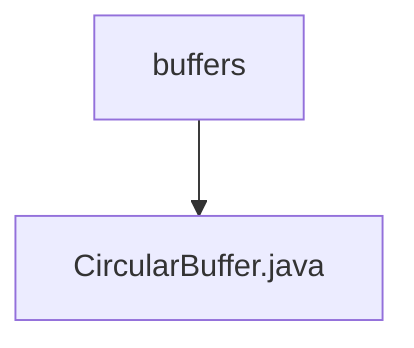

# 基础信息

|      |      |
|------|------|
| 名称 | buffers |
| 编码语言 | .java |
| 代码路径 | Java/src/main/java/com/thealgorithms/datastructures/buffers |
| 包名 | Java.src.main.java.com.thealgorithms.datastructures.buffers |
| 概述说明 | 实现线程安全的循环缓冲区，支持添加和获取操作，指针自动回绕。 |

# 说明

实现一个循环缓冲区，该缓冲区支持线程安全的添加和获取操作。通过使用指针自动回绕机制，确保在缓冲区满时能够循环使用空间，避免数据覆盖或丢失。该设计适用于多线程环境，保证数据操作的并发安全性和高效性。

### 包内部结构视图

该流程图展示了路径的层级关系，`buffers` 文件夹包含一个名为 `CircularBuffer.java` 的文件。这种结构清晰地表示了文件在项目中的位置，便于理解和管理代码的组织方式。

# 文件列表 File List

| 名称   | 类型  | 说明 |
|-------|------|-------------|
| [CircularBuffer.java](CircularBuffer.md) | file | 实现线程安全的循环缓冲区，支持添加和获取操作，指针自动回绕。 |

