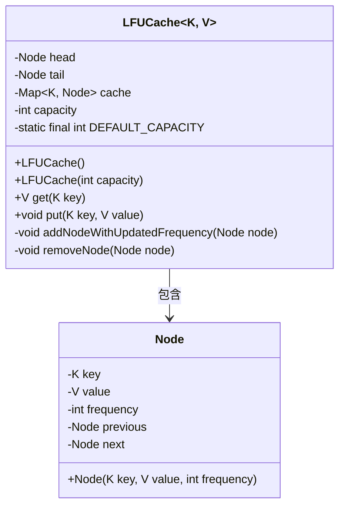
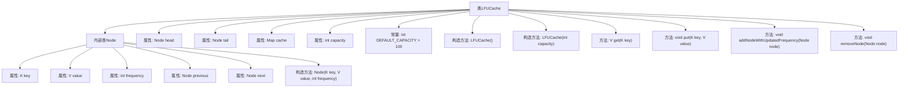

# 基础信息

|      |      |
|------|------|
| 名称 | LFUCache |
| 编码语言 | .java |
| 代码路径 | Java/src/main/java/com/thealgorithms/datastructures/caches/LFUCache.java |
| 包名 | com.thealgorithms.datastructures.caches |
| 依赖项 | ['java.util.HashMap', 'java.util.Map'] |
| 概述说明 | LFU缓存实现包括节点类、缓存操作及频率更新逻辑。 |

# 说明

LFU缓存实现包括节点类、缓存操作及频率更新逻辑。节点类用于存储缓存数据及其访问频率。缓存操作涉及数据的插入、查询和删除，确保高效管理缓存内容。频率更新逻辑通过维护频率映射表，动态调整节点频率，确保最少使用数据优先被淘汰。整体设计旨在优化缓存性能，提升数据访问效率。

# 类列表 Class Summary

| 名称   | 类型  | 说明 |
|-------|------|-------------|
| LFUCache | class | LFU缓存实现，包含节点类、缓存操作及频率更新逻辑。 |

## 类 LFUCache

|      |      |
|------|------|
| 访问范围 | public |
| 类型 | class |
| 名称 | LFUCache |
| 说明 | LFU缓存实现，包含节点类、缓存操作及频率更新逻辑。 |

### UML类图

**类图描述：**

`LFUCache` 是一个泛型类，用于实现最少使用频率（LFU）缓存策略。它包含一个内部类 `Node`，用于表示缓存中的元素，每个节点包含键、值、使用频率以及前后节点的指针。`LFUCache` 类通过维护一个双向链表来按频率排序节点，并使用 `HashMap` 来快速访问节点。主要方法包括 `get` 用于获取缓存值并更新频率，`put` 用于插入或更新缓存值，并在缓存满时移除最不常用的节点。

### 内部方法调用关系图

这段代码实现了一个LFU（Least Frequently Used）缓存机制。LFU缓存根据使用频率来决定哪些数据应该被保留或移除。代码中定义了一个内部类`Node`，用于存储缓存项的键、值、使用频率以及前后节点的指针。`LFUCache`类包含了缓存的核心逻辑，包括初始化缓存、获取缓存项、插入或更新缓存项、以及根据频率调整缓存项位置的方法。通过双向链表和哈希表的结合，LFU缓存能够高效地管理缓存项，并在缓存满时移除最不常用的项。

### 字段列表 Field List

| 名称  | 类型  | 说明 |
|-------|-------|------|
| head | Node | 私有成员变量head，类型为Node。 |
| tail | Node | 私有节点类型的尾部变量。 |
| DEFAULT_CAPACITY = 100 | int | 定义了默认容量为100的静态常量。 |
| cache | Map<K, Node> | 私有缓存映射存储键值对。 |
| capacity | int | 私有整型变量capacity。 |

### 方法列表 Method List

| 名称  | 类型  | 说明 |
|-------|-------|------|
| addNodeWithUpdatedFrequency | void | 更新链表节点频率并插入新节点。 |
| get | V | 方法获取缓存中键对应的值，更新节点频率并返回节点值。 |
| removeNode | void | 移除节点并更新链表头尾指针。 |
| put | void | 缓存更新方法，检查键存在则更新值及频率，否则添加新节点并移除最少使用项。 |

