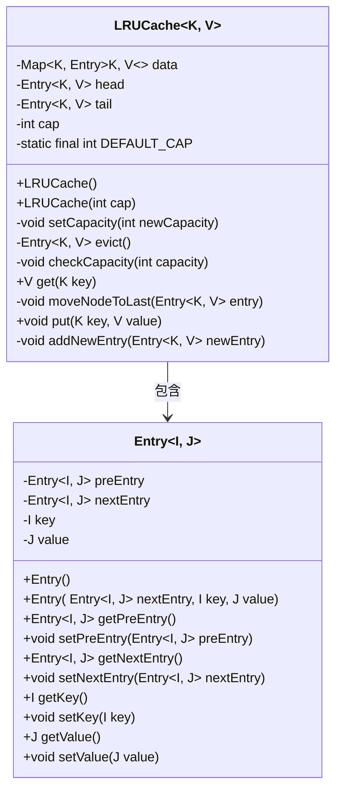

# 基础信息

|      |      |
|------|------|
| 名称 | LRUCache |
| 编码语言 | .java |
| 代码路径 | Java/src/main/java/com/thealgorithms/datastructures/caches/LRUCache.java |
| 包名 | com.thealgorithms.datastructures.caches |
| 依赖项 | ['java.util.HashMap', 'java.util.Map'] |
| 概述说明 | LRUCache利用哈希表和双向链表实现，支持容量设置、数据存取及淘汰最近最少使用项。 |

# 说明

LRUCache的实现结合了哈希表和双向链表两种数据结构，旨在高效管理缓存。它支持设置缓存容量，能够快速存取数据，并通过淘汰最近最少使用的项来维护缓存大小。哈希表用于实现快速查找，双向链表则用于维护数据的访问顺序，确保最近访问的项位于链表前端，而最少使用的项位于链表尾端，便于在容量满时进行淘汰。这种设计在保证高效性的同时，有效管理了缓存资源。

# 类列表 Class Summary

| 名称   | 类型  | 说明 |
|-------|------|-------------|
| LRUCache | class | LRUCache实现基于哈希表和双向链表，支持缓存容量设置、数据存取及淘汰最近最少使用项。 |

## 类 LRUCache

|      |      |
|------|------|
| 访问范围 | public |
| 类型 | class |
| 名称 | LRUCache |
| 说明 | LRUCache实现基于哈希表和双向链表，支持缓存容量设置、数据存取及淘汰最近最少使用项。 |

### UML类图

这段代码实现了一个LRU（Least Recently Used）缓存机制。`LRUCache`类使用哈希表`data`来存储缓存条目，并通过双向链表`Entry`来维护条目的访问顺序。`get`方法用于获取缓存中的值，并在访问后将条目移动到链表末尾；`put`方法用于插入或更新缓存条目，并在缓存满时移除最久未使用的条目。`Entry`类表示缓存条目，包含前驱、后继、键和值等属性。通过这种方式，LRUCache能够高效地管理缓存条目，确保最常用的数据保持在缓存中。

### 内部方法调用关系图

```mermaid
graph TD
    A["类LRUCache<K, V>"]
    B["属性: Map<K, Entry<K, V>> data"]
    C["属性: Entry<K, V> head"]
    D["属性: Entry<K, V> tail"]
    E["属性: int cap"]
    F["属性: static final int DEFAULT_CAP = 100"]
    G["构造方法: LRUCache()"]
    H["构造方法: LRUCache(int cap)"]
    I["方法: setCapacity(int newCapacity)"]
    J["方法: evict()"]
    K["方法: checkCapacity(int capacity)"]
    L["方法: get(K key)"]
    M["方法: moveNodeToLast(Entry<K, V> entry)"]
    N["方法: put(K key, V value)"]
    O["方法: addNewEntry(Entry<K, V> newEntry)"]
    P["内部类: Entry<I, J>"]
    Q["属性: Entry<I, J> preEntry"]
    R["属性: Entry<I, J> nextEntry"]
    S["属性: I key"]
    T["属性: J value"]
    U["构造方法: Entry()"]
    V["构造方法: Entry(Entry<I, J> preEntry, Entry<I, J> nextEntry, I key, J value)"]
    W["方法: getPreEntry()"]
    X["方法: setPreEntry(Entry<I, J> preEntry)"]
    Y["方法: getNextEntry()"]
    Z["方法: setNextEntry(Entry<I, J> nextEntry)"]
    AA["方法: getKey()"]
    AB["方法: setKey(I key)"]
    AC["方法: getValue()"]
    AD["方法: setValue(J value)"]

    A --> B
    A --> C
    A --> D
    A --> E
    A --> F
    A --> G
    A --> H
    A --> I
    A --> J
    A --> K
    A --> L
    A --> M
    A --> N
    A --> O
    A --> P
    P --> Q
    P --> R
    P --> S
    P --> T
    P --> U
    P --> V
    P --> W
    P --> X
    P --> Y
    P --> Z
    P --> AA
    P --> AB
    P --> AC
    P --> AD

    G --> I
    H --> I
    I --> J
    I --> K
    L --> M
    N --> M
    N --> J
    N --> O
    O --> C
    O --> D
```

这段代码实现了一个LRU（Least Recently Used）缓存机制。LRUCache类通过HashMap存储缓存项，并使用双向链表维护缓存项的顺序。当缓存达到容量上限时，会移除最久未使用的项。代码中的主要方法包括`get`、`put`、`evict`和`moveNodeToLast`，分别用于获取缓存项、添加缓存项、移除最久未使用的项以及将最近使用的项移动到链表末尾。内部类`Entry`用于表示缓存项，包含前后指针、键和值等属性。

### 字段列表 Field List

| 名称  | 类型  | 说明 |
|-------|-------|------|
| DEFAULT_CAP = 100 | int | 私有静态常量默认容量为100。 |
| data = new HashMap<>() | Map<K, Entry<K, V>> | 私有Map存储键值对，键为K，值为Entry<K,V>。 |
| head | Entry<K, V> | 私有成员变量head，类型为Entry<K, V>。 |
| tail | Entry<K, V> | 私有变量tail，类型为Entry<K, V>。 |
| cap | int | 定义了一个私有的整型变量cap。 |

### 方法列表 Method List

| 名称  | 类型  | 说明 |
|-------|-------|------|
| checkCapacity | void | 检查容量是否大于0，否则抛出异常。 |
| moveNodeToLast | void | 将链表节点移至末尾，更新前后节点连接。 |
| evict | Entry<K, V> | 该方法从缓存中移除并返回头节点，更新链表头。 |
| get | V | 根据键获取值，若不存在返回null，存在则移动节点至末尾并返回值。 |
| setCapacity | void | 方法设置容量，检查并移除超限数据，更新容量值。 |
| addNewEntry | void | 方法`addNewEntry`用于在空链表中添加新条目或更新链表尾部。 |
| put | void | 该方法用于插入键值对，若键存在则更新值并移至末尾，否则新增或替换旧条目。 |

