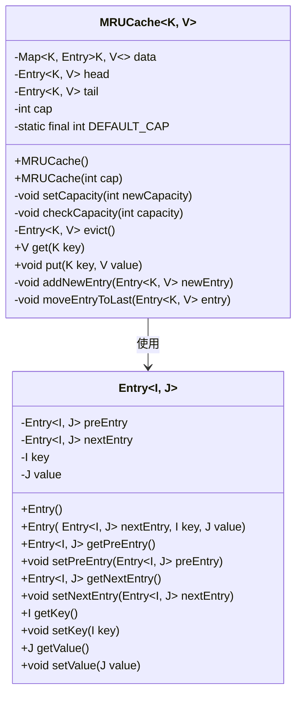
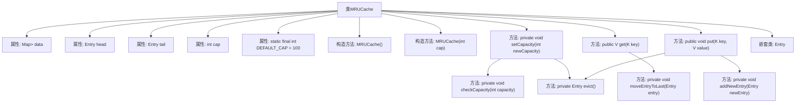

# 基础信息

|      |      |
|------|------|
| 名称 | MRUCache |
| 编码语言 | .java |
| 代码路径 | Java/src/main/java/com/thealgorithms/datastructures/caches/MRUCache.java |
| 包名 | com.thealgorithms.datastructures.caches |
| 依赖项 | ['java.util.HashMap', 'java.util.Map'] |
| 概述说明 | MRUCache实现最近使用缓存，支持默认和指定容量，具备获取、添加和淘汰功能。 |

# 说明

MRUCache是一个实现最近使用缓存的类，支持默认容量和指定容量两种初始化方式。它包含获取缓存数据、添加新数据以及淘汰最久未使用数据的功能。通过维护最近使用顺序，确保缓存中始终保留最近访问的数据，从而提高访问效率。

# 类列表 Class Summary

| 名称   | 类型  | 说明 |
|-------|------|-------------|
| MRUCache | class | MRUCache实现最近使用缓存，支持默认和指定容量，包含获取、添加和淘汰功能。 |

## 类 MRUCache

|      |      |
|------|------|
| 访问范围 | public |
| 类型 | class |
| 名称 | MRUCache |
| 说明 | MRUCache实现最近使用缓存，支持默认和指定容量，包含获取、添加和淘汰功能。 |

### UML类图

### 描述
`MRUCache` 是一个基于最近使用策略（MRU）的缓存实现类，使用泛型 `K` 和 `V` 分别表示键和值的类型。它内部维护了一个 `HashMap` 用于快速查找，以及一个双向链表用于管理缓存项的访问顺序。当缓存达到容量上限时，会优先移除最近使用的项。`Entry` 是 `MRUCache` 的内部类，表示缓存中的一个键值对，并包含指向前后节点的引用。

### 内部方法调用关系图

**描述：**  
该代码实现了一个基于最近使用（MRU）策略的缓存类 `MRUCache`，使用双向链表和哈希表来管理缓存条目。`MRUCache` 类包含两个构造方法，分别用于设置默认容量和指定容量。`setCapacity` 方法用于调整缓存容量，并在必要时移除最近使用的条目。`get` 方法用于获取指定键的值，并将该条目移动到链表末尾以标记为最近使用。`put` 方法用于插入或更新键值对，并在缓存满时移除最近使用的条目。`addNewEntry` 和 `moveEntryToLast` 方法分别用于添加新条目和将条目移动到链表末尾。`Entry` 嵌套类表示缓存中的条目，包含键值对及前后条目的引用。

### 字段列表 Field List

| 名称  | 类型  | 说明 |
|-------|-------|------|
| cap | int | 定义私有整型变量cap。 |
| head | Entry<K, V> | 私有变量head，类型为Entry<K, V>。 |
| DEFAULT_CAP = 100 | int | 定义私有静态常量DEFAULT_CAP，默认值为100。 |
| data = new HashMap<>() | Map<K, Entry<K, V>> | 定义了一个私有不可变的HashMap，用于存储键值对。 |
| tail | Entry<K, V> | 定义私有变量tail，类型为Entry<K, V>。 |

### 方法列表 Method List

| 名称  | 类型  | 说明 |
|-------|-------|------|
| evict | Entry<K, V> | 缓存满时移除尾部元素并返回。 |
| checkCapacity | void | 检查容量是否大于零，否则抛出异常。 |
| addNewEntry | void | 向空列表添加新条目，或更新尾部条目并设为新尾部。 |
| setCapacity | void | 调整容量并移除超限数据，确保新容量有效。 |
| moveEntryToLast | void | 将指定条目移至链表末尾，更新前后节点连接并调整头尾指针。 |
| get | V | 该方法通过键获取值，若不存在返回null，存在则移动条目至末尾并返回值。 |
| put | void | 方法put更新或插入键值对，若键存在则更新值并移至末尾；若缓存满则淘汰旧条目，否则新建条目并添加。 |

