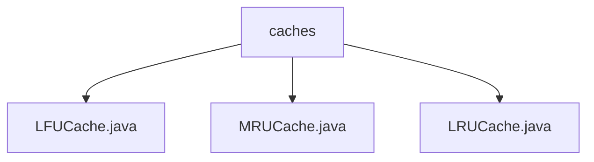

# 基础信息

|      |      |
|------|------|
| 名称 | caches |
| 编码语言 | .java |
| 代码路径 | Java/src/main/java/com/thealgorithms/datastructures/caches |
| 包名 | Java.src.main.java.com.thealgorithms.datastructures.caches |
| 概述说明 | LFU缓存实现节点类、缓存操作及频率更新逻辑。MRUCache支持默认和指定容量，维护最近使用顺序。LRUCache结合哈希表和双向链表，高效管理缓存。 |

# 说明

## 概述
该代码模块主要实现了三种不同的缓存策略：LFU（Least Frequently Used，最少使用）、MRU（Most Recently Used，最近使用）和LRU（Least Recently Used，最近最少使用）。这些缓存策略通过不同的数据结构和管理逻辑，优化了缓存的性能和访问效率。LFU缓存通过维护访问频率映射表，确保最少使用的数据优先被淘汰；MRU缓存通过维护最近使用顺序，确保缓存中始终保留最近访问的数据；LRU缓存则结合哈希表和双向链表，快速存取数据并淘汰最近最少使用的项。

## 主要业务场景
1. **LFU缓存**：适用于需要根据数据访问频率进行缓存淘汰的场景，例如在频繁访问某些数据的应用中，优先保留高频访问的数据，淘汰低频访问的数据。
2. **MRU缓存**：适用于需要保留最近访问数据的场景，例如在需要快速访问最近操作记录的应用中，确保最近使用的数据始终在缓存中。
3. **LRU缓存**：适用于需要平衡访问频率和最近使用时间的场景，例如在需要高效管理缓存资源且访问模式较为随机的应用中，确保最近最少使用的数据被淘汰。

### 包内部结构视图

该流程图展示了`caches`目录下的三个Java文件：`LFUCache.java`、`MRUCache.java`和`LRUCache.java`。这些文件均位于`caches`目录中，表示它们是该目录下的直接子文件。流程图清晰地反映了文件的层级关系，便于理解项目结构。

# 文件列表 File List

| 名称   | 类型  | 说明 |
|-------|------|-------------|
| [MRUCache.java](MRUCache.md) | file | MRUCache实现最近使用缓存，支持默认和指定容量，具备获取、添加和淘汰功能。 |
| [LRUCache.java](LRUCache.md) | file | LRUCache利用哈希表和双向链表实现，支持容量设置、数据存取及淘汰最近最少使用项。 |
| [LFUCache.java](LFUCache.md) | file | LFU缓存实现包括节点类、缓存操作及频率更新逻辑。 |

