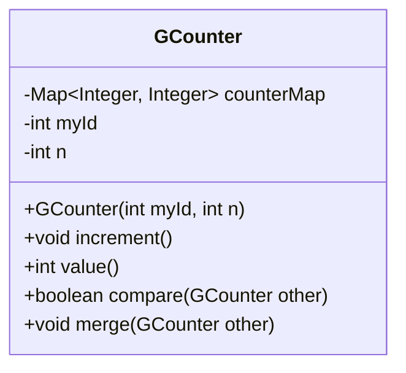
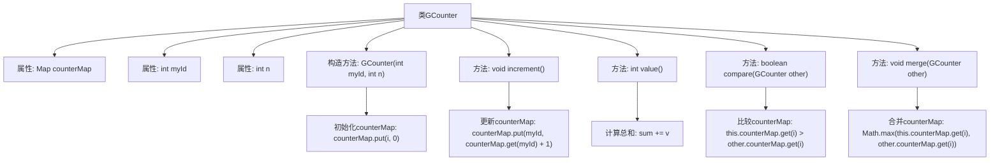

# 基础信息

|      |      |
|------|------|
| 名称 | GCounter |
| 编码语言 | .java |
| 代码路径 | Java/src/main/java/com/thealgorithms/datastructures/crdt/GCounter.java |
| 包名 | com.thealgorithms.datastructures.crdt |
| 依赖项 | ['java.util.HashMap', 'java.util.Map'] |
| 概述说明 | GCounter类用于集群节点计数器，支持自增、求和、比较和合并操作。 |

# 说明

GCounter类是一种用于集群节点计数器的工具，支持多种操作。它允许节点进行自增操作，以增加计数器的值。此外，GCounter还支持求和功能，能够计算多个节点计数器的总和。比较操作可以用于评估不同节点计数器的值大小。最后，GCounter具备合并功能，能够将多个节点的计数器值合并为一个统一的计数器。这些功能使得GCounter类在分布式系统中高效管理计数器数据。

# 类列表 Class Summary

| 名称   | 类型  | 说明 |
|-------|------|-------------|
| GCounter | class | GCounter类用于集群节点计数器，支持自增、求和、比较和合并操作。 |

## 类 GCounter

|      |      |
|------|------|
| 访问范围 | None |
| 类型 | class |
| 名称 | GCounter |
| 说明 | GCounter类用于集群节点计数器，支持自增、求和、比较和合并操作。 |

### UML类图

这段代码定义了一个名为 `GCounter` 的类，用于实现一个分布式计数器。该类包含一个 `counterMap` 用于存储每个节点的计数值，`myId` 表示当前节点的标识符，`n` 表示集群中的节点数量。`GCounter` 提供了 `increment` 方法用于增加当前节点的计数值，`value` 方法用于获取所有节点的计数值总和，`compare` 方法用于比较两个 `GCounter` 的状态，`merge` 方法用于合并两个 `GCounter` 的状态。该类适用于分布式系统中实现最终一致性的计数器。

### 内部方法调用关系图

这段代码定义了一个名为`GCounter`的类，用于在分布式系统中实现一个递增计数器。`GCounter`类包含一个`Map`类型的`counterMap`属性，用于存储每个节点的计数值，以及`myId`和`n`属性分别表示当前节点的ID和集群中的节点总数。类中提供了`increment`方法用于递增当前节点的计数值，`value`方法用于计算所有节点的计数值总和，`compare`方法用于比较两个`GCounter`对象的状态，`merge`方法用于合并两个`GCounter`对象的状态。流程图展示了类的结构及其方法之间的调用关系。

### 字段列表 Field List

| 名称  | 类型  | 说明 |
|-------|-------|------|
| counterMap | Map<Integer, Integer> | 私有整型映射变量counterMap。 |
| n | int | 声明一个私有的整型常量n。 |
| myId | int | 私有整型变量myId声明为不可修改。 |

### 方法列表 Method List

| 名称  | 类型  | 说明 |
|-------|-------|------|
| value | int | 该方法计算并返回计数器映射中所有值的总和。 |
| merge | void | 合并两个GCounter对象，取对应位置的最大值更新当前计数器。 |
| increment | void | 方法increment更新counterMap中myId对应的值加1。 |
| compare | boolean | 比较两个GCounter对象的计数器值，若当前对象值不大于另一对象值则返回true。 |

