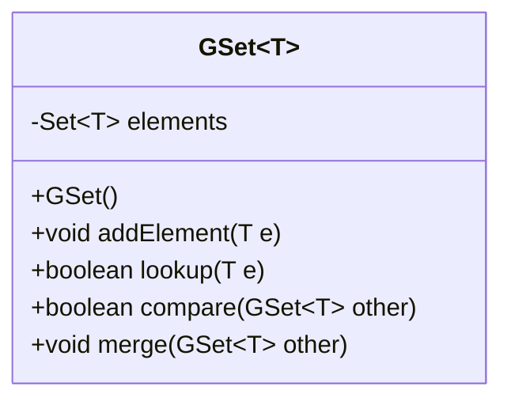
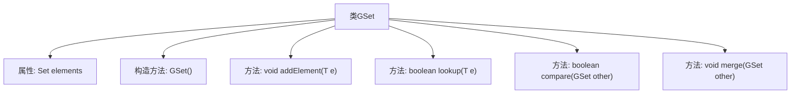

# 基础信息

|      |      |
|------|------|
| 名称 | GSet |
| 编码语言 | .java |
| 代码路径 | Java/src/main/java/com/thealgorithms/datastructures/crdt/GSet.java |
| 包名 | com.thealgorithms.datastructures.crdt |
| 依赖项 | ['java.util.HashSet', 'java.util.Set'] |
| 概述说明 | GSet类实现泛型集合，支持添加、查找、子集比较及合并功能。 |

# 说明

GSet类实现了一个泛型集合，提供了多种集合操作功能。它支持添加元素，允许用户将新元素纳入集合中。查找元素功能可以判断指定元素是否存在于集合内。子集比较功能用于确定一个集合是否为另一个集合的子集。集合合并功能则能够将两个集合合并为一个新的集合，包含所有元素。这些功能共同构成了一个完整的集合操作工具，适用于各种泛型数据类型的处理。

# 类列表 Class Summary

| 名称   | 类型  | 说明 |
|-------|------|-------------|
| GSet | class | GSet类实现了一个泛型集合，支持添加元素、查找元素、子集比较和集合合并功能。 |

## 类 GSet

|      |      |
|------|------|
| 访问范围 | public |
| 类型 | class |
| 名称 | GSet |
| 说明 | GSet类实现了一个泛型集合，支持添加元素、查找元素、子集比较和集合合并功能。 |

### UML类图

类图描述：  
`GSet<T>` 是一个泛型类，表示一个集合数据结构，内部使用 `Set<T>` 存储元素。它提供了添加元素、查找元素、比较是否为子集以及合并两个集合的功能。`GSet<T>` 的构造函数初始化一个空的 `HashSet`，`addElement` 方法用于添加元素，`lookup` 方法用于检查元素是否存在，`compare` 方法用于判断当前集合是否为另一个集合的子集，`merge` 方法用于将两个集合合并。

### 内部方法调用关系图

这段代码定义了一个泛型类 `GSet<T>`，用于管理一组元素。类中包含一个 `Set<T>` 类型的属性 `elements`，用于存储元素。构造方法 `GSet()` 初始化一个空的 `HashSet`。方法 `addElement(T e)` 用于向集合中添加元素，`lookup(T e)` 用于检查元素是否存在，`compare(GSet<T> other)` 用于比较当前集合是否为另一个集合的子集，`merge(GSet<T> other)` 用于合并两个集合。这些方法共同实现了对集合的基本操作。

### 字段列表 Field List

| 名称  | 类型  | 说明 |
|-------|-------|------|
| elements | Set<T> | 私有不可变集合存储类型为T的元素。 |

### 方法列表 Method List

| 名称  | 类型  | 说明 |
|-------|-------|------|
| merge | void | 合并两个集合的所有元素。 |
| compare | boolean | 比较两个集合，检查当前集合元素是否全包含于另一集合。 |
| lookup | boolean | 该方法检查元素e是否存在于集合elements中，返回布尔值。 |
| addElement | void | 方法addElement用于将元素e添加到elements集合中。 |

