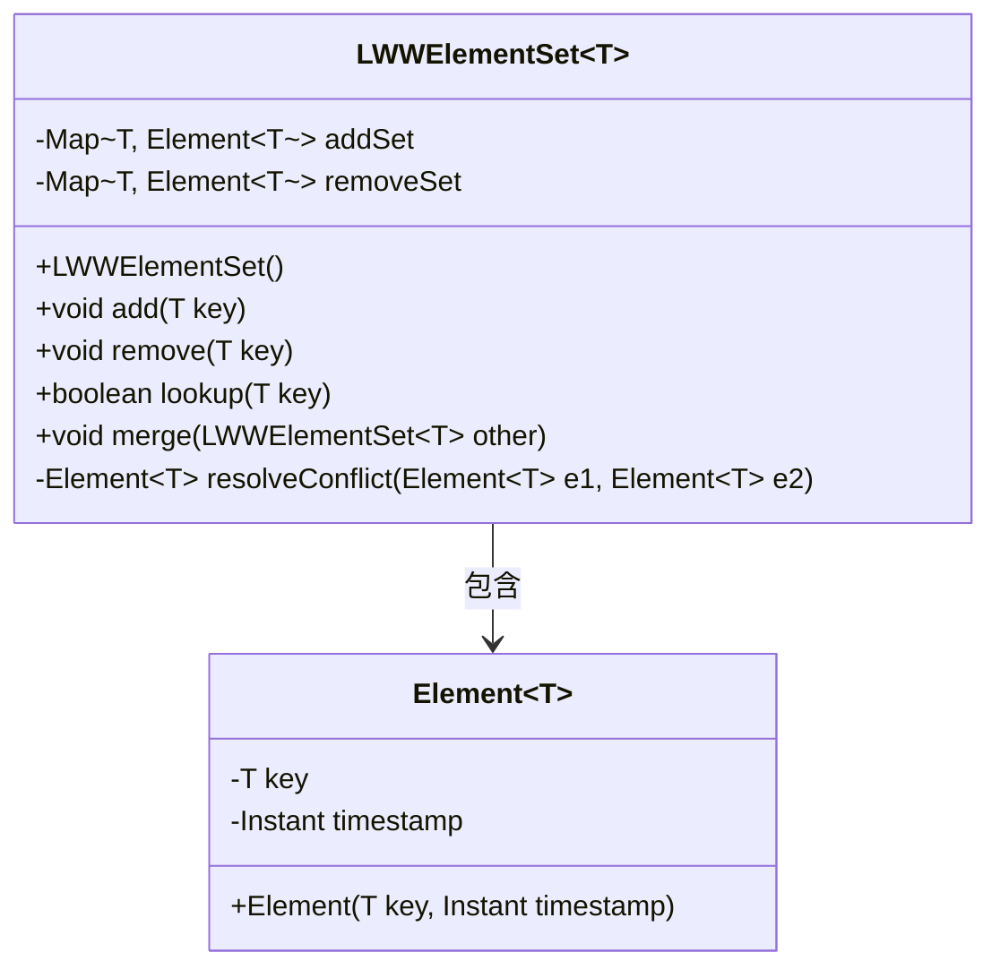
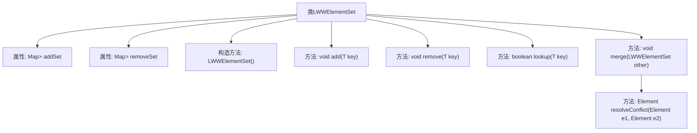
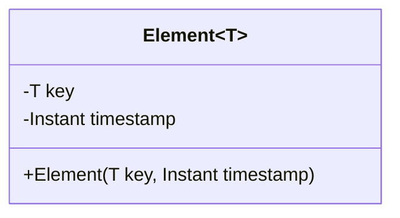
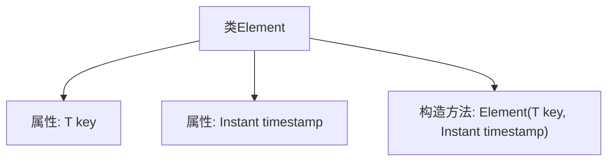

# 基础信息

|      |      |
|------|------|
| 名称 | LWWElementSet |
| 编码语言 | .java |
| 代码路径 | Java/src/main/java/com/thealgorithms/datastructures/crdt/LWWElementSet.java |
| 包名 | com.thealgorithms.datastructures.crdt |
| 依赖项 | ['java.time.Instant', 'java.util.HashMap', 'java.util.Map'] |
| 概述说明 | LWWElementSet类管理元素，支持增删查并，时间戳解决冲突。Element类含键和时间戳，构造函数初始化。 |

# 说明

LWWElementSet类通过addSet和removeSet方法管理元素，支持元素的添加、删除、查找和合并操作，时间戳用于解决冲突。Element类包含键和时间戳两个属性，其构造函数用于初始化这两个属性。

# 类列表 Class Summary

| 名称   | 类型  | 说明 |
|-------|------|-------------|
| LWWElementSet | class | LWWElementSet类通过addSet和removeSet管理元素，支持添加、删除、查找和合并操作，时间戳决定冲突解决。 |
| Element | class | 类Element包含键和时间戳，构造函数初始化这两个属性。 |

## 类 LWWElementSet

|      |      |
|------|------|
| 访问范围 | None |
| 类型 | class |
| 名称 | LWWElementSet |
| 说明 | LWWElementSet类通过addSet和removeSet管理元素，支持添加、删除、查找和合并操作，时间戳决定冲突解决。 |

### UML类图

类图描述：
`LWWElementSet` 是一个泛型类，用于实现基于时间戳的最终一致性集合。它包含两个 `Map` 成员：`addSet` 和 `removeSet`，分别用于存储添加和删除的元素及其时间戳。`Element` 类表示集合中的元素，包含元素的键和时间戳。`LWWElementSet` 提供了添加、删除、查找和合并集合的功能，并通过时间戳解决冲突。

### 内部方法调用关系图

这段代码定义了一个`LWWElementSet<T>`类，用于实现基于时间戳的“最后写入胜出”（Last-Write-Wins）元素集合。类中包含两个主要的映射：`addSet`和`removeSet`，分别用于存储添加和删除的元素及其时间戳。`add`方法将元素添加到`addSet`，`remove`方法将元素添加到`removeSet`。`lookup`方法通过比较时间戳来判断元素是否存在于集合中。`merge`方法用于合并两个`LWWElementSet`，`resolveConflict`方法用于解决时间戳冲突，保留最新操作。

### 字段列表 Field List

| 名称  | 类型  | 说明 |
|-------|-------|------|
| removeSet | Map<T, Element<T>> | 最终映射集合用于移除指定元素。 |
| addSet | Map<T, Element<T>> | 最终映射集合，键为T类型，值为Element<T>类型。 |

### 方法列表 Method List

| 名称  | 类型  | 说明 |
|-------|-------|------|
| remove | void | 方法remove将键和当前时间存入removeSet。 |
| add | void | 方法add将键值对存入addSet，值为当前时间。 |
| merge | void | 合并两个LWWElementSet的添加和删除集合，解决冲突。 |
| resolveConflict | Element<T> | 解决冲突方法：返回时间戳较新的元素。 |
| lookup | boolean | 方法查找键值，返回添加集存在且移除集不存在或添加时间晚于移除时间。 |

## 类 Element

|      |      |
|------|------|
| 访问范围 | None |
| 类型 | class |
| 名称 | Element |
| 说明 | 类Element包含键和时间戳，构造函数初始化这两个属性。 |

### UML类图

这段代码定义了一个泛型类 `Element<T>`，其中包含两个私有成员变量：`key` 和 `timestamp`。`key` 是一个泛型类型 `T`，而 `timestamp` 是一个 `Instant` 类型的对象。类中定义了一个构造函数 `Element(T key, Instant timestamp)`，用于初始化这两个成员变量。该类的主要作用是存储一个带有时间戳的元素，适用于需要记录元素创建或更新时间戳的场景。

### 内部方法调用关系图

这段代码定义了一个泛型类 `Element<T>`，其中包含两个属性：`key` 和 `timestamp`。`key` 是一个泛型类型，可以是任何类型的数据，而 `timestamp` 是一个 `Instant` 类型的对象，用于记录时间戳。类中定义了一个构造方法 `Element(T key, Instant timestamp)`，用于初始化这两个属性。流程图展示了类的结构及其属性和构造方法之间的关系。

### 字段列表 Field List

| 名称  | 类型  | 说明 |
|-------|-------|------|
| timestamp | Instant | 即时时间戳记录当前时间点。 |
| key | T | 定义模板类T的键类型。 |

### 方法列表 Method List

| 名称  | 类型  | 说明 |
|-------|-------|------|

