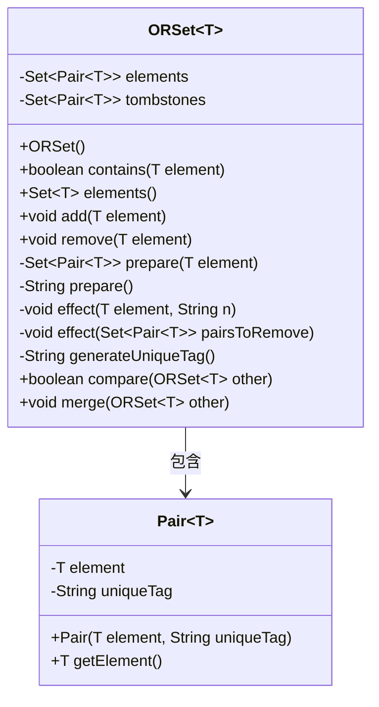

# 基础信息

|      |      |
|------|------|
| 名称 | ORSet |
| 编码语言 | .java |
| 代码路径 | Java/src/main/java/com/thealgorithms/datastructures/crdt/ORSet.java |
| 包名 | com.thealgorithms.datastructures.crdt |
| 依赖项 | ['java.util.HashSet', 'java.util.Set', 'java.util.UUID'] |
| 概述说明 | ORSet类实现元素增删、集合合并及比较功能。 |

# 说明

ORSet类实现了一种数据结构，支持添加和删除元素的操作，同时具备合并多个集合的功能。此外，该类还提供了集合之间的比较功能，能够判断两个集合是否相等或包含关系。这些功能共同构成了一个高效的集合管理工具，适用于需要动态更新和合并集合的场景。

# 类列表 Class Summary

| 名称   | 类型  | 说明 |
|-------|------|-------------|
| ORSet | class | ORSet类实现添加删除元素、合并集合及比较功能。 |

## 类 ORSet

|      |      |
|------|------|
| 访问范围 | public |
| 类型 | class |
| 名称 | ORSet |
| 说明 | ORSet类实现添加删除元素、合并集合及比较功能。 |

### UML类图

类图描述：  
`ORSet` 是一个泛型类，用于实现一个添加优先的集合（Add-Wins OR-Set）。它包含两个私有成员：`elements` 和 `tombstones`，分别用于存储当前元素和已删除元素的标记。`ORSet` 提供了添加、删除、检查元素存在性、合并集合等操作。`Pair` 是一个内部类，用于表示元素与其唯一标记的配对。`ORSet` 依赖于 `Pair` 类来管理元素的唯一性。

### 内部方法调用关系图

```mermaid
graph TD
    A["类ORSet<T>"]
    B["属性: Set<Pair<T>> elements"]
    C["属性: Set<Pair<T>> tombstones"]
    D["构造方法: ORSet()"]
    E["方法: boolean contains(T element)"]
    F["方法: Set<T> elements()"]
    G["方法: void add(T element)"]
    H["方法: void remove(T element)"]
    I["私有方法: Set<Pair<T>> prepare(T element)"]
    J["私有方法: String prepare()"]
    K["私有方法: void effect(T element, String n)"]
    L["私有方法: void effect(Set<Pair<T>> pairsToRemove)"]
    M["私有方法: String generateUniqueTag()"]
    N["方法: boolean compare(ORSet<T> other)"]
    O["方法: void merge(ORSet<T> other)"]
    P["内部类: Pair<T>"]
    Q["属性: T element"]
    R["属性: String uniqueTag"]
    S["构造方法: Pair(T element, String uniqueTag)"]
    T["方法: T getElement()"]

    A --> B
    A --> C
    A --> D
    A --> E
    A --> F
    A --> G
    A --> H
    A --> I
    A --> J
    A --> K
    A --> L
    A --> M
    A --> N
    A --> O
    A -.-> P
    P --> Q
    P --> R
    P --> S
    P --> T
```

这段代码实现了一个基于Add-Wins策略的OR-Set（Observed-Remove Set），用于在分布式系统中处理并发操作。ORSet通过维护元素集合和墓碑集合来确保在添加和删除操作时的数据一致性。代码包含了元素的添加、删除、比较和合并操作，并通过内部类Pair来管理元素及其唯一标识。流程图展示了类ORSet及其内部类Pair的结构与方法调用关系。

### 字段列表 Field List

| 名称  | 类型  | 说明 |
|-------|-------|------|
| elements | Set<Pair<T>> | 私有集合存储类型为Pair<T>的元素。 |
| tombstones | Set<Pair<T>> | 私有不可变集合存储类型为Pair的墓碑标记。 |

### 方法列表 Method List

| 名称  | 类型  | 说明 |
|-------|-------|------|
| merge | void | 合并两个ORSet，移除已删除元素，添加新元素和删除标记。 |
| remove | void | 移除指定元素及其相关配对。 |
| compare | boolean | 比较两个ORSet集合是否相等，检查元素和墓碑集合并集。 |
| elements | Set<T> | 该方法返回集合中所有元素的唯一集合。 |
| effect | void | 私有方法effect接收元素和字符串，创建Pair对象并加入集合，移除所有标记删除项。 |
| add | void | 方法`add`接受元素`T`，调用`prepare`生成字符串`n`，再调用`effect`处理元素和`n`。 |
| prepare | String | 该方法返回生成的唯一标签。 |
| contains | boolean | 检查集合中是否包含指定元素。 |
| effect | void | 从集合中移除指定元素并标记为删除。 |
| generateUniqueTag | String | 生成唯一标签的方法，使用UUID随机字符串。 |
| prepare | Set<Pair<T>> | 方法prepare返回与给定元素匹配的Pair集合。 |

