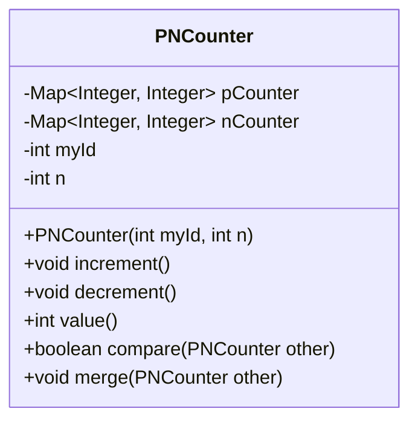

# 基础信息

|      |      |
|------|------|
| 名称 | PNCounter |
| 编码语言 | .java |
| 代码路径 | Java/src/main/java/com/thealgorithms/datastructures/crdt/PNCounter.java |
| 包名 | com.thealgorithms.datastructures.crdt |
| 依赖项 | ['java.util.HashMap', 'java.util.Map'] |
| 概述说明 | PNCounter类用于集群节点计数器，支持增减、计算、比较与合并操作。 |

# 说明

PNCounter类是一种专为集群节点设计的计数器，具备增加和减少操作的功能，能够计算当前值，支持不同节点间的状态比较与合并，适用于分布式系统中需要协同计数的场景。

# 类列表 Class Summary

| 名称   | 类型  | 说明 |
|-------|------|-------------|
| PNCounter | class | PNCounter类用于集群节点计数器，支持增减操作、值计算、状态比较与合并。 |

## 类 PNCounter

|      |      |
|------|------|
| 访问范围 | None |
| 类型 | class |
| 名称 | PNCounter |
| 说明 | PNCounter类用于集群节点计数器，支持增减操作、值计算、状态比较与合并。 |

### UML类图

**描述：**
`PNCounter` 类实现了一个正负计数器（PN-Counter），用于分布式系统中多个节点的计数操作。该类包含两个 `Map` 对象 `pCounter` 和 `nCounter`，分别用于记录每个节点的增量和减量计数。通过 `increment` 和 `decrement` 方法，当前节点可以增加或减少计数。`value` 方法返回当前计数的总值，`compare` 方法用于比较两个计数器的状态，`merge` 方法用于合并两个计数器的状态。该类确保在节点数量一致的情况下进行操作，否则抛出异常。

### 内部方法调用关系图

```mermaid
graph TD
    A["类PNCounter"]
    B["属性: Map<Integer, Integer> pCounter"]
    C["属性: Map<Integer, Integer> nCounter"]
    D["属性: int myId"]
    E["属性: int n"]
    F["构造方法: PNCounter(int myId, int n)"]
    G["方法: void increment()"]
    H["方法: void decrement()"]
    I["方法: int value()"]
    J["方法: boolean compare(PNCounter other)"]
    K["方法: void merge(PNCounter other)"]
    L["初始化: pCounter和nCounter"]
    M["更新: pCounter.put(myId, pCounter.get(myId) + 1)"]
    N["更新: nCounter.put(myId, nCounter.get(myId) + 1)"]
    O["计算: sumP = pCounter.values().stream().mapToInt(Integer::intValue).sum()"]
    P["计算: sumN = nCounter.values().stream().mapToInt(Integer::intValue).sum()"]
    Q["返回: sumP - sumN"]
    R["比较: this.n != other.n"]
    S["比较: this.pCounter.get(i) > other.pCounter.get(i) && this.nCounter.get(i) > other.nCounter.get(i)"]
    T["合并: this.pCounter.put(i, Math.max(this.pCounter.get(i), other.pCounter.get(i)))"]
    U["合并: this.nCounter.put(i, Math.max(this.nCounter.get(i), other.nCounter.get(i)))"]

    A --> B
    A --> C
    A --> D
    A --> E
    A --> F
    A --> G
    A --> H
    A --> I
    A --> J
    A --> K
    F --> L
    G --> M
    H --> N
    I --> O
    I --> P
    I --> Q
    J --> R
    J --> S
    K --> R
    K --> T
    K --> U
```

这段代码定义了一个`PNCounter`类，用于在分布式系统中实现一个正负计数器。类中包含两个`Map`类型的属性`pCounter`和`nCounter`，分别用于记录每个节点的增加和减少操作。构造方法初始化这两个计数器，`increment`和`decrement`方法分别更新当前节点的增加和减少计数，`value`方法计算并返回当前计数的总值。`compare`方法用于比较两个计数器的状态，`merge`方法用于合并两个计数器的状态。该类的设计适用于分布式环境中的计数操作，确保节点间的计数状态一致。

### 字段列表 Field List

| 名称  | 类型  | 说明 |
|-------|-------|------|
| nCounter | Map<Integer, Integer> | 私有整数映射变量nCounter。 |
| myId | int | 私有整型变量myId，不可修改。 |
| pCounter | Map<Integer, Integer> | 私有整型映射变量pCounter，用于存储键值对。 |
| n | int | 私有整型常量n。 |

### 方法列表 Method List

| 名称  | 类型  | 说明 |
|-------|-------|------|
| value | int | 计算pCounter和nCounter值之和的差值。 |
| decrement | void | 方法decrement更新myId对应的计数器值。 |
| merge | void | 合并PN计数器时需节点数相同，逐节点取最大值更新。 |
| compare | boolean | 比较两个PN-Counter对象，节点数不同抛出异常，节点值相同返回true。 |
| increment | void | 方法increment通过pCounter更新myId对应的值加1。 |

