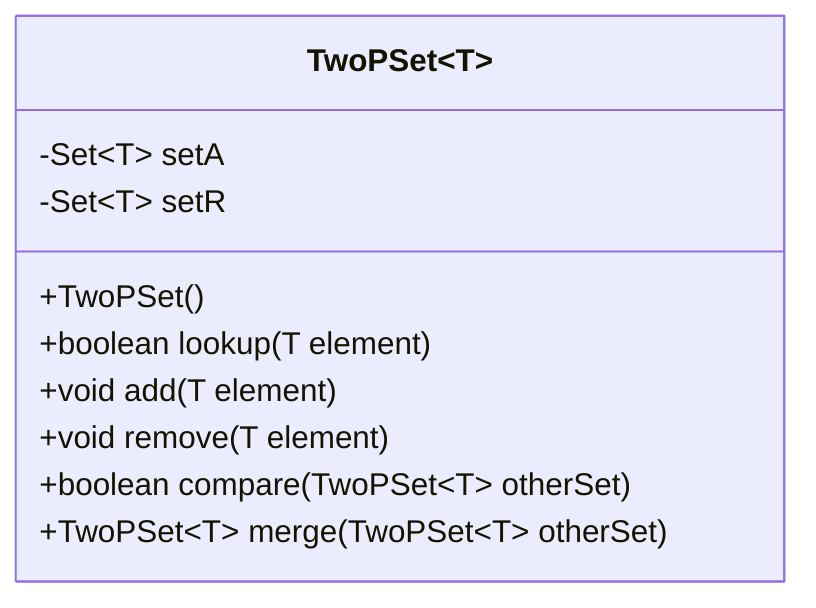

# 基础信息

|      |      |
|------|------|
| 名称 | TwoPSet |
| 编码语言 | .java |
| 代码路径 | Java/src/main/java/com/thealgorithms/datastructures/crdt/TwoPSet.java |
| 包名 | com.thealgorithms.datastructures.crdt |
| 依赖项 | ['java.util.HashSet', 'java.util.Set'] |
| 概述说明 | TwoPSet类实现双阶段集合，支持增删查比合操作。 |

# 说明

TwoPSet类实现了一个双阶段集合数据结构，支持添加元素、移除元素、查找元素、比较集合以及合并集合等操作。该类的设计旨在处理集合操作中的并发和冲突问题，确保数据的一致性和完整性。通过双阶段机制，TwoPSet能够有效地管理集合的更新和查询，适用于需要高并发和分布式环境的应用场景。

# 类列表 Class Summary

| 名称   | 类型  | 说明 |
|-------|------|-------------|
| TwoPSet | class | TwoPSet类实现双阶段集合，支持添加、移除、查找、比较和合并操作。 |

## 类 TwoPSet

|      |      |
|------|------|
| 访问范围 | public |
| 类型 | class |
| 名称 | TwoPSet |
| 说明 | TwoPSet类实现双阶段集合，支持添加、移除、查找、比较和合并操作。 |

### UML类图

这段代码定义了一个泛型类 `TwoPSet<T>`，它实现了两阶段集合（2P-Set）的数据结构。2P-Set 包含两个集合 `setA` 和 `setR`，分别用于存储添加的元素和已移除的元素。`lookup` 方法用于检查元素是否存在且未被移除，`add` 方法用于添加元素，`remove` 方法用于移除元素并将其放入 `setR`。`compare` 方法用于比较两个 2P-Set 的集合内容，`merge` 方法用于合并两个 2P-Set 并返回一个新的集合。这种数据结构适用于需要跟踪元素添加和移除操作的场景。

### 内部方法调用关系图

```mermaid
graph TD
    A["类TwoPSet<T>"]
    B["属性: Set<T> setA"]
    C["属性: Set<T> setR"]
    D["构造方法: TwoPSet()"]
    E["方法: boolean lookup(T element)"]
    F["方法: void add(T element)"]
    G["方法: void remove(T element)"]
    H["方法: boolean compare(TwoPSet<T> otherSet)"]
    I["方法: TwoPSet<T> merge(TwoPSet<T> otherSet)"]
    J["内部调用: setA.contains(element)"]
    K["内部调用: setR.contains(element)"]
    L["内部调用: setA.add(element)"]
    M["内部调用: setR.add(element)"]
    N["内部调用: otherSet.setA.containsAll(setA)"]
    O["内部调用: otherSet.setR.containsAll(setR)"]
    P["内部调用: mergedSet.setA.addAll(this.setA)"]
    Q["内部调用: mergedSet.setA.addAll(otherSet.setA)"]
    R["内部调用: mergedSet.setR.addAll(this.setR)"]
    S["内部调用: mergedSet.setR.addAll(otherSet.setR)"]

    A --> B
    A --> C
    A --> D
    A --> E
    A --> F
    A --> G
    A --> H
    A --> I
    E --> J
    E --> K
    F --> L
    G --> M
    H --> N
    H --> O
    I --> P
    I --> Q
    I --> R
    I --> S
```

这段代码实现了一个Two-Phase Set（2P-Set），这是一种用于处理分布式系统中元素添加和删除的数据结构。它包含两个集合：`setA`用于记录添加的元素，`setR`用于记录被删除的元素。`lookup`方法检查元素是否在`setA`中且不在`setR`中，`add`方法将元素添加到`setA`，`remove`方法将元素添加到`setR`。`compare`方法用于比较两个2P-Set的集合，`merge`方法用于合并两个2P-Set。

### 字段列表 Field List

| 名称  | 类型  | 说明 |
|-------|-------|------|
| setA | Set<T> | 私有不可变集合setA，类型为T。 |
| setR | Set<T> | 私有不可变集合setR，类型为T。 |

### 方法列表 Method List

| 名称  | 类型  | 说明 |
|-------|-------|------|
| lookup | boolean | 检查元素在setA中存在且不在setR中。 |
| add | void | 该方法用于向集合中添加指定元素。 |
| remove | void | 方法移除指定元素，若存在则添加到集合setR。 |
| merge | TwoPSet<T> | 合并两个TwoPSet集合，返回包含所有元素的新集合。 |
| compare | boolean | 比较两个TwoPSet集合，确保A集和R集完全包含。 |

