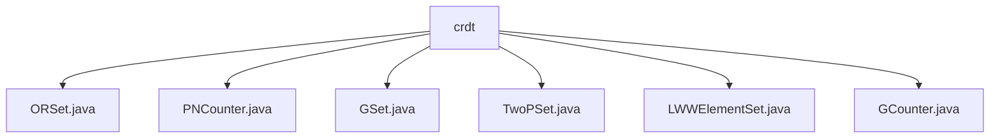

# 基础信息

|      |      |
|------|------|
| 名称 | crdt |
| 编码语言 | .java |
| 代码路径 | Java/src/main/java/com/thealgorithms/datastructures/crdt |
| 包名 | Java.src.main.java.com.thealgorithms.datastructures.crdt |
| 概述说明 | ORSet、PNCounter、GSet、TwoPSet、LWWElementSet、GCounter类实现多种数据结构，支持添加、删除、查找、合并、比较操作，适用于分布式系统。 |

# 说明

## 概述
该代码模块实现了一系列基于CRDT（Conflict-Free Replicated Data Type，无冲突复制数据类型）的数据结构，旨在支持分布式系统中的高效数据管理和协同操作。这些数据结构包括集合、计数器等，具备添加、删除、查找、比较和合并等核心功能，能够有效处理并发操作和数据冲突，确保数据的一致性和完整性。模块中的每个类都针对特定的业务场景进行了优化，适用于高并发和分布式环境。

## 主要业务场景
1. **集合管理**：
   - **ORSet**：支持动态更新和合并集合，适用于需要频繁添加、删除和合并元素的场景。
   - **GSet**：提供泛型集合操作，支持元素添加、查找、子集比较和集合合并，适用于处理各种泛型数据类型的集合操作。
   - **TwoPSet**：通过双阶段机制处理并发和冲突问题，适用于高并发和分布式环境中的集合管理。
   - **LWWElementSet**：利用时间戳解决元素添加和删除的冲突，适用于需要基于时间戳进行数据一致性管理的场景。

2. **计数器管理**：
   - **PNCounter**：支持增加和减少操作，适用于分布式系统中需要协同计数的场景。
   - **GCounter**：支持自增、求和、比较和合并操作，适用于分布式系统中高效管理计数器数据的场景。

这些数据结构广泛应用于分布式数据库、实时协同编辑、分布式缓存等场景，能够有效提升系统的并发处理能力和数据一致性。

### 包内部结构视图

该流程图展示了`crdt`目录下的文件层级关系。`crdt`作为根节点，包含了六个子节点，分别是`ORSet.java`、`PNCounter.java`、`GSet.java`、`TwoPSet.java`、`LWWElementSet.java`和`GCounter.java`。这些文件都属于`crdt`目录下的具体实现，展示了它们之间的直接关联关系。

# 文件列表 File List

| 名称   | 类型  | 说明 |
|-------|------|-------------|
| [PNCounter.java](PNCounter.md) | file | PNCounter类用于集群节点计数器，支持增减、计算、比较与合并操作。 |
| [ORSet.java](ORSet.md) | file | ORSet类实现元素增删、集合合并及比较功能。 |
| [GCounter.java](GCounter.md) | file | GCounter类用于集群节点计数器，支持自增、求和、比较和合并操作。 |
| [LWWElementSet.java](LWWElementSet.md) | file | LWWElementSet类管理元素，支持增删查并，时间戳解决冲突。Element类含键和时间戳，构造函数初始化。 |
| [TwoPSet.java](TwoPSet.md) | file | TwoPSet类实现双阶段集合，支持增删查比合操作。 |
| [GSet.java](GSet.md) | file | GSet类实现泛型集合，支持添加、查找、子集比较及合并功能。 |

