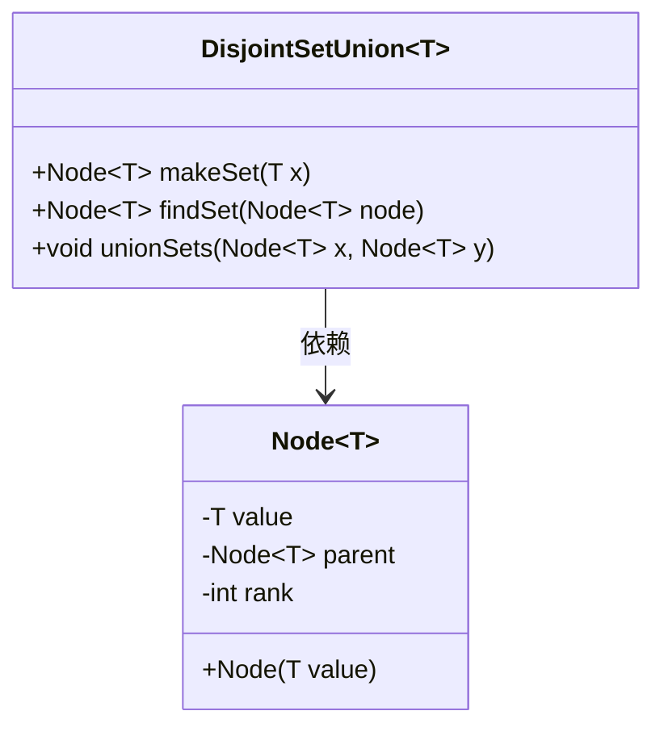
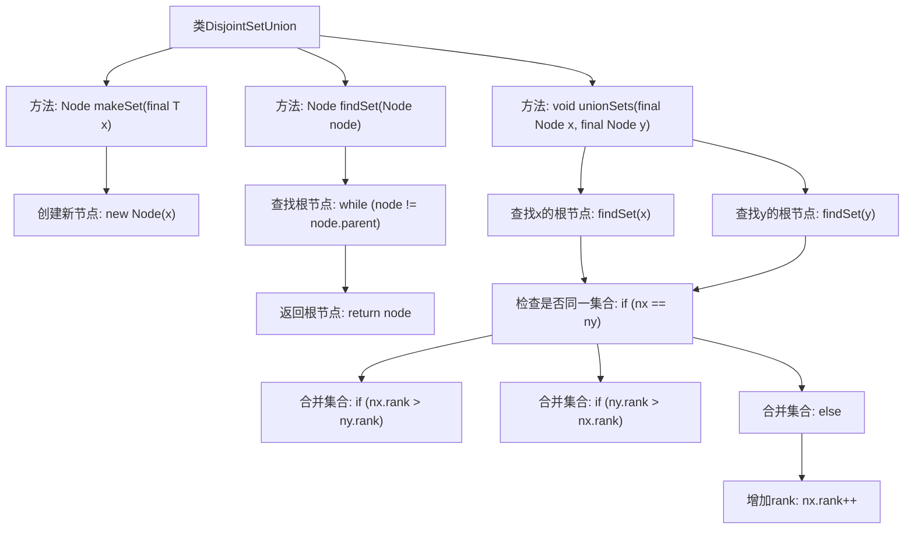

# 基础信息

|      |      |
|------|------|
| 名称 | DisjointSetUnion |
| 编码语言 | .java |
| 代码路径 | Java/src/main/java/com/thealgorithms/datastructures/disjointsetunion/DisjointSetUnion.java |
| 包名 | com.thealgorithms.datastructures.disjointsetunion |
| 依赖项 | [] |
| 概述说明 | DSU类实现并查集，支持创建集合、查找根节点及基于秩的集合合并。 |

# 说明

DSU类用于实现并查集数据结构，支持创建集合、查找根节点以及基于秩的集合合并操作。并查集是一种用于管理元素分组的数据结构，常用于处理不相交集合的合并与查询问题。DSU类通过优化路径压缩和按秩合并策略，确保查找和合并操作的高效性。路径压缩在查找根节点时减少树的深度，而按秩合并则在合并集合时保持树的平衡，从而提升整体性能。

# 类列表 Class Summary

| 名称   | 类型  | 说明 |
|-------|------|-------------|
| DisjointSetUnion | class | DSU类实现并查集，支持创建集合、查找根节点及基于秩的集合合并。 |

## 类 DisjointSetUnion

|      |      |
|------|------|
| 访问范围 | public |
| 类型 | class |
| 名称 | DisjointSetUnion |
| 说明 | DSU类实现并查集，支持创建集合、查找根节点及基于秩的集合合并。 |

### UML类图

**描述：**
`DisjointSetUnion` 类实现了一个并查集数据结构，用于管理不相交集合的合并与查找操作。它包含三个主要方法：`makeSet` 用于创建新节点，`findSet` 用于查找节点的根并应用路径压缩优化，`unionSets` 用于合并两个集合并基于秩进行优化。`Node` 类表示并查集中的节点，包含值、父节点和秩属性。通过路径压缩和按秩合并，`DisjointSetUnion` 能够高效地处理集合的合并与查找操作。

### 内部方法调用关系图

**描述：**  
该代码实现了并查集（Disjoint Set Union, DSU）数据结构，主要用于高效管理不相交集合的合并与查询操作。`makeSet`方法用于创建新节点，`findSet`方法通过路径压缩查找节点的根，`unionSets`方法根据节点秩（rank）合并两个集合，确保树的高度尽可能小，从而优化后续查询操作。

### 字段列表 Field List

| 名称  | 类型  | 说明 |
|-------|-------|------|

### 方法列表 Method List

| 名称  | 类型  | 说明 |
|-------|-------|------|
| makeSet | Node<T> | 创建包含元素x的新节点并返回。 |
| findSet | Node<T> | 查找并返回节点的根节点。 |
| unionSets | void | 合并两个集合，按节点秩决定父节点，避免长链，优化查找根节点时间。 |

