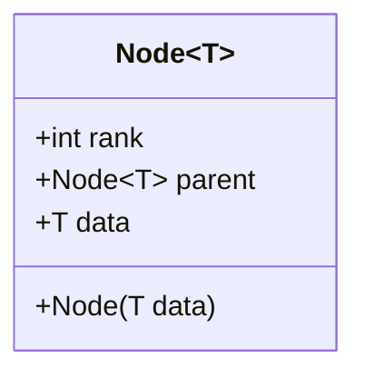
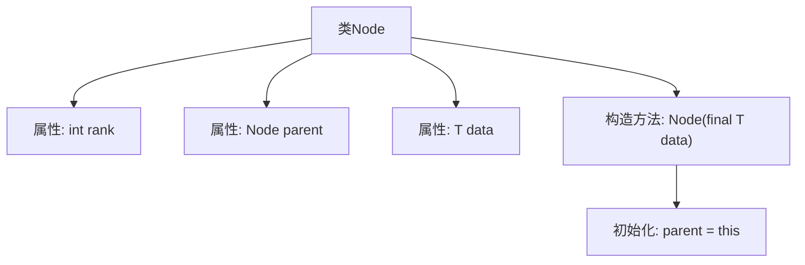

# 基础信息

|      |      |
|------|------|
| 名称 | Node |
| 编码语言 | .java |
| 代码路径 | Java/src/main/java/com/thealgorithms/datastructures/disjointsetunion/Node.java |
| 包名 | com.thealgorithms.datastructures.disjointsetunion |
| 依赖项 | [] |
| 概述说明 | Node类含rank、parent和data属性，初始化时parent指向自身。 |

# 说明

Node类具有三个主要属性：rank、parent和data。在初始化时，parent属性指向自身，表示节点的初始状态。rank属性用于表示节点的层级或优先级，而data属性用于存储节点相关的数据信息。这种设计使得Node类在数据结构中能够有效地表示节点的层次关系和状态。

# 类列表 Class Summary

| 名称   | 类型  | 说明 |
|-------|------|-------------|
| Node | class | Node类包含rank、parent和data属性，初始化时parent指向自身。 |

## 类 Node

|      |      |
|------|------|
| 访问范围 | public |
| 类型 | class |
| 名称 | Node |
| 说明 | Node类包含rank、parent和data属性，初始化时parent指向自身。 |

### UML类图

**描述：**  
`Node<T>` 类是一个泛型类，用于表示一个节点数据结构。每个节点包含一个 `rank` 属性，用于优化联合操作；一个 `parent` 属性，指向其父节点，初始时节点自身为其父节点；以及一个 `data` 属性，存储节点关联的数据。构造函数 `Node(T data)` 用于初始化节点，并将 `parent` 设置为自身，表示初始时为单例集合。

### 内部方法调用关系图

这段代码定义了一个泛型类 `Node<T>`，用于表示集合中的一个节点。节点包含三个属性：`rank` 用于优化合并操作，`parent` 指向父节点，`data` 存储节点关联的数据。构造方法 `Node(final T data)` 初始化节点时，将 `parent` 指向自身，表示节点最初是一个单例集合。

### 字段列表 Field List

| 名称  | 类型  | 说明 |
|-------|-------|------|
| parent | Node<T> | 节点T的父节点引用。 |
| data | T | 声明一个公共泛型变量data。 |
| rank | int | 定义了一个公共整型变量rank。 |

### 方法列表 Method List

| 名称  | 类型  | 说明 |
|-------|-------|------|

