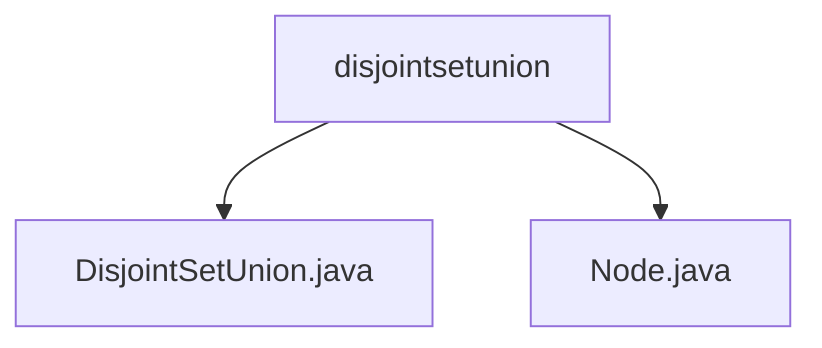

# 基础信息

|      |      |
|------|------|
| 名称 | disjointsetunion |
| 编码语言 | .java |
| 代码路径 | Java/src/main/java/com/thealgorithms/datastructures/disjointsetunion |
| 包名 | Java.src.main.java.com.thealgorithms.datastructures.disjointsetunion |
| 概述说明 | DSU类实现并查集，支持集合创建、查找和合并，优化路径压缩和按秩合并。Node类包含rank、parent和data属性，表示节点层次和状态。 |

# 说明

## 概述
该代码模块实现了一个并查集（Disjoint Set Union, DSU）数据结构，用于管理元素的分组，并支持高效的集合合并与查询操作。并查集是一种常用于处理不相交集合的数据结构，通过优化路径压缩和按秩合并策略，确保查找和合并操作的高效性。模块包含两个主要类：`DSU`类和`Node`类。`DSU`类负责实现并查集的核心功能，包括创建集合、查找根节点以及基于秩的集合合并操作。`Node`类用于表示并查集中的节点，包含`rank`、`parent`和`data`三个属性，分别表示节点的层级、父节点以及存储的数据信息。

## 主要业务场景
该模块的主要业务场景包括：
1. **集合的创建与初始化**：在初始化时，每个节点的`parent`属性指向自身，表示节点的初始状态，形成一个独立的集合。
2. **查找根节点**：通过路径压缩优化查找操作，减少树的深度，从而提高查找效率。
3. **集合的合并**：基于秩的合并策略，将两个集合合并为一个集合，保持树的平衡，避免树的高度过高，从而提升整体性能。
4. **处理不相交集合的合并与查询**：适用于需要频繁合并和查询集合的场景，例如图算法中的连通性判断、最小生成树算法等。

通过路径压缩和按秩合并的优化策略，该模块能够高效地处理大规模数据的集合操作，适用于需要高性能集合管理的应用场景。

### 包内部结构视图

该流程图展示了 `disjointsetunion` 文件夹与其内部的两个文件 `DisjointSetUnion.java` 和 `Node.java` 之间的层级关系。`disjointsetunion` 作为父节点，包含两个子节点，分别表示两个Java文件。这种结构清晰地反映了文件在项目中的组织方式。

# 文件列表 File List

| 名称   | 类型  | 说明 |
|-------|------|-------------|
| [Node.java](Node.md) | file | Node类含rank、parent和data属性，初始化时parent指向自身。 |
| [DisjointSetUnion.java](DisjointSetUnion.md) | file | DSU类实现并查集，支持创建集合、查找根节点及基于秩的集合合并。 |

