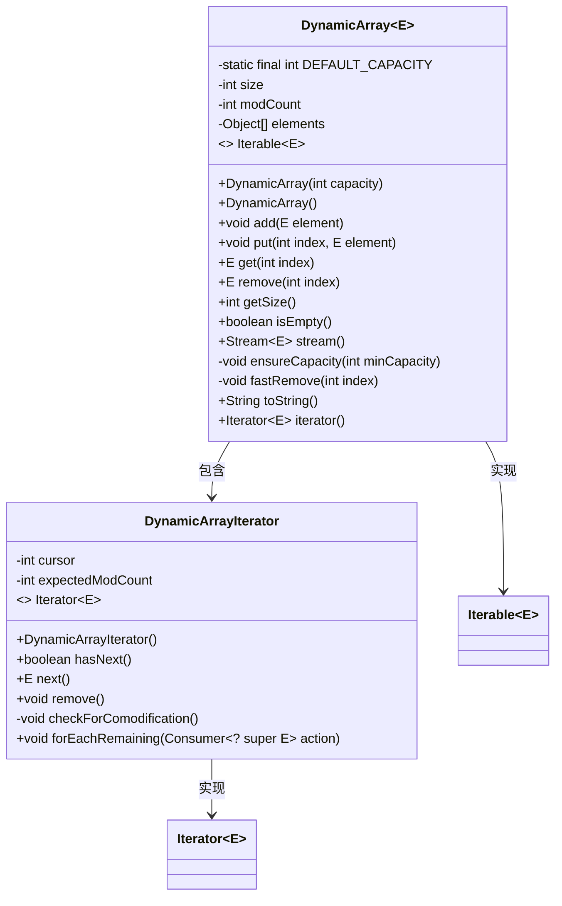

# 基础信息

|      |      |
|------|------|
| 名称 | DynamicArray |
| 编码语言 | .java |
| 代码路径 | Java/src/main/java/com/thealgorithms/datastructures/dynamicarray/DynamicArray.java |
| 包名 | com.thealgorithms.datastructures.dynamicarray |
| 依赖项 | ['java.util.Arrays', 'java.util.ConcurrentModificationException', 'java.util.Iterator', 'java.util.NoSuchElementException', 'java.util.Objects', 'java.util.function.Consumer', 'java.util.stream.Stream', 'java.util.stream.StreamSupport'] |
| 概述说明 | 动态数组类支持增删改查，自动扩容，迭代器确保并发安全。 |

# 说明

动态数组类是一种数据结构，支持元素的增加、删除、修改和查询操作。该类具备自动扩容功能，能够在数组容量不足时自动扩展存储空间，以容纳更多元素。此外，动态数组类还提供了迭代器，确保在并发修改情况下操作的安全性，避免数据不一致或异常情况的发生。这种设计使得动态数组类在处理动态数据集合时既高效又可靠。

# 类列表 Class Summary

| 名称   | 类型  | 说明 |
|-------|------|-------------|
| DynamicArray | class | 动态数组类，支持增删改查，自动扩容，迭代器确保并发修改安全。 |

## 类 DynamicArray

|      |      |
|------|------|
| 访问范围 | public |
| 类型 | class |
| 名称 | DynamicArray |
| 说明 | 动态数组类，支持增删改查，自动扩容，迭代器确保并发修改安全。 |

### UML类图

该代码定义了一个泛型动态数组类 `DynamicArray<E>`，实现了 `Iterable<E>` 接口，支持动态扩容、元素添加、删除、获取等操作。内部类 `DynamicArrayIterator` 实现了 `Iterator<E>` 接口，用于遍历数组元素。类图展示了 `DynamicArray` 类与其内部迭代器类的关系，以及它们实现的接口。

### 内部方法调用关系图

```mermaid
graph TD
    A["类DynamicArray<E>"]
    B["属性: int DEFAULT_CAPACITY"]
    C["属性: int size"]
    D["属性: int modCount"]
    E["属性: Object[] elements"]
    F["构造方法: DynamicArray(int capacity)"]
    G["构造方法: DynamicArray()"]
    H["方法: void add(E element)"]
    I["方法: void put(int index, E element)"]
    J["方法: E get(int index)"]
    K["方法: E remove(int index)"]
    L["方法: int getSize()"]
    M["方法: boolean isEmpty()"]
    N["方法: Stream<E> stream()"]
    O["方法: void ensureCapacity(int minCapacity)"]
    P["方法: void fastRemove(int index)"]
    Q["重写方法: String toString()"]
    R["重写方法: Iterator<E> iterator()"]
    S["内部类: DynamicArrayIterator"]
    T["方法: boolean hasNext()"]
    U["方法: E next()"]
    V["方法: void remove()"]
    W["方法: void checkForComodification()"]
    X["方法: void forEachRemaining(Consumer<? super E> action)"]

    A --> B
    A --> C
    A --> D
    A --> E
    A --> F
    A --> G
    A --> H
    A --> I
    A --> J
    A --> K
    A --> L
    A --> M
    A --> N
    A --> O
    A --> P
    A --> Q
    A --> R
    R --> S
    S --> T
    S --> U
    S --> V
    S --> W
    S --> X
```

**描述：**
该代码定义了一个动态数组类 `DynamicArray<E>`，支持元素的添加、删除、获取等操作，并实现了迭代器接口。类内部通过 `ensureCapacity` 方法动态扩展数组容量，通过 `fastRemove` 方法高效删除元素。迭代器 `DynamicArrayIterator` 提供了遍历和修改数组的功能，并通过 `checkForComodification` 方法确保迭代过程中数组未被外部修改。

### 字段列表 Field List

| 名称  | 类型  | 说明 |
|-------|-------|------|
| DEFAULT_CAPACITY = 16 | int | 定义默认容量为16的私有静态常量。 |
| size | int | 声明一个私有的整型变量size。 |
| modCount | int | modCount是用于记录集合修改次数的私有整型变量。 |
| elements | Object[] | 声明一个名为elements的私有对象数组。 |

### 方法列表 Method List

| 名称  | 类型  | 说明 |
|-------|-------|------|
| getSize | int | 获取当前对象的大小值。 |
| iterator | Iterator<E> | 重写iterator方法，返回DynamicArrayIterator实例。 |
| isEmpty | boolean | 该方法检查大小是否为零，返回布尔值。 |
| toString | String | 重写toString方法，返回数组前size个元素的字符串表示。 |
| get | E | 获取指定索引元素，越界抛出异常。 |
| fastRemove | void | 快速移除数组指定索引元素，并调整后续元素位置，最后释放内存。 |
| stream | Stream<E> | 该方法返回一个流，使用spliterator创建，不并行执行。 |
| put | void | 方法在指定索引插入元素，检查索引有效性并确保容量，更新大小和修改计数。 |
| remove | E | 移除指定索引元素，检查边界，返回旧值并更新修改计数。 |
| add | void | 方法add确保容量后，将元素添加到数组末尾并更新修改计数。 |
| ensureCapacity | void | 确保容量足够，不足时扩展数组至两倍或指定大小。 |

