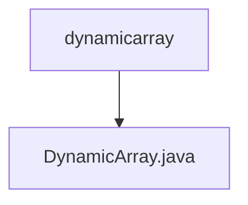

# 基础信息

|      |      |
|------|------|
| 名称 | dynamicarray |
| 编码语言 | .java |
| 代码路径 | Java/src/main/java/com/thealgorithms/datastructures/dynamicarray |
| 包名 | Java.src.main.java.com.thealgorithms.datastructures.dynamicarray |
| 概述说明 | 动态数组类支持增删改查，自动扩容，迭代器确保并发安全。 |

# 说明

动态数组类是一种数据结构，支持元素的增加、删除、修改和查询操作。该类具备自动扩容功能，能够在数组容量不足时自动扩展存储空间，以容纳更多元素。此外，动态数组类还提供了迭代器，确保在并发修改情况下操作的安全性，避免数据不一致或异常情况的发生。这种设计使得动态数组类在处理动态数据集合时既高效又可靠。

### 包内部结构视图

流程图描述：该流程图展示了路径层级关系，其中`dynamicarray`文件夹包含一个名为`DynamicArray.java`的文件。这种结构反映了典型的Java项目目录布局，动态数组数据结构实现文件位于特定的包路径下。

# 文件列表 File List

| 名称   | 类型  | 说明 |
|-------|------|-------------|
| [DynamicArray.java](DynamicArray.md) | file | 动态数组类支持增删改查，自动扩容，迭代器确保并发安全。 |

