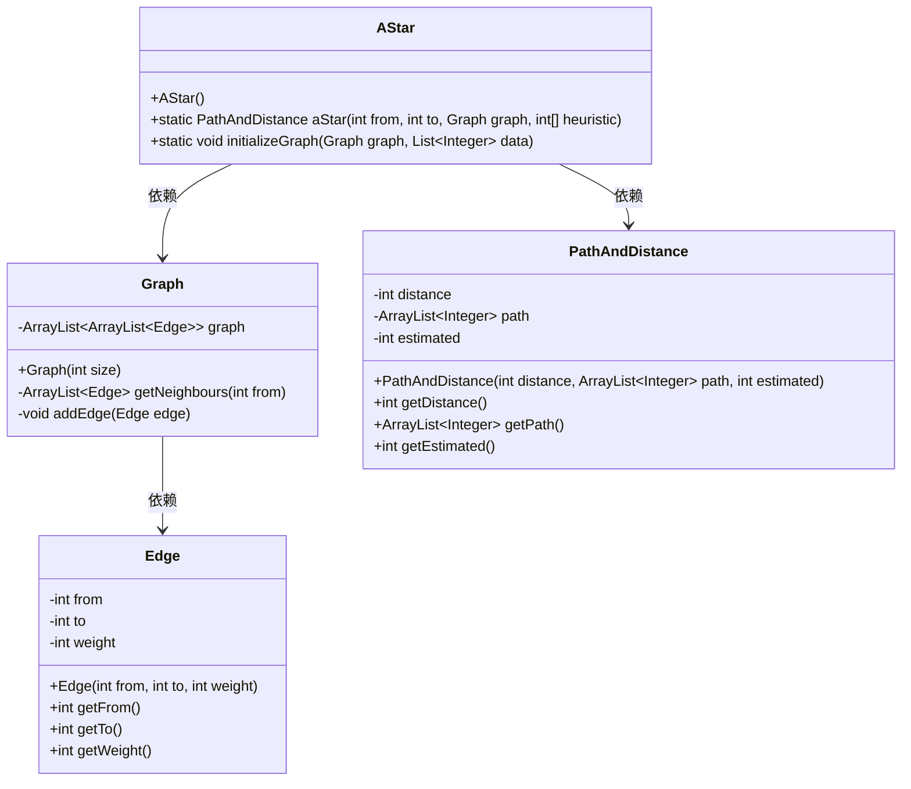

# 基础信息

|      |      |
|------|------|
| 名称 | AStar |
| 编码语言 | .java |
| 代码路径 | Java/src/main/java/com/thealgorithms/datastructures/graphs/AStar.java |
| 包名 | com.thealgorithms.datastructures.graphs |
| 依赖项 | ['java.util.ArrayList', 'java.util.Comparator', 'java.util.List', 'java.util.PriorityQueue'] |
| 概述说明 | AStar类实现A*算法，用于图中最短路径搜索，包含图结构、边和路径信息，使用优先队列探索节点。 |

# 说明

AStar类实现了A*算法，用于在图中查找最短路径。该类包含图结构、边和路径信息，通过优先队列探索节点，确保高效找到最优路径。

# 类列表 Class Summary

| 名称   | 类型  | 说明 |
|-------|------|-------------|
| AStar | class | AStar类实现A*算法，用于在图中查找最短路径。包含图结构、边和路径信息，通过优先队列探索节点。 |

## 类 AStar

|      |      |
|------|------|
| 访问范围 | public final |
| 类型 | class |
| 名称 | AStar |
| 说明 | AStar类实现A*算法，用于在图中查找最短路径。包含图结构、边和路径信息，通过优先队列探索节点。 |

### UML类图

### 描述
这段代码实现了一个A*路径搜索算法，用于在图中找到从起点到终点的最短路径。`AStar`类提供了初始化图和执行A*算法的静态方法。`Graph`类表示图的邻接表结构，`Edge`类表示图中的边，包含起点、终点和权重。`PathAndDistance`类用于存储路径信息，包括路径的总距离、路径节点列表和启发式估计值。A*算法通过优先队列探索节点，结合启发式估计值来选择最优路径。

### 内部方法调用关系图

```mermaid
graph TD
    A["类AStar"]
    B["私有构造方法: AStar()"]
    C["内部类Graph"]
    D["属性: ArrayList<ArrayList<Edge>> graph"]
    E["构造方法: Graph(int size)"]
    F["方法: ArrayList<Edge> getNeighbours(int from)"]
    G["方法: void addEdge(Edge edge)"]
    H["内部类Edge"]
    I["属性: int from"]
    J["属性: int to"]
    K["属性: int weight"]
    L["构造方法: Edge(int from, int to, int weight)"]
    M["方法: int getFrom()"]
    N["方法: int getTo()"]
    O["方法: int getWeight()"]
    P["内部类PathAndDistance"]
    Q["属性: int distance"]
    R["属性: ArrayList<Integer> path"]
    S["属性: int estimated"]
    T["构造方法: PathAndDistance(int distance, ArrayList<Integer> path, int estimated)"]
    U["方法: int getDistance()"]
    V["方法: ArrayList<Integer> getPath()"]
    W["方法: int getEstimated()"]
    X["方法: void initializeGraph(Graph graph, List<Integer> data)"]
    Y["方法: PathAndDistance aStar(int from, int to, Graph graph, int[] heuristic)"]
    Z["优先级队列: PriorityQueue<PathAndDistance> queue"]
    AA["循环: while (!queue.isEmpty() && !solutionFound)"]
    AB["条件判断: if (currentPosition == to)"]
    AC["更新路径: queue.add(new PathAndDistance(...))"]

    A --> B
    A --> C
    C --> D
    C --> E
    C --> F
    C --> G
    A --> H
    H --> I
    H --> J
    H --> K
    H --> L
    H --> M
    H --> N
    H --> O
    A --> P
    P --> Q
    P --> R
    P --> S
    P --> T
    P --> U
    P --> V
    P --> W
    A --> X
    A --> Y
    Y --> Z
    Y --> AA
    AA --> AB
    AA --> AC
```

这段代码实现了一个A*路径搜索算法，用于在图中找到从起点到终点的最短路径。代码包含三个内部类：`Graph`表示图的邻接表，`Edge`表示图中的边，`PathAndDistance`表示路径及其距离和启发式估计。`initializeGraph`方法用于初始化图，`aStar`方法实现了A*算法，通过优先级队列探索节点，并根据启发式估计和实际距离选择最优路径。

### 字段列表 Field List

| 名称  | 类型  | 说明 |
|-------|-------|------|

### 方法列表 Method List

| 名称  | 类型  | 说明 |
|-------|-------|------|
| aStar | PathAndDistance | A*算法实现，通过优先队列探索节点，结合启发式估计寻找最短路径。 |
| initializeGraph | void | 初始化图结构，每四个数据元素添加一条边。 |

