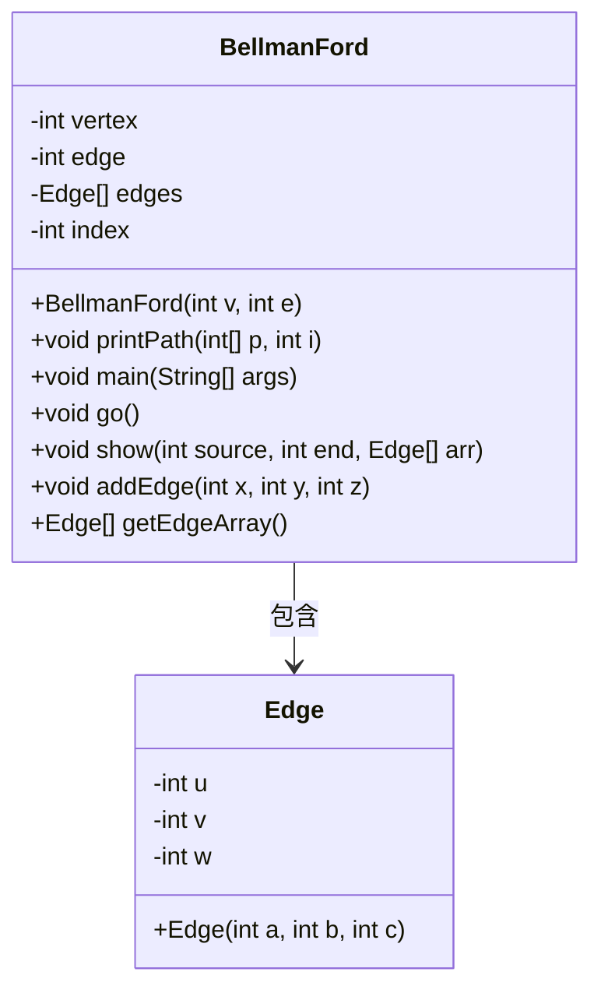
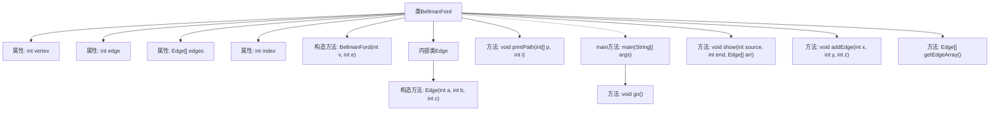

# 基础信息

|      |      |
|------|------|
| 名称 | BellmanFord |
| 编码语言 | .java |
| 代码路径 | Java/src/main/java/com/thealgorithms/datastructures/graphs/BellmanFord.java |
| 包名 | com.thealgorithms.datastructures.graphs |
| 依赖项 | ['java.util.Scanner'] |
| 概述说明 | BellmanFord算法检测负权环，计算并输出最短路径，支持边和顶点输入。 |

# 说明

BellmanFord算法实现用于检测图中是否存在负权环，并支持输入边和顶点信息。该算法通过迭代计算各顶点之间的最短路径，最终输出计算结果。若检测到负权环，算法会相应提示，确保路径计算的准确性和可靠性。

# 类列表 Class Summary

| 名称   | 类型  | 说明 |
|-------|------|-------------|
| BellmanFord | class | BellmanFord算法实现，检测负权环，支持输入边和顶点，计算最短路径并输出结果。 |

## 类 BellmanFord

|      |      |
|------|------|
| 访问范围 | None |
| 类型 | class |
| 名称 | BellmanFord |
| 说明 | BellmanFord算法实现，检测负权环，支持输入边和顶点，计算最短路径并输出结果。 |

### UML类图

### 描述
`BellmanFord` 类实现了 Bellman-Ford 算法，用于检测图中的负权环。该类包含一个内部类 `Edge`，用于表示图中的边。`BellmanFord` 类提供了多个方法，包括初始化图、添加边、计算最短路径、检测负权环以及输出路径等。`Edge` 类用于存储边的起点、终点和权重。`BellmanFord` 类通过 `Edge` 类来管理图中的边，并通过 `addEdge` 方法添加边，`getEdgeArray` 方法获取边的数组。`go` 和 `show` 方法分别用于交互式计算和显示结果。

### 内部方法调用关系图

这段代码实现了Bellman-Ford算法，用于检测图中的负权环。代码包含一个主类`BellmanFord`和一个内部类`Edge`。`BellmanFord`类通过构造方法初始化顶点和边的数量，并提供方法来添加边、执行算法、打印路径以及检测负权环。`go`方法通过用户输入构建图并执行算法，`show`方法则用于显示计算结果。`addEdge`方法用于添加边，`getEdgeArray`方法返回边数组。`printPath`方法递归打印路径。整个流程通过`main`方法启动。

### 字段列表 Field List

| 名称  | 类型  | 说明 |
|-------|-------|------|
| vertex | int | 定义整型变量vertex。 |
| edge | int | 定义了一个整型变量edge。 |
| edges | Edge[] | 私有边数组edges。 |
| index = 0 | int | 定义一个私有整型变量index并初始化为0。 |

### 方法列表 Method List

| 名称  | 类型  | 说明 |
|-------|-------|------|
| getEdgeArray | Edge[] | 返回边数组的方法。 |
| addEdge | void | 添加单向边，存储边信息。 |
| printPath | void | 递归打印路径，从当前节点回溯到父节点并输出。 |
| show | void | 展示图中从起点到终点的最短路径及距离，检测负权环。 |
| main | void | Java主方法创建BellmanFord对象并调用其go方法。 |
| go | void | 该代码实现最短路径算法，输入顶点和边，计算并输出最短路径及路径信息，检测负权环。 |

