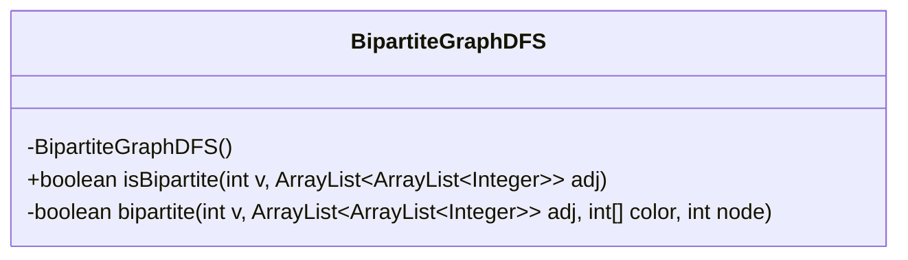
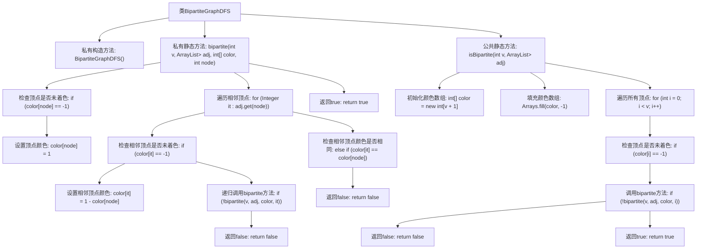

# 基础信息

|      |      |
|------|------|
| 名称 | BipartiteGraphDFS |
| 编码语言 | .java |
| 代码路径 | Java/src/main/java/com/thealgorithms/datastructures/graphs/BipartiteGraphDFS.java |
| 包名 | com.thealgorithms.datastructures.graphs |
| 依赖项 | ['java.util.ArrayList', 'java.util.Arrays'] |
| 概述说明 | BipartiteGraphDFS类利用DFS算法验证图的二分性，确保相邻节点颜色互异。 |

# 说明

BipartiteGraphDFS类使用深度优先搜索（DFS）算法来验证一个图是否为二分图。该算法通过遍历图中的节点，确保相邻节点被赋予不同的颜色，从而判断图是否满足二分图的条件。如果所有相邻节点的颜色都不同，则图是二分图；否则，图不是二分图。

# 类列表 Class Summary

| 名称   | 类型  | 说明 |
|-------|------|-------------|
| BipartiteGraphDFS | class | BipartiteGraphDFS类通过DFS检查图是否为二分图，确保相邻节点颜色不同。 |

## 类 BipartiteGraphDFS

|      |      |
|------|------|
| 访问范围 | public final |
| 类型 | class |
| 名称 | BipartiteGraphDFS |
| 说明 | BipartiteGraphDFS类通过DFS检查图是否为二分图，确保相邻节点颜色不同。 |

### UML类图

**描述：**
`BipartiteGraphDFS` 是一个工具类，用于检查图是否为二分图。它包含一个私有构造函数，防止类被实例化。类中的 `isBipartite` 方法接受顶点数和邻接表作为参数，返回图是否为二分图的布尔值。`bipartite` 是一个递归的辅助方法，用于深度优先搜索（DFS）并尝试为每个顶点着色，确保相邻顶点颜色不同。如果发现相邻顶点颜色相同，则图不是二分图。

### 内部方法调用关系图

这段代码实现了一个判断图是否为二分图的算法。通过深度优先搜索（DFS）遍历图的顶点，并为每个顶点着色，确保相邻顶点颜色不同。`isBipartite`方法初始化颜色数组并遍历所有顶点，调用`bipartite`方法进行DFS遍历和着色检查。`bipartite`方法递归地检查并着色顶点，若发现相邻顶点颜色相同则返回false，否则返回true。

### 字段列表 Field List

| 名称  | 类型  | 说明 |
|-------|-------|------|

### 方法列表 Method List

| 名称  | 类型  | 说明 |
|-------|-------|------|
| isBipartite | boolean | 判断图是否为二分图，通过着色法遍历所有节点。 |
| bipartite | boolean | 检查图是否为二分图，通过递归着色节点并验证邻接节点颜色。 |

