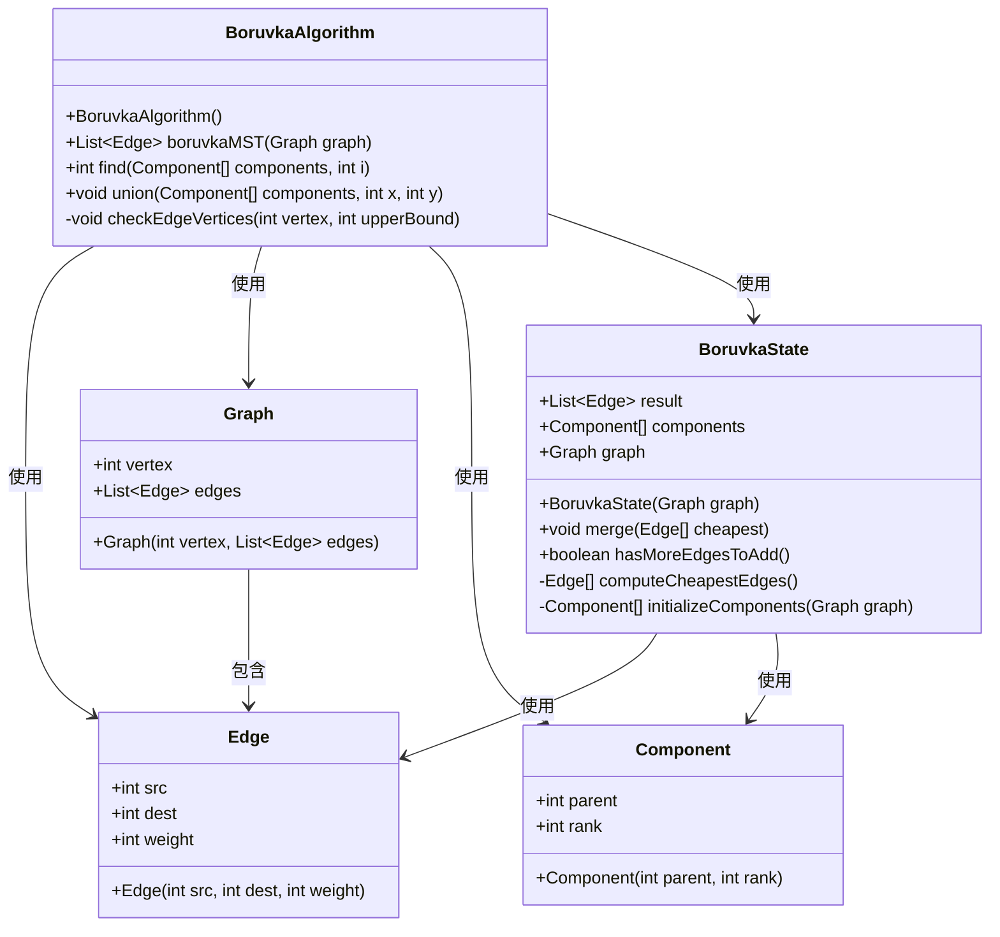

# 基础信息

|      |      |
|------|------|
| 名称 | BoruvkaAlgorithm |
| 编码语言 | .java |
| 代码路径 | Java/src/main/java/com/thealgorithms/datastructures/graphs/BoruvkaAlgorithm.java |
| 包名 | com.thealgorithms.datastructures.graphs |
| 依赖项 | ['java.util.ArrayList', 'java.util.List'] |
| 概述说明 | Boruvka算法实现最小生成树，涉及图结构、边定义、并查集操作及状态管理。 |

# 说明

Boruvka算法用于求解最小生成树，涉及图结构、边定义、并查集操作及状态管理。图结构表示节点和边的连接关系，边定义包括权重和连接节点。并查集用于管理节点的集合合并与查询，确保不形成环路。状态管理跟踪算法执行过程中的节点和边状态，确保每次迭代选择最小权重边并更新集合，直至所有节点连通形成最小生成树。

# 类列表 Class Summary

| 名称   | 类型  | 说明 |
|-------|------|-------------|
| BoruvkaAlgorithm | class | Boruvka算法实现最小生成树，包含图结构、边定义、并查集操作及状态管理。 |

## 类 BoruvkaAlgorithm

|      |      |
|------|------|
| 访问范围 | final |
| 类型 | class |
| 名称 | BoruvkaAlgorithm |
| 说明 | Boruvka算法实现最小生成树，包含图结构、边定义、并查集操作及状态管理。 |

### UML类图

这段代码实现了Boruvka算法，用于寻找图的最小生成树（MST）。`BoruvkaAlgorithm`类是该算法的主类，包含核心方法`boruvkaMST`。`Graph`类表示图的结构，包含顶点和边的列表。`Edge`类表示图中的边，包含源顶点、目标顶点和权重。`Component`类用于表示并查集（Union-Find）数据结构中的子集。`BoruvkaState`类用于管理算法的状态，包括结果边的列表和并查集的组件。通过这些类的协作，算法能够高效地找到图的最小生成树。

### 内部方法调用关系图

```mermaid
graph TD
    A["类BoruvkaAlgorithm"]
    B["内部类Edge"]
    C["属性: int src"]
    D["属性: int dest"]
    E["属性: int weight"]
    F["构造方法: Edge(int src, int dest, int weight)"]
    G["内部类Graph"]
    H["属性: int vertex"]
    I["属性: List<Edge> edges"]
    J["构造方法: Graph(int vertex, List<Edge> edges)"]
    K["方法: checkEdgeVertices(int vertex, int upperBound)"]
    L["内部类Component"]
    M["属性: int parent"]
    N["属性: int rank"]
    O["构造方法: Component(int parent, int rank)"]
    P["内部类BoruvkaState"]
    Q["属性: List<Edge> result"]
    R["属性: Component[] components"]
    S["属性: Graph graph"]
    T["构造方法: BoruvkaState(Graph graph)"]
    U["方法: merge(Edge[] cheapest)"]
    V["方法: hasMoreEdgesToAdd()"]
    W["方法: computeCheapestEdges()"]
    X["方法: initializeComponents(Graph graph)"]
    Y["静态方法: find(Component[] components, int i)"]
    Z["静态方法: union(Component[] components, int x, int y)"]
    AA["静态方法: boruvkaMST(Graph graph)"]
    AB["静态方法: checkEdgeVertices(int vertex, int upperBound)"]

    A --> B
    B --> C
    B --> D
    B --> E
    B --> F
    A --> G
    G --> H
    G --> I
    G --> J
    J --> K
    A --> L
    L --> M
    L --> N
    L --> O
    A --> P
    P --> Q
    P --> R
    P --> S
    P --> T
    P --> U
    P --> V
    P --> W
    W --> X
    A --> Y
    A --> Z
    A --> AA
    AA --> AB
```

这段代码实现了Boruvka算法，用于寻找图的最小生成树。代码包含多个内部类，如`Edge`表示图的边，`Graph`表示图的结构，`Component`用于Union-Find操作，`BoruvkaState`用于管理算法的状态。`boruvkaMST`方法是算法的入口，通过迭代查找最便宜的边并合并子集，最终返回最小生成树的边列表。流程图展示了类之间的关系和主要方法的调用顺序。

### 字段列表 Field List

| 名称  | 类型  | 说明 |
|-------|-------|------|

### 方法列表 Method List

| 名称  | 类型  | 说明 |
|-------|-------|------|
| union | void | 并查集合并操作，按秩优化，防止树过深。 |
| find | int | 递归查找组件父节点并路径压缩。 |
| checkEdgeVertices | void | 检查顶点是否在有效范围内，否则抛出异常。 |
| boruvkaMST | List<Edge> | Boruvka算法实现最小生成树，循环计算并合并最便宜边直至完成。 |

