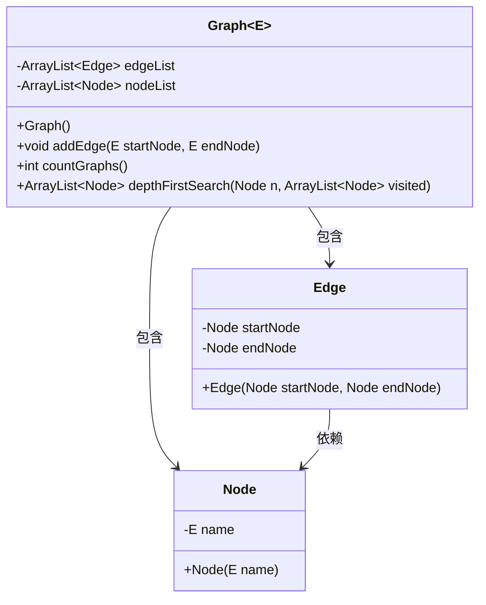
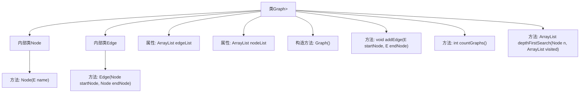
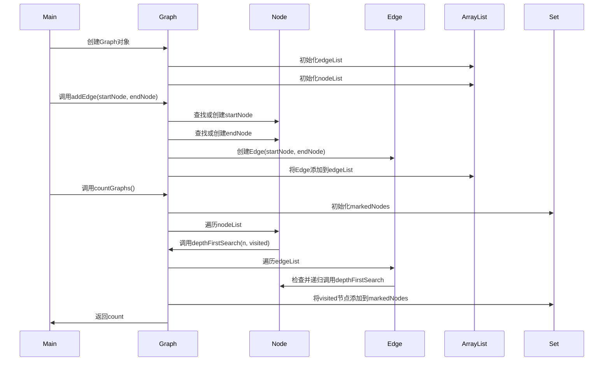
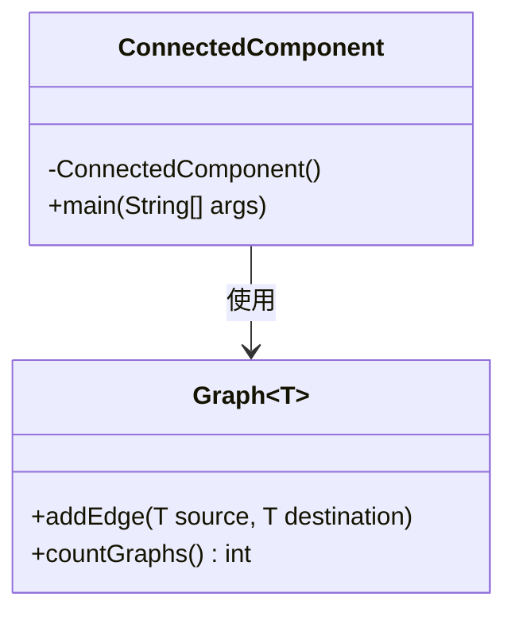

# 基础信息

|      |      |
|------|------|
| 名称 | ConnectedComponent |
| 编码语言 | .java |
| 代码路径 | Java/src/main/java/com/thealgorithms/datastructures/graphs/ConnectedComponent.java |
| 包名 | com.thealgorithms.datastructures.graphs |
| 依赖项 | ['java.util.ArrayList', 'java.util.HashSet', 'java.util.Set'] |
| 概述说明 | 图类管理节点和边，ConnectedComponent类统计字符与整数图数量。 |

# 说明

图类实现节点和边的管理，支持添加边和计算连通组件数量。ConnectedComponent类用于创建和统计字符与整数图的数量。图类提供添加边的功能，并能够计算图中的连通组件数量。ConnectedComponent类则专注于创建和统计由字符和整数构成的图的数量。这两个类共同协作，提供对图结构的全面管理和分析功能。

# 类列表 Class Summary

| 名称   | 类型  | 说明 |
|-------|------|-------------|
| Graph | class | 图类实现节点和边的管理，支持添加边和计算连通组件数量。 |
| ConnectedComponent | class | ConnectedComponent类用于创建和统计字符与整数图的数量。 |

## 类 Graph

|      |      |
|------|------|
| 访问范围 | None |
| 类型 | class |
| 名称 | Graph |
| 说明 | 图类实现节点和边的管理，支持添加边和计算连通组件数量。 |

### UML类图

这段代码定义了一个泛型类 `Graph<E>`，其中 `E` 是一个可比较的类型。`Graph` 类包含两个内部类 `Node` 和 `Edge`，分别表示图中的节点和边。`Graph` 类维护了一个节点列表 `nodeList` 和一个边列表 `edgeList`。`addEdge` 方法用于添加边，如果节点不在 `nodeList` 中，则会自动添加。`countGraphs` 方法用于计算图中的连通分量数量，通过深度优先搜索（DFS）实现。`depthFirstSearch` 方法是 DFS 的具体实现，用于遍历图并标记访问过的节点。

### 内部方法调用关系图

**描述：**  
该代码实现了一个图数据结构，包含节点（Node）和边（Edge）的内部类。Graph类提供了添加边（addEdge）、计算连通分量（countGraphs）和深度优先搜索（depthFirstSearch）的功能。addEdge方法确保节点存在并添加边，countGraphs方法通过深度优先搜索计算图的连通分量数量。深度优先搜索递归遍历图的节点，确保所有连通节点被标记。

### 字段列表 Field List

| 名称  | 类型  | 说明 |
|-------|-------|------|
| edgeList | ArrayList<Edge> | 存储Edge对象的动态数组。 |
| nodeList | ArrayList<Node> | 存储节点对象的动态数组。 |

### 方法列表 Method List

| 名称  | 类型  | 说明 |
|-------|-------|------|
| depthFirstSearch | ArrayList<Node> | 深度优先搜索算法，递归遍历节点并返回访问列表。 |
| countGraphs | int | 统计图中独立子图数量。 |
| addEdge | void | 该方法为图结构添加边，查找或创建节点并连接它们。 |

## 类 ConnectedComponent

|      |      |
|------|------|
| 访问范围 | public final |
| 类型 | class |
| 名称 | ConnectedComponent |
| 说明 | ConnectedComponent类用于创建和统计字符与整数图的数量。 |

### UML类图

类图描述：  
`ConnectedComponent` 是一个不可实例化的工具类，包含一个私有的构造函数和一个公有的 `main` 方法。`Graph` 是一个泛型类，提供了 `addEdge` 方法用于添加边，以及 `countGraphs` 方法用于计算图中连通分量的数量。`ConnectedComponent` 类依赖于 `Graph` 类来创建图并计算连通分量的数量。

### 内部方法调用关系图

```mermaid
graph TD
    A["类ConnectedComponent"]
    B["私有构造方法: ConnectedComponent()"]
    C["main方法: main(String[] args)"]
    D["创建Graph<Character>对象: graphChars"]
    E["添加边: graphChars.addEdge('a', 'b')"]
    F["添加边: graphChars.addEdge('a', 'e')"]
    G["添加边: graphChars.addEdge('b', 'e')"]
    H["添加边: graphChars.addEdge('b', 'c')"]
    I["添加边: graphChars.addEdge('c', 'd')"]
    J["添加边: graphChars.addEdge('d', 'a')"]
    K["添加边: graphChars.addEdge('x', 'y')"]
    L["添加边: graphChars.addEdge('x', 'z')"]
    M["添加边: graphChars.addEdge('w', 'w')"]
    N["创建Graph<Integer>对象: graphInts"]
    O["添加边: graphInts.addEdge(1, 2)"]
    P["添加边: graphInts.addEdge(2, 3)"]
    Q["添加边: graphInts.addEdge(2, 4)"]
    R["添加边: graphInts.addEdge(3, 5)"]
    S["添加边: graphInts.addEdge(7, 8)"]
    T["添加边: graphInts.addEdge(8, 10)"]
    U["添加边: graphInts.addEdge(10, 8)"]
    V["输出: System.out.println('Amount of different char-graphs: ' + graphChars.countGraphs())"]
    W["输出: System.out.println('Amount of different int-graphs: ' + graphInts.countGraphs())"]

    A --> B
    A -.-> C
    C --> D
    D --> E
    D --> F
    D --> G
    D --> H
    D --> I
    D --> J
    D --> K
    D --> L
    D --> M
    C --> N
    N --> O
    N --> P
    N --> Q
    N --> R
    N --> S
    N --> T
    N --> U
    C --> V
    C --> W
```

这段代码定义了一个`ConnectedComponent`类，主要用于创建两个图对象`graphChars`和`graphInts`，并分别添加边。最后，代码输出这两个图中不同连通图的数量。流程图展示了从类定义到方法调用，再到输出结果的完整流程，清晰地反映了代码的执行顺序和逻辑结构。

### 字段列表 Field List

| 名称  | 类型  | 说明 |
|-------|-------|------|

### 方法列表 Method List

| 名称  | 类型  | 说明 |
|-------|-------|------|
| main | void | Java代码创建字符和整数图，分别统计并输出不同图的数量。 |

