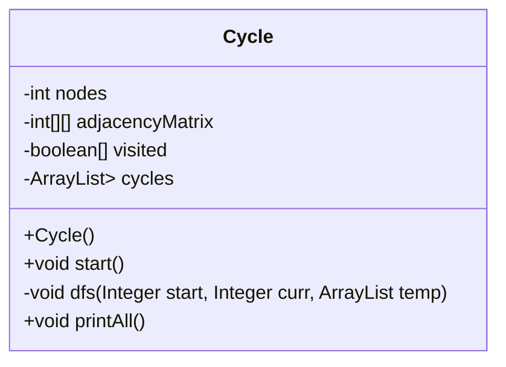
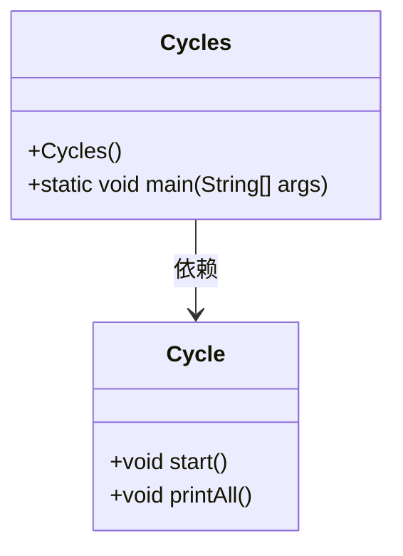
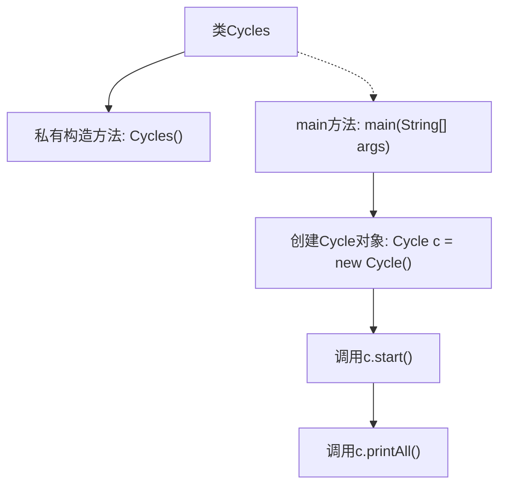

# 基础信息

|      |      |
|------|------|
| 名称 | Cycles |
| 编码语言 | .java |
| 代码路径 | Java/src/main/java/com/thealgorithms/datastructures/graphs/Cycles.java |
| 包名 | com.thealgorithms.datastructures.graphs |
| 依赖项 | ['java.util.ArrayList', 'java.util.Scanner'] |
| 概述说明 | Cycle类通过DFS检测图中的环，Cycles类调用其方法并输出结果。 |

# 说明

Cycle类用于检测图中的所有环，通过深度优先搜索（DFS）遍历邻接矩阵并记录环。Cycles类包含主方法，负责创建Cycle对象，并调用其start和printAll方法以启动环检测并输出所有检测到的环。

# 类列表 Class Summary

| 名称   | 类型  | 说明 |
|-------|------|-------------|
| Cycle | class | Cycle类用于检测图中的所有环，通过DFS遍历邻接矩阵并记录环。 |
| Cycles | class | Cycles类包含主方法，创建Cycle对象并调用其start和printAll方法。 |

## 类 Cycle

|      |      |
|------|------|
| 访问范围 | None |
| 类型 | class |
| 名称 | Cycle |
| 说明 | Cycle类用于检测图中的所有环，通过DFS遍历邻接矩阵并记录环。 |

### UML类图

**描述：**
`Cycle` 类用于检测图中的所有环。它通过深度优先搜索（DFS）算法遍历图中的节点，记录所有可能的环。类中包含私有成员变量如节点数、邻接矩阵、访问标记数组和环列表。公有方法包括构造函数 `Cycle()` 用于初始化图和输入数据，`start()` 方法用于启动环检测，`printAll()` 方法用于输出所有检测到的环。私有方法 `dfs()` 实现了DFS算法，递归地探索图中的路径以发现环。

### 内部方法调用关系图

```mermaid
graph TD
    A["类Cycle"]
    B["属性: int nodes"]
    C["属性: int[][] adjacencyMatrix"]
    D["属性: boolean[] visited"]
    E["属性: ArrayList<ArrayList<Integer>> cycles"]
    F["构造方法: Cycle()"]
    G["方法: void start()"]
    H["方法: void dfs(Integer start, Integer curr, ArrayList<Integer> temp)"]
    I["方法: void printAll()"]
    J["输入: Scanner in = new Scanner(System.in)"]
    K["输出: System.out.print('Enter the no. of nodes: ')"]
    L["输出: System.out.print('Enter the no. of Edges: ')"]
    M["输出: System.out.println('Enter the details of each edges <Start Node> <End Node>')"]
    N["输入: nodes = in.nextInt()"]
    O["输入: edges = in.nextInt()"]
    P["初始化: adjacencyMatrix = new int[nodes][nodes]"]
    Q["初始化: visited = new boolean[nodes]"]
    R["循环: for (int i = 0; i < nodes; i++)"]
    S["赋值: visited[i] = false"]
    T["循环: for (int i = 0; i < edges; i++)"]
    U["输入: start = in.nextInt()"]
    V["输入: end = in.nextInt()"]
    W["赋值: adjacencyMatrix[start][end] = 1"]
    X["关闭: in.close()"]
    Y["循环: for (int i = 0; i < nodes; i++)"]
    Z["初始化: ArrayList<Integer> temp = new ArrayList<>()"]
    AA["调用: dfs(i, i, temp)"]
    AB["循环: for (int j = 0; j < nodes; j++)"]
    AC["赋值: adjacencyMatrix[i][j] = 0"]
    AD["赋值: adjacencyMatrix[j][i] = 0"]
    AE["调用: temp.add(curr)"]
    AF["赋值: visited[curr] = true"]
    AG["循环: for (int i = 0; i < nodes; i++)"]
    AH["条件: if (adjacencyMatrix[curr][i] == 1)"]
    AI["条件: if (i == start)"]
    AJ["调用: cycles.add(new ArrayList<Integer>(temp))"]
    AK["条件: if (!visited[i])"]
    AL["调用: dfs(start, i, temp)"]
    AM["条件: if (temp.size() > 0)"]
    AN["调用: temp.remove(temp.size() - 1)"]
    AO["赋值: visited[curr] = false"]
    AP["循环: for (int i = 0; i < cycles.size(); i++)"]
    AQ["循环: for (int j = 0; j < cycles.get(i).size(); j++)"]
    AR["输出: System.out.print(cycles.get(i).get(j) + ' -> ')"]
    AS["输出: System.out.println(cycles.get(i).get(0))"]
    AT["输出: System.out.println()"]

    A --> B
    A --> C
    A --> D
    A --> E
    A --> F
    A --> G
    A --> H
    A --> I
    F --> J
    F --> K
    F --> L
    F --> M
    F --> N
    F --> O
    F --> P
    F --> Q
    F --> R
    R --> S
    F --> T
    T --> U
    T --> V
    T --> W
    F --> X
    G --> Y
    Y --> Z
    Y --> AA
    Y --> AB
    AB --> AC
    AB --> AD
    H --> AE
    H --> AF
    H --> AG
    AG --> AH
    AH --> AI
    AI --> AJ
    AH --> AK
    AK --> AL
    H --> AM
    AM --> AN
    H --> AO
    I --> AP
    AP --> AQ
    AQ --> AR
    AP --> AS
    AP --> AT
```

这段代码实现了一个用于检测图中所有环路的类`Cycle`。通过深度优先搜索（DFS）算法，代码首先构建邻接矩阵表示图结构，然后从每个节点开始搜索环路，并将找到的环路存储在`cycles`列表中。最后，`printAll`方法输出所有找到的环路。流程图详细展示了类的构造方法、DFS搜索过程以及环路的输出步骤。

### 字段列表 Field List

| 名称  | 类型  | 说明 |
|-------|-------|------|
| cycles = new ArrayList<ArrayList<Integer>>() | ArrayList<ArrayList<Integer>> | 创建包含整数列表的列表对象。 |
| nodes | int | 私有整型变量nodes用于存储节点数量。 |
| adjacencyMatrix | int[][] | 私有二维整型数组用于存储邻接矩阵。 |
| visited | boolean[] | 声明一个私有的布尔数组变量visited。 |

### 方法列表 Method List

| 名称  | 类型  | 说明 |
|-------|-------|------|
| start | void | 遍历节点，深度优先搜索并清空邻接矩阵。 |
| dfs | void | 深度优先搜索查找图中环，记录路径并回溯。 |
| printAll | void | 该方法遍历并打印二维列表中的所有元素，每行以首元素结尾。 |

## 类 Cycles

|      |      |
|------|------|
| 访问范围 | public final |
| 类型 | class |
| 名称 | Cycles |
| 说明 | Cycles类包含主方法，创建Cycle对象并调用其start和printAll方法。 |

### UML类图

这段代码定义了一个名为 `Cycles` 的类，该类包含一个私有的构造函数和一个公有的静态 `main` 方法。`Cycles` 类依赖于 `Cycle` 类，`Cycle` 类有两个公有方法：`start` 和 `printAll`。在 `main` 方法中，创建了一个 `Cycle` 对象并调用了其 `start` 和 `printAll` 方法。代码的主要作用是启动一个循环并打印所有相关的内容。

### 内部方法调用关系图

这段代码定义了一个名为 `Cycles` 的最终类，包含一个私有构造方法和一个 `main` 方法。`main` 方法首先创建了一个 `Cycle` 对象，然后依次调用了该对象的 `start` 和 `printAll` 方法。流程图清晰地展示了代码的执行顺序和类方法的调用关系。

### 字段列表 Field List

| 名称  | 类型  | 说明 |
|-------|-------|------|

### 方法列表 Method List

| 名称  | 类型  | 说明 |
|-------|-------|------|
| main | void | Java主方法创建Cycle对象并调用其start和printAll方法。 |

