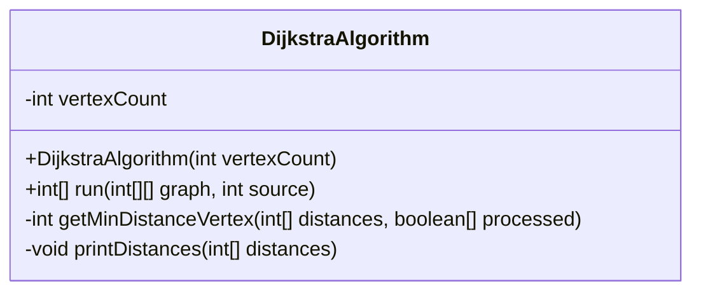
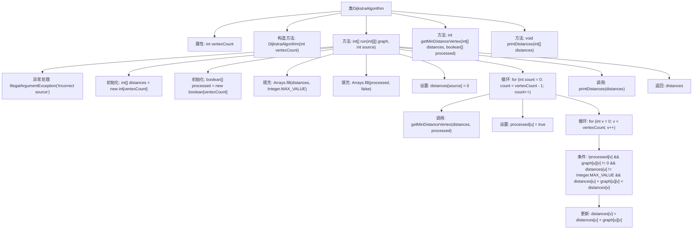

# 基础信息

|      |      |
|------|------|
| 名称 | DijkstraAlgorithm |
| 编码语言 | .java |
| 代码路径 | Java/src/main/java/com/thealgorithms/datastructures/graphs/DijkstraAlgorithm.java |
| 包名 | com.thealgorithms.datastructures.graphs |
| 依赖项 | ['java.util.Arrays'] |
| 概述说明 | Dijkstra算法用于计算图中源点到各顶点的最短路径。 |

# 说明

Dijkstra算法是一种用于计算图中从源点到各顶点最短路径的经典算法。该算法通过逐步扩展路径并更新各顶点的最短距离来实现目标。它适用于带权有向图或无向图，且要求图中边的权重为非负值。算法首先初始化源点到自身的距离为0，其他顶点到源点的距离为无穷大。然后，从源点开始，每次选择当前距离最小的未处理顶点，更新其邻接顶点的距离。这一过程重复进行，直到所有顶点的最短路径被确定。Dijkstra算法的时间复杂度取决于图的表示方式和优先队列的实现，通常为O(V^2)或O(E log V)，其中V为顶点数，E为边数。

# 类列表 Class Summary

| 名称   | 类型  | 说明 |
|-------|------|-------------|
| DijkstraAlgorithm | class | Dijkstra算法实现，计算图中源点到各顶点的最短路径。 |

## 类 DijkstraAlgorithm

|      |      |
|------|------|
| 访问范围 | public |
| 类型 | class |
| 名称 | DijkstraAlgorithm |
| 说明 | Dijkstra算法实现，计算图中源点到各顶点的最短路径。 |

### UML类图

**描述：**  
`DijkstraAlgorithm` 类实现了 Dijkstra 算法，用于在图中查找从源顶点到所有其他顶点的最短路径。类中包含一个构造函数用于初始化顶点数量，`run` 方法用于执行算法并返回最短路径数组，`getMinDistanceVertex` 方法用于找到未处理顶点中距离最小的顶点，`printDistances` 方法用于打印最终的最短路径结果。

### 内部方法调用关系图

这段代码实现了Dijkstra算法，用于在图中找到从源点到所有其他顶点的最短路径。代码首先初始化距离数组和已处理数组，然后通过循环找到未处理顶点中距离最小的顶点，并更新其邻接顶点的距离。最后，打印出每个顶点到源点的最短距离并返回距离数组。

### 字段列表 Field List

| 名称  | 类型  | 说明 |
|-------|-------|------|
| vertexCount | int | 私有整型变量vertexCount用于存储顶点数量。 |

### 方法列表 Method List

| 名称  | 类型  | 说明 |
|-------|-------|------|
| printDistances | void | 打印顶点及其距离的私有方法。 |
| getMinDistanceVertex | int | 获取未处理顶点中距离最小的顶点索引。 |
| run | int[] | 计算图中从源点到各顶点的最短路径并返回距离数组。 |

