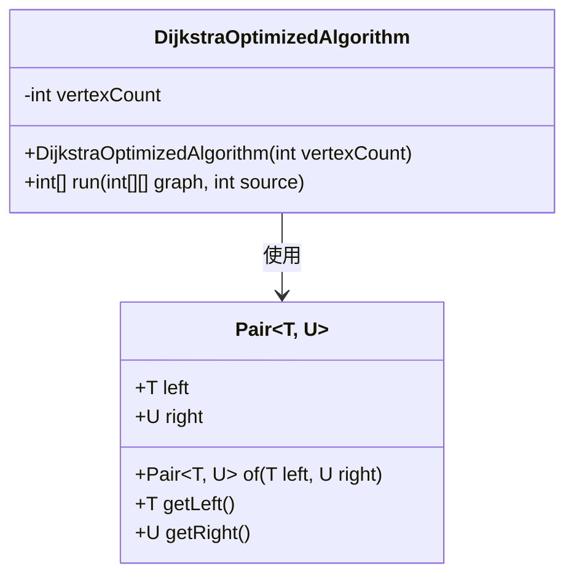
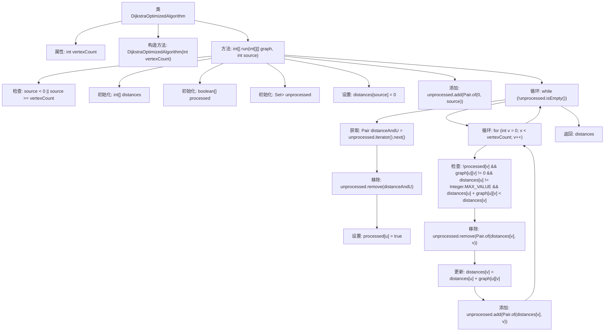

# 基础信息

|      |      |
|------|------|
| 名称 | DijkstraOptimizedAlgorithm |
| 编码语言 | .java |
| 代码路径 | Java/src/main/java/com/thealgorithms/datastructures/graphs/DijkstraOptimizedAlgorithm.java |
| 包名 | com.thealgorithms.datastructures.graphs |
| 依赖项 | ['java.util.Arrays', 'java.util.Set', 'java.util.TreeSet', 'org.apache.commons.lang3.tuple.Pair'] |
| 概述说明 | Dijkstra算法优化，利用邻接矩阵求源点到各顶点最短路径。 |

# 说明

Dijkstra优化算法是一种用于计算图中从源点到各顶点最短路径的方法。该算法通过邻接矩阵来表示图的结构，邻接矩阵中的元素表示顶点之间的边及其权重。算法从源点开始，逐步扩展到其他顶点，通过比较和更新路径长度来确定最短路径。在每一步中，算法选择当前距离源点最近的未处理顶点，并更新其邻接顶点的距离。通过这种方式，Dijkstra算法确保找到从源点到所有其他顶点的最短路径。优化后的Dijkstra算法通过减少不必要的计算和存储开销，提高了算法的效率和性能。

# 类列表 Class Summary

| 名称   | 类型  | 说明 |
|-------|------|-------------|
| DijkstraOptimizedAlgorithm | class | Dijkstra优化算法，通过邻接矩阵计算源点到各顶点的最短路径。 |

## 类 DijkstraOptimizedAlgorithm

|      |      |
|------|------|
| 访问范围 | public |
| 类型 | class |
| 名称 | DijkstraOptimizedAlgorithm |
| 说明 | Dijkstra优化算法，通过邻接矩阵计算源点到各顶点的最短路径。 |

### UML类图

这段代码实现了一个优化的Dijkstra算法，用于在图中找到从源节点到所有其他节点的最短路径。`DijkstraOptimizedAlgorithm`类包含一个构造函数和一个`run`方法，`run`方法接收一个邻接矩阵表示的图和源节点，返回一个包含最短路径距离的数组。`Pair`类用于存储距离和节点的对，并在算法中用于管理未处理的节点。

### 内部方法调用关系图

这段代码实现了一个优化的Dijkstra算法，用于在加权图中找到从源顶点到所有其他顶点的最短路径。代码首先初始化距离数组和处理标记数组，然后使用优先队列（`TreeSet`）来管理未处理的顶点。在每次迭代中，算法选择当前距离最小的顶点，更新其邻居顶点的距离，并将这些邻居重新加入队列。最终，算法返回一个包含从源顶点到所有其他顶点最短距离的数组。

### 字段列表 Field List

| 名称  | 类型  | 说明 |
|-------|-------|------|
| vertexCount | int | 私有整型变量vertexCount。 |

### 方法列表 Method List

| 名称  | 类型  | 说明 |
|-------|-------|------|
| run | int[] | 实现Dijkstra算法计算图中节点到源点的最短路径。 |

