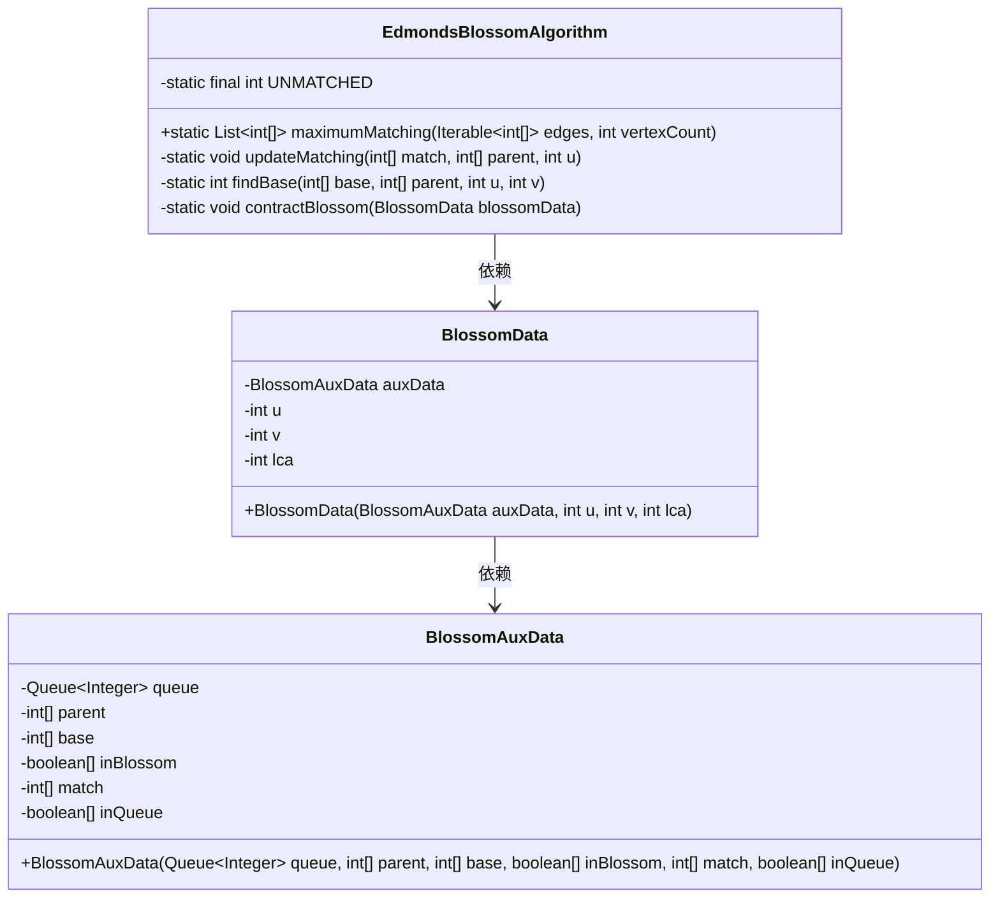
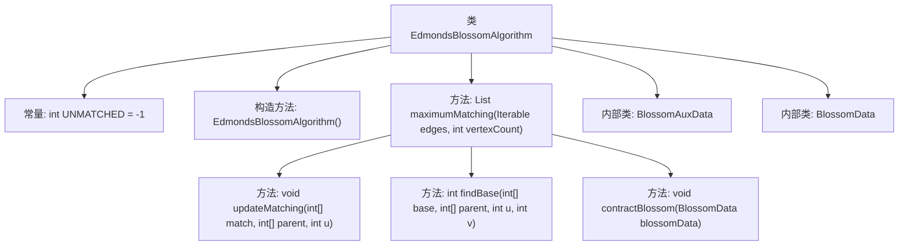
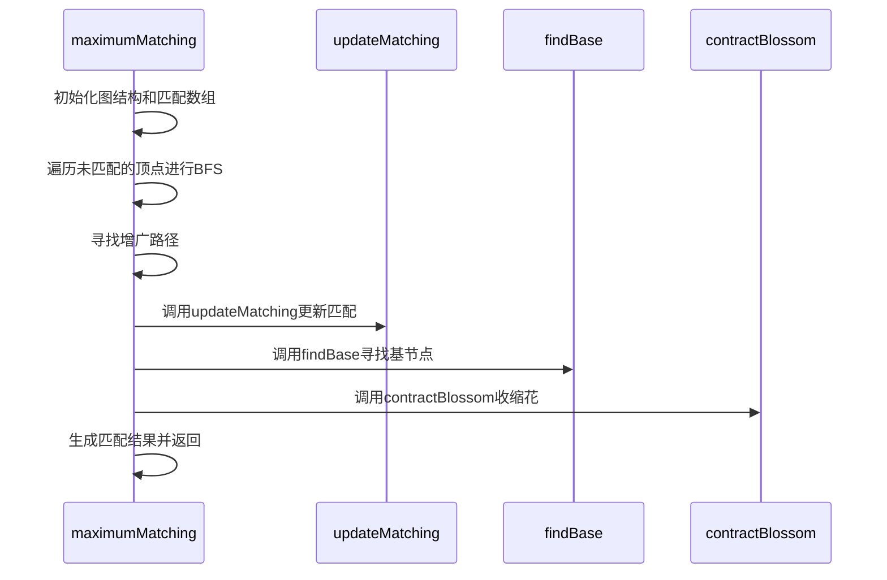

# 基础信息

|      |      |
|------|------|
| 名称 | EdmondsBlossomAlgorithm |
| 编码语言 | .java |
| 代码路径 | Java/src/main/java/com/thealgorithms/datastructures/graphs/EdmondsBlossomAlgorithm.java |
| 包名 | com.thealgorithms.datastructures.graphs |
| 依赖项 | ['java.util.ArrayList', 'java.util.Arrays', 'java.util.LinkedList', 'java.util.List', 'java.util.Queue'] |
| 概述说明 | Edmonds Blossom算法利用BFS和花收缩实现图的最大匹配。 |

# 说明

Edmonds Blossom算法用于解决图的最大匹配问题，通过广度优先搜索（BFS）和花收缩技术实现。该算法首先使用BFS遍历图，寻找增广路径。当发现奇环（即花）时，通过花收缩将其简化，避免重复处理。花收缩将奇环压缩为单个节点，保持图的匹配性质不变。通过反复应用BFS和花收缩，算法最终找到图的最大匹配。该方法适用于一般图，并能有效处理复杂环结构。

# 类列表 Class Summary

| 名称   | 类型  | 说明 |
|-------|------|-------------|
| EdmondsBlossomAlgorithm | class | Edmonds Blossom算法实现图的最大匹配，通过BFS和花收缩处理。 |

## 类 EdmondsBlossomAlgorithm

|      |      |
|------|------|
| 访问范围 | public final |
| 类型 | class |
| 名称 | EdmondsBlossomAlgorithm |
| 说明 | Edmonds Blossom算法实现图的最大匹配，通过BFS和花收缩处理。 |

### UML类图

该代码实现了Edmonds Blossom算法，用于在一般图中找到最大匹配。`EdmondsBlossomAlgorithm`类包含核心逻辑，如初始化图、BFS遍历、更新匹配和收缩花（Blossom）。`BlossomAuxData`和`BlossomData`类用于封装与花操作相关的辅助数据。通过这些类的协作，算法能够高效地处理复杂的图结构，并找到最大匹配。

### 内部方法调用关系图

这段代码实现了Edmonds的Blossom算法，用于在一般图中寻找最大匹配。算法通过BFS遍历未匹配的顶点，寻找增广路径，并在发现花（Blossom）时进行收缩操作。代码中包含了多个辅助方法和内部类，用于处理匹配更新、基节点查找和花收缩等操作。最终，算法返回一个包含所有匹配对的列表。

### 字段列表 Field List

| 名称  | 类型  | 说明 |
|-------|-------|------|
| UNMATCHED = -1 | int | 定义私有静态常量UNMATCHED，值为-1。 |

### 方法列表 Method List

| 名称  | 类型  | 说明 |
|-------|-------|------|
| updateMatching | void | 更新匹配关系，通过父节点数组调整匹配对。 |
| maximumMatching | List<int[]> | 实现最大匹配算法，通过BFS寻找增广路径并更新匹配结果。 |
| contractBlossom | void | 私有方法contractBlossom通过遍历更新BlossomData中的基础值和队列。 |
| findBase | int | 该方法通过遍历标记u的祖先，再查找v的公共祖先，返回共同节点。 |

