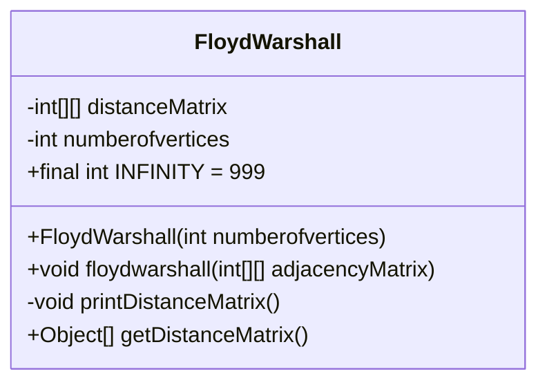
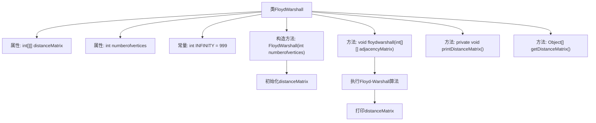

# 基础信息

|      |      |
|------|------|
| 名称 | FloydWarshall |
| 编码语言 | .java |
| 代码路径 | Java/src/main/java/com/thealgorithms/datastructures/graphs/FloydWarshall.java |
| 包名 | com.thealgorithms.datastructures.graphs |
| 依赖项 | [] |
| 概述说明 | FloydWarshall类实现Floyd-Warshall算法，计算所有顶点对的最短路径并输出距离矩阵。 |

# 说明

FloydWarshall类实现了Floyd-Warshall算法，该算法用于计算图中所有顶点对之间的最短路径。通过动态规划的方法，该算法逐步更新距离矩阵，最终得到每对顶点之间的最短路径长度。FloydWarshall类的主要功能是处理输入图，执行算法逻辑，并输出最终的距离矩阵，该矩阵包含了图中所有顶点对的最短路径信息。该算法适用于包含负权边的图，但不能处理存在负权环的情况。

# 类列表 Class Summary

| 名称   | 类型  | 说明 |
|-------|------|-------------|
| FloydWarshall | class | FloydWarshall类实现Floyd-Warshall算法，计算图中所有顶点对的最短路径，并输出距离矩阵。 |

## 类 FloydWarshall

|      |      |
|------|------|
| 访问范围 | public |
| 类型 | class |
| 名称 | FloydWarshall |
| 说明 | FloydWarshall类实现Floyd-Warshall算法，计算图中所有顶点对的最短路径，并输出距离矩阵。 |

### UML类图

类图描述：
`FloydWarshall` 类实现了弗洛伊德-沃舍尔算法，用于计算图中所有顶点对之间的最短路径。该类包含一个距离矩阵 `distanceMatrix` 和顶点数量 `numberofvertices`。构造函数初始化距离矩阵，`floydwarshall` 方法执行算法并更新距离矩阵，`printDistanceMatrix` 方法用于打印最终的距离矩阵，`getDistanceMatrix` 方法返回距离矩阵。该类通过三重循环动态更新最短路径，最终输出结果。

### 内部方法调用关系图

这段代码实现了Floyd-Warshall算法，用于计算图中所有顶点对之间的最短路径。类`FloydWarshall`包含一个距离矩阵`distanceMatrix`和顶点数量`numberofvertices`。构造方法初始化距离矩阵，`floydwarshall`方法执行算法并更新距离矩阵，`printDistanceMatrix`方法打印最终的距离矩阵，`getDistanceMatrix`方法返回距离矩阵。流程图展示了类的结构和方法的调用关系。

### 字段列表 Field List

| 名称  | 类型  | 说明 |
|-------|-------|------|
| numberofvertices | int | 定义一个私有整型变量，用于存储顶点数量。 |
| INFINITY = 999 | int | 定义常量INFINITY，值为999。 |
| distanceMatrix | int[][] | 私有二维整型数组存储距离矩阵。 |

### 方法列表 Method List

| 名称  | 类型  | 说明 |
|-------|-------|------|
| getDistanceMatrix | Object[] | 返回距离矩阵数组。 |
| floydwarshall | void | Floyd-Warshall算法实现，计算所有顶点间最短路径并更新距离矩阵。 |
| printDistanceMatrix | void | 打印顶点距离矩阵，包含顶点编号及对应距离值。 |

