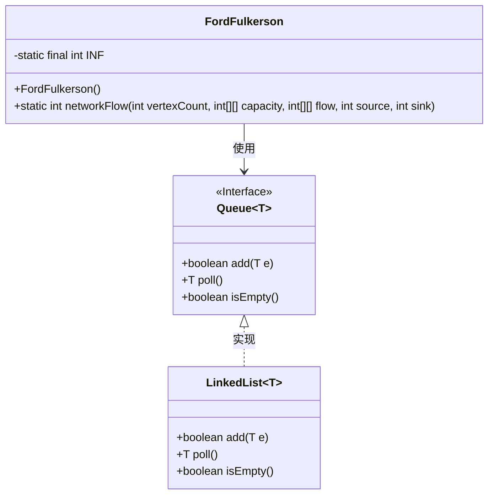
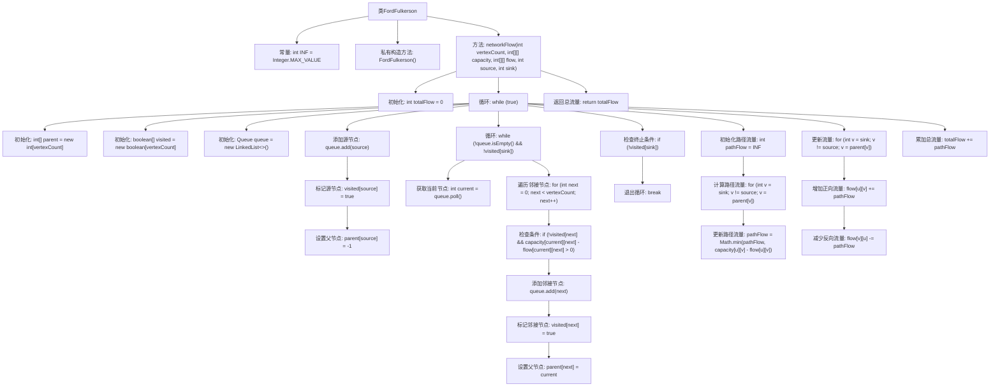

# 基础信息

|      |      |
|------|------|
| 名称 | FordFulkerson |
| 编码语言 | .java |
| 代码路径 | Java/src/main/java/com/thealgorithms/datastructures/graphs/FordFulkerson.java |
| 包名 | com.thealgorithms.datastructures.graphs |
| 依赖项 | ['java.util.LinkedList', 'java.util.Queue'] |
| 概述说明 | Ford-Fulkerson算法用于计算网络中的最大流量。 |

# 说明

Ford-Fulkerson算法是一种用于计算网络最大流的经典方法。该算法通过不断寻找增广路径来增加流量，直到无法找到新的增广路径为止。增广路径是指从源点到汇点的路径，其上的剩余容量大于零。在每次找到增广路径后，算法会更新路径上的流量，并调整剩余容量。最终，当所有可能的增广路径都被遍历后，算法停止并返回网络的最大流值。该算法的关键在于如何高效地寻找增广路径，通常使用深度优先搜索或广度优先搜索来实现。

# 类列表 Class Summary

| 名称   | 类型  | 说明 |
|-------|------|-------------|
| FordFulkerson | class | Ford-Fulkerson算法实现，计算网络最大流。 |

## 类 FordFulkerson

|      |      |
|------|------|
| 访问范围 | public final |
| 类型 | class |
| 名称 | FordFulkerson |
| 说明 | Ford-Fulkerson算法实现，计算网络最大流。 |

### UML类图

这段代码实现了Ford-Fulkerson算法，用于计算流网络中的最大流。`FordFulkerson`类包含一个静态方法`networkFlow`，该方法通过广度优先搜索（BFS）寻找增广路径，并更新流值，直到无法找到新的增广路径为止。代码中使用了`Queue`接口和其实现类`LinkedList`来管理待处理的顶点。通过不断调整流值，最终计算出从源点到汇点的最大流。

### 内部方法调用关系图

这段代码实现了Ford-Fulkerson算法，用于计算流网络中的最大流量。算法通过不断寻找增广路径来增加流量，直到无法找到新的增广路径为止。代码初始化了父节点数组和访问标记数组，使用广度优先搜索（BFS）来寻找增广路径，并更新流量矩阵。最终返回从源节点到汇节点的最大流量。

### 字段列表 Field List

| 名称  | 类型  | 说明 |
|-------|-------|------|
| INF = Integer.MAX_VALUE | int | 定义私有静态常量INF为整型最大值。 |

### 方法列表 Method List

| 名称  | 类型  | 说明 |
|-------|-------|------|
| networkFlow | int | 网络流算法计算源点到汇点的最大流量。 |

