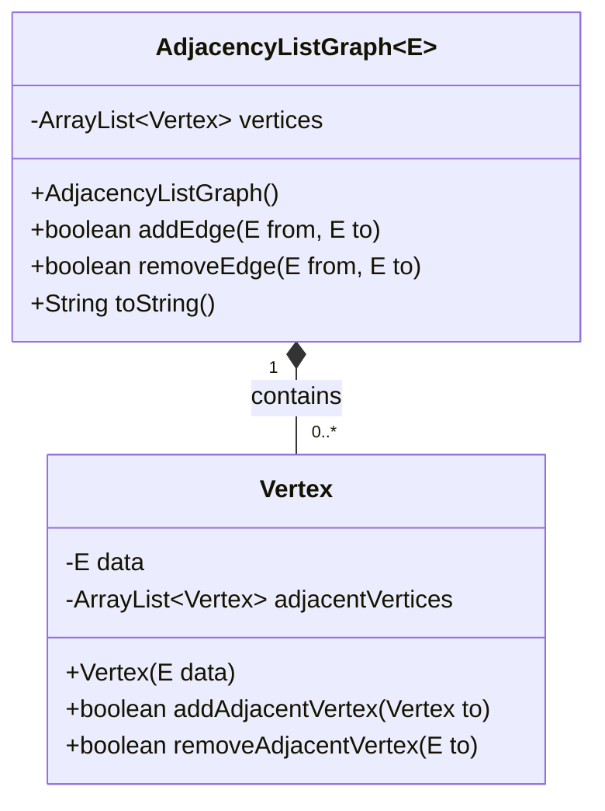
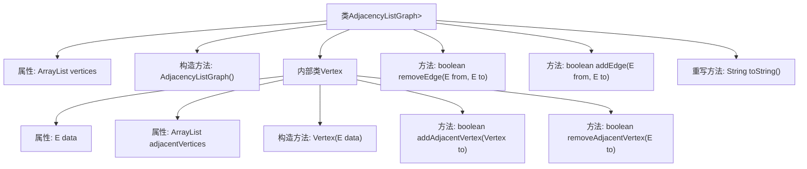
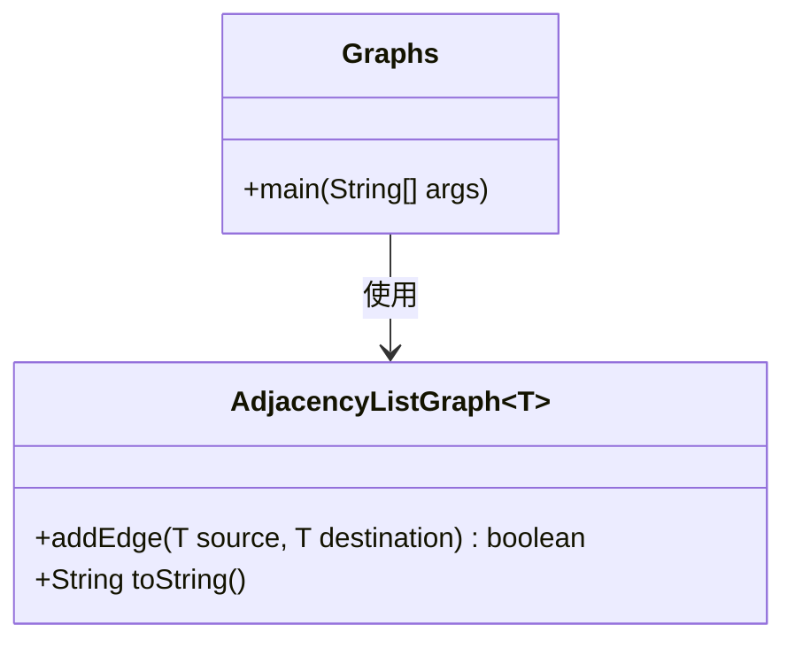
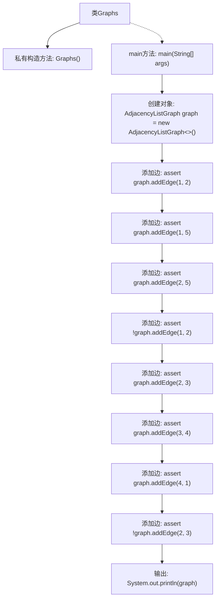

# 基础信息

|      |      |
|------|------|
| 名称 | Graphs |
| 编码语言 | .java |
| 代码路径 | Java/src/main/java/com/thealgorithms/datastructures/graphs/Graphs.java |
| 包名 | com.thealgorithms.datastructures.graphs |
| 依赖项 | ['java.util.ArrayList'] |
| 概述说明 | AdjacencyListGraph类实现图结构，支持边和顶点操作，Graphs类测试添加边功能。 |

# 说明

AdjacencyListGraph类实现了基于邻接表的图结构，支持添加和删除边与顶点，并提供图的结构描述功能。Graphs类用于测试邻接表图中添加边的功能，验证其正确性和稳定性。

# 类列表 Class Summary

| 名称   | 类型  | 说明 |
|-------|------|-------------|
| AdjacencyListGraph | class | AdjacencyListGraph类实现基于邻接表的图结构，支持添加、删除边和顶点，并提供图的结构描述。 |
| Graphs | class | Graphs类测试邻接表图添加边的功能。 |

## 类 AdjacencyListGraph

|      |      |
|------|------|
| 访问范围 | None |
| 类型 | class |
| 名称 | AdjacencyListGraph |
| 说明 | AdjacencyListGraph类实现基于邻接表的图结构，支持添加、删除边和顶点，并提供图的结构描述。 |

### UML类图

这段代码定义了一个基于邻接表的图数据结构 `AdjacencyListGraph`，其中包含一个内部类 `Vertex` 用于表示图的顶点。`AdjacencyListGraph` 类管理所有顶点，并提供了添加和删除边的方法。`Vertex` 类表示图中的单个顶点，包含顶点数据及其邻接顶点列表，并提供了添加和删除邻接顶点的方法。该图结构适用于处理有向图或无向图，并通过 `toString` 方法提供了图的文本描述。

### 内部方法调用关系图

这段代码定义了一个泛型类 `AdjacencyListGraph`，用于表示基于邻接表的图结构。类中包含一个内部类 `Vertex`，用于表示图中的顶点。`AdjacencyListGraph` 提供了添加边、删除边、以及生成图的字符串表示的方法。每个顶点包含一个数据项和一个邻接顶点列表。代码通过比较顶点数据来管理边的添加和删除，并确保边的唯一性。

### 字段列表 Field List

| 名称  | 类型  | 说明 |
|-------|-------|------|
| vertices | ArrayList<Vertex> | ArrayList存储顶点对象的集合。 |

### 方法列表 Method List

| 名称  | 类型  | 说明 |
|-------|-------|------|
| toString | String | 重写toString方法，输出顶点及其相邻顶点数据。 |
| removeEdge | boolean | 移除图中从节点from到节点to的边，若成功返回true，否则false。 |
| addEdge | boolean | 方法`addEdge`检查并添加顶点间的边，若顶点不存在则创建并添加。 |

## 类 Graphs

|      |      |
|------|------|
| 访问范围 | public final |
| 类型 | class |
| 名称 | Graphs |
| 说明 | Graphs类测试邻接表图添加边的功能。 |

### UML类图

这段代码定义了一个`Graphs`类，其中包含一个`main`方法用于测试`AdjacencyListGraph`类的功能。`AdjacencyListGraph`是一个泛型类，提供了`addEdge`方法来添加边，并返回一个布尔值表示是否成功。`toString`方法用于打印图的结构。`Graphs`类通过`main`方法创建了一个`AdjacencyListGraph`实例，并多次调用`addEdge`方法来添加边，最后打印图的内容。

### 内部方法调用关系图

这段代码定义了一个名为`Graphs`的类，其中包含一个私有构造方法和一个`main`方法。在`main`方法中，创建了一个`AdjacencyListGraph`对象，并多次调用`addEdge`方法向图中添加边。每次添加边后，使用`assert`语句验证操作是否成功。最后，输出图的内容。流程图展示了代码的执行顺序，从创建对象到添加边，再到最终输出。

### 字段列表 Field List

| 名称  | 类型  | 说明 |
|-------|-------|------|

### 方法列表 Method List

| 名称  | 类型  | 说明 |
|-------|-------|------|
| main | void | Java代码创建邻接表图并添加边，验证边添加结果。 |

