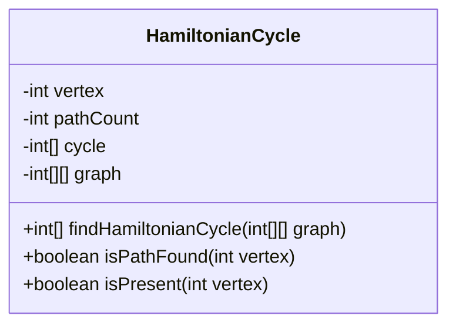
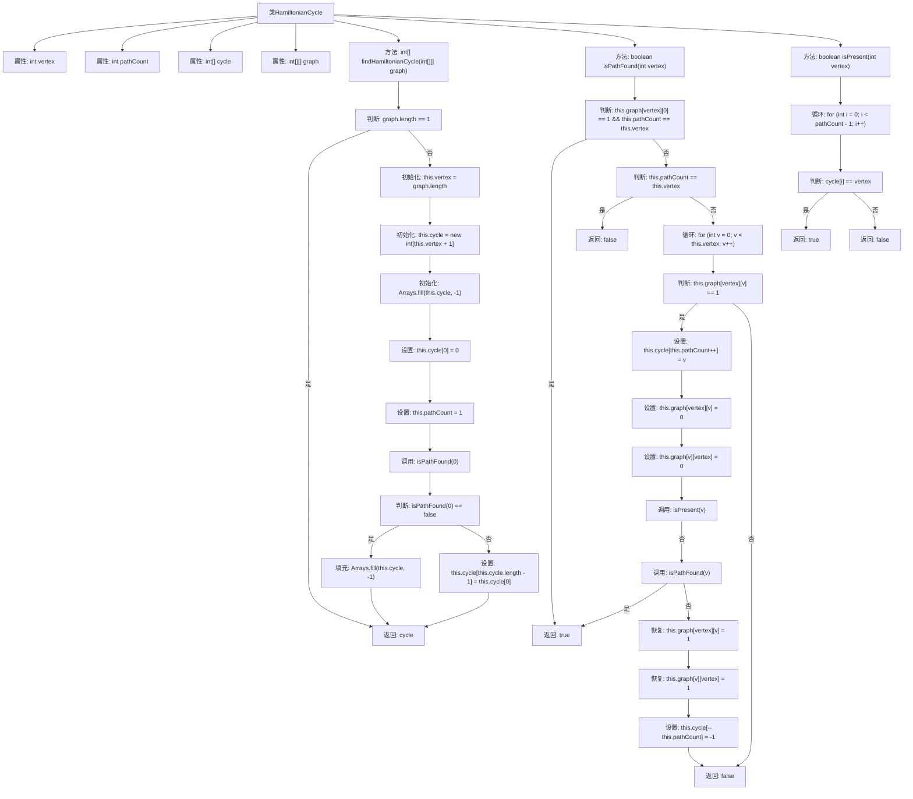

# 基础信息

|      |      |
|------|------|
| 名称 | HamiltonianCycle |
| 编码语言 | .java |
| 代码路径 | Java/src/main/java/com/thealgorithms/datastructures/graphs/HamiltonianCycle.java |
| 包名 | com.thealgorithms.datastructures.graphs |
| 依赖项 | ['java.util.Arrays'] |
| 概述说明 | HamiltonianCycle类递归搜索邻接矩阵寻找哈密顿环，找到返回顶点序列，否则返回-1。 |

# 说明

HamiltonianCycle类采用递归方法遍历图的邻接矩阵，以寻找是否存在哈密顿环。如果成功找到哈密顿环，该类将返回环中顶点的序列；如果未找到，则返回-1。该过程通过系统地检查图中的所有可能路径，确保能够确定是否存在一个经过每个顶点一次且仅一次的闭合环。

# 类列表 Class Summary

| 名称   | 类型  | 说明 |
|-------|------|-------------|
| HamiltonianCycle | class | HamiltonianCycle类通过递归搜索图的邻接矩阵，寻找哈密顿环。若找到，返回环的顶点序列；否则返回-1。 |

## 类 HamiltonianCycle

|      |      |
|------|------|
| 访问范围 | public |
| 类型 | class |
| 名称 | HamiltonianCycle |
| 说明 | HamiltonianCycle类通过递归搜索图的邻接矩阵，寻找哈密顿环。若找到，返回环的顶点序列；否则返回-1。 |

### UML类图

**描述：**  
`HamiltonianCycle` 类用于在给定的图中寻找哈密顿回路。该类通过递归方法 `isPathFound` 来探索可能的路径，并使用 `isPresent` 方法检查顶点是否已存在于当前路径中。`findHamiltonianCycle` 方法初始化并返回找到的哈密顿回路，若未找到则返回包含 `-1` 的数组。该类通过邻接矩阵表示图结构，并通过回溯算法实现路径搜索。

### 内部方法调用关系图

**描述**：这段代码实现了哈密顿环的查找算法。首先，`findHamiltonianCycle`方法初始化图的相关属性，并调用`isPathFound`方法递归地查找哈密顿环。`isPathFound`方法通过深度优先搜索遍历图中的顶点，尝试构建一个哈密顿环。`isPresent`方法用于检查某个顶点是否已经在当前路径中。如果找到哈密顿环，返回环的顶点序列；否则返回一个填充为-1的数组表示未找到。

### 字段列表 Field List

| 名称  | 类型  | 说明 |
|-------|-------|------|
| vertex | int | 定义了一个私有整型变量vertex。 |
| graph | int[][] | 定义了一个私有的二维整型数组graph。 |
| pathCount | int | 私有整型变量pathCount用于计数路径数量。 |
| cycle | int[] | 定义了一个私有的整型数组cycle。 |

### 方法列表 Method List

| 名称  | 类型  | 说明 |
|-------|-------|------|
| isPresent | boolean | 检查顶点是否存在于循环路径中。 |
| isPathFound | boolean | 方法检查图中是否存在从指定顶点到起点的闭合路径。 |
| findHamiltonianCycle | int[] | 查找哈密顿环的算法实现，初始化并回溯求解。 |

