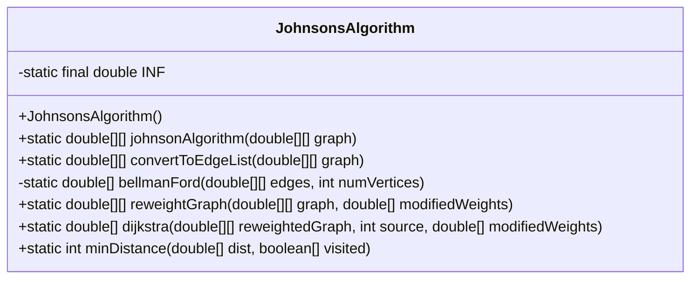
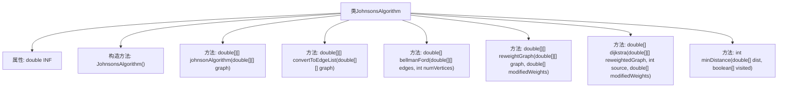
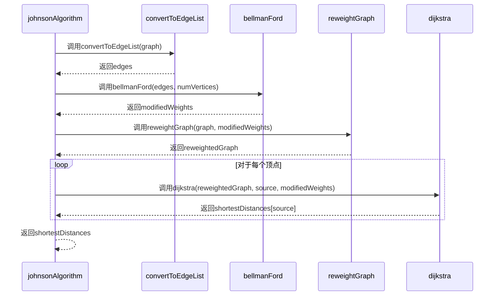

# 基础信息

|      |      |
|------|------|
| 名称 | JohnsonsAlgorithm |
| 编码语言 | .java |
| 代码路径 | Java/src/main/java/com/thealgorithms/datastructures/graphs/JohnsonsAlgorithm.java |
| 包名 | com.thealgorithms.datastructures.graphs |
| 依赖项 | ['java.util.ArrayList', 'java.util.Arrays', 'java.util.List'] |
| 概述说明 | Johnson算法结合Bellman-Ford和Dijkstra计算图顶点对最短路径。 |

# 说明

Johnson算法是一种用于计算图中所有顶点对之间最短路径的算法。它结合了Bellman-Ford算法和Dijkstra算法的优点，首先通过Bellman-Ford算法对图进行预处理，消除负权边的影响，然后利用Dijkstra算法计算每个顶点到其他顶点的最短路径。这种方法在保证计算效率的同时，能够处理包含负权边的图，适用于需要高效计算所有顶点对最短路径的场景。

# 类列表 Class Summary

| 名称   | 类型  | 说明 |
|-------|------|-------------|
| JohnsonsAlgorithm | class | Johnson算法计算图中所有顶点对的最短路径，结合Bellman-Ford和Dijkstra算法。 |

## 类 JohnsonsAlgorithm

|      |      |
|------|------|
| 访问范围 | public final |
| 类型 | class |
| 名称 | JohnsonsAlgorithm |
| 说明 | Johnson算法计算图中所有顶点对的最短路径，结合Bellman-Ford和Dijkstra算法。 |

### UML类图

**描述：**  
`JohnsonsAlgorithm` 类实现了约翰逊算法，用于计算图中所有顶点对之间的最短路径。该类包含多个静态方法，包括将邻接矩阵转换为边列表的 `convertToEdgeList`，用于计算修改后权重的 `bellmanFord`，以及重新加权图的 `reweightGraph`。`dijkstra` 方法用于在重新加权的图上运行 Dijkstra 算法，而 `minDistance` 方法则用于找到未访问顶点中距离最小的顶点。最终，`johnsonAlgorithm` 方法整合了这些步骤，返回所有顶点对之间的最短路径。

### 内部方法调用关系图

**描述：**  
这段代码实现了Johnson算法，用于计算图中所有顶点对之间的最短路径。首先，通过`convertToEdgeList`将邻接矩阵转换为边列表，然后使用`bellmanFord`计算修正权重，接着通过`reweightGraph`重新加权图，最后对每个顶点调用`dijkstra`算法计算最短路径。最终返回一个二维数组，表示所有顶点对之间的最短距离。

### 字段列表 Field List

| 名称  | 类型  | 说明 |
|-------|-------|------|
| INF = Double.POSITIVE_INFINITY | double | 定义常量INF表示正无穷大的双精度浮点数。 |

### 方法列表 Method List

| 名称  | 类型  | 说明 |
|-------|-------|------|
| minDistance | int | 方法查找未访问节点中的最小距离，并返回其索引。 |
| dijkstra | double[] | Dijkstra算法实现，计算最短路径并调整回原始权重。 |
| bellmanFord | double[] | Bellman-Ford算法实现，检测负权环并计算最短路径。 |
| convertToEdgeList | double[][] | 将图的邻接矩阵转换为边列表，排除自环和无限权重的边。 |
| reweightGraph | double[][] | 该函数根据修改后的权重重新计算图的边权重。 |
| johnsonAlgorithm | double[][] | Johnson算法计算图中所有顶点对的最短路径。 |

