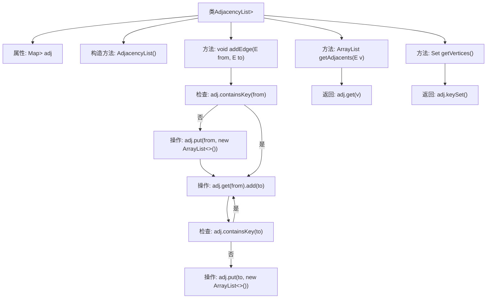
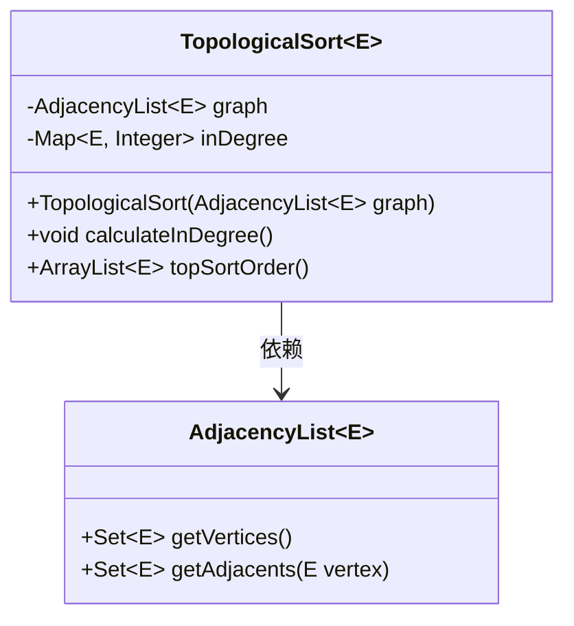
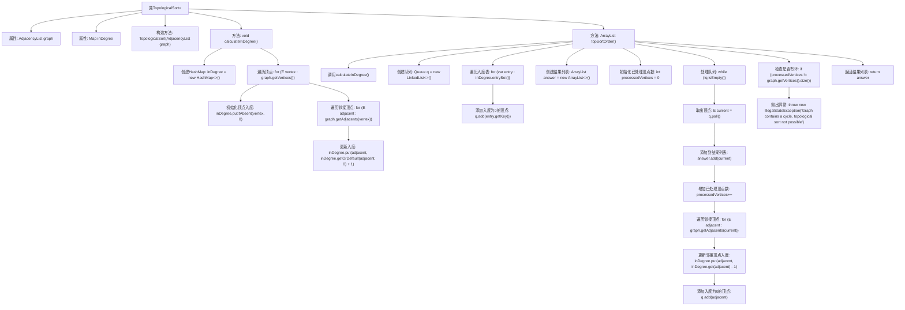
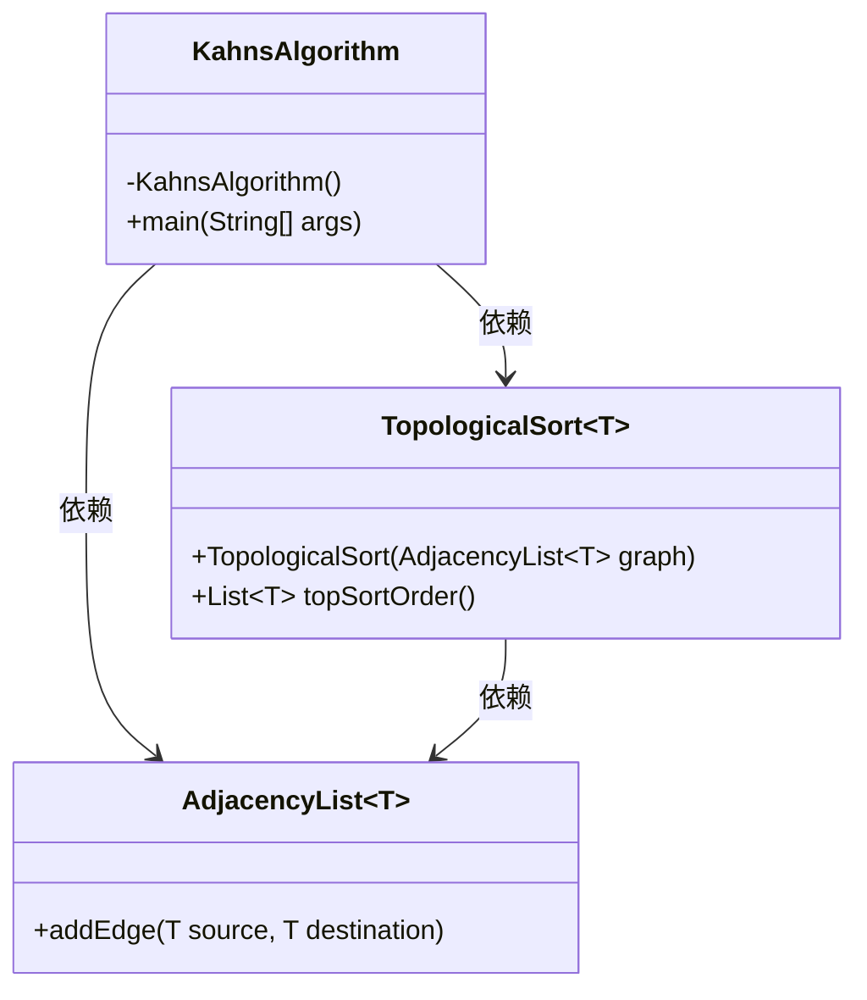
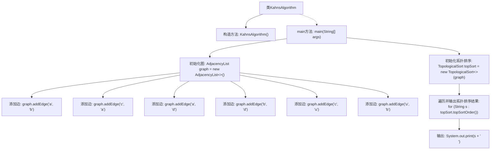

# 基础信息

|      |      |
|------|------|
| 名称 | KahnsAlgorithm |
| 编码语言 | .java |
| 代码路径 | Java/src/main/java/com/thealgorithms/datastructures/graphs/KahnsAlgorithm.java |
| 包名 | com.thealgorithms.datastructures.graphs |
| 依赖项 | ['java.util.ArrayList', 'java.util.HashMap', 'java.util.LinkedHashMap', 'java.util.LinkedList', 'java.util.Map', 'java.util.Queue', 'java.util.Set'] |
| 概述说明 | 实现有向图邻接表，支持添加边、获取邻接顶点和所有顶点。提供拓扑排序功能，使用Kahn算法，检测环并返回排序结果。 |

# 说明

AdjacencyList类实现了有向图的邻接表结构，支持添加边、获取邻接顶点和所有顶点功能。TopologicalSort类实现了图的拓扑排序算法，通过计算每个顶点的入度并返回排序后的顶点列表，若图中存在环则抛出异常。Kahn算法同样用于图的拓扑排序，确保输出节点的正确顺序。这些类共同提供了图的表示和拓扑排序的完整解决方案。

# 类列表 Class Summary

| 名称   | 类型  | 说明 |
|-------|------|-------------|
| AdjacencyList | class | AdjacencyList类实现有向图邻接表，支持添加边、获取邻接顶点和所有顶点。 |
| TopologicalSort | class | TopologicalSort类实现图的拓扑排序，计算入度并返回排序后的顶点列表，若图有环则抛出异常。 |
| KahnsAlgorithm | class | Kahn算法实现图的拓扑排序，输出节点顺序。 |


## 类 AdjacencyList

|      |      |
|------|------|
| 访问范围 | None |
| 类型 | class |
| 名称 | AdjacencyList |
| 说明 | AdjacencyList类实现有向图邻接表，支持添加边、获取邻接顶点和所有顶点。 |


### UML类图

```mermaid
classDiagram
    class AdjacencyList~E extends Comparable~E~~ {
        -Map~E, ArrayList~E~~ adj
        +AdjacencyList()
        +void addEdge(E from, E to)
        +ArrayList~E~ getAdjacents(E v)
        +Set~E~ getVertices()
    }
```

### 描述
`AdjacencyList` 类用于表示图的邻接表结构，其中泛型 `E` 必须实现 `Comparable` 接口。该类包含一个 `Map` 类型的私有成员 `adj`，用于存储顶点及其相邻顶点的列表。类提供了构造方法 `AdjacencyList()` 来初始化邻接表，以及 `addEdge(E from, E to)` 方法来添加有向边，`getAdjacents(E v)` 方法用于获取指定顶点的相邻顶点列表，`getVertices()` 方法用于获取图中所有顶点的集合。


### 内部方法调用关系图



该流程图描述了`AdjacencyList`类的结构及其方法调用关系。`AdjacencyList`类用于表示图的邻接表，包含一个`Map`属性`adj`，用于存储顶点及其相邻顶点列表。类中的方法包括`addEdge`用于添加有向边，`getAdjacents`用于获取某个顶点的相邻顶点列表，`getVertices`用于获取图中所有顶点的集合。流程图详细展示了`addEdge`方法中的逻辑判断和操作步骤。

### 字段列表 Field List

| 名称  | 类型  | 说明 |
|-------|-------|------|
| adj | Map<E, ArrayList<E>> | 映射结构存储元素与其关联元素列表。 |

### 方法列表 Method List

| 名称  | 类型  | 说明 |
|-------|-------|------|
| addEdge | void | 添加有向边，更新邻接表。 |
| getAdjacents | ArrayList<E> | 获取指定元素的相邻元素列表。 |
| getVertices | Set<E> | 获取图中所有顶点的集合。 |


## 类 TopologicalSort

|      |      |
|------|------|
| 访问范围 | None |
| 类型 | class |
| 名称 | TopologicalSort |
| 说明 | TopologicalSort类实现图的拓扑排序，计算入度并返回排序后的顶点列表，若图有环则抛出异常。 |


### UML类图



这段代码实现了一个拓扑排序算法，用于对有向无环图（DAG）进行排序。`TopologicalSort`类通过`AdjacencyList`类表示图结构，并计算每个顶点的入度。`calculateInDegree`方法计算所有顶点的入度，`topSortOrder`方法使用队列进行拓扑排序，并检测图中是否存在环。如果图中存在环，则抛出`IllegalStateException`异常。


### 内部方法调用关系图



**描述：**  
这段代码实现了一个拓扑排序算法，用于对有向无环图（DAG）进行排序。首先，通过`calculateInDegree`方法计算每个顶点的入度，然后使用`topSortOrder`方法进行拓扑排序。排序过程中，使用队列存储入度为0的顶点，并逐步处理这些顶点及其邻接顶点，更新入度并将新的入度为0的顶点加入队列。如果最终处理的顶点数与图中顶点总数不一致，则抛出异常，表示图中存在环，无法进行拓扑排序。最终返回排序后的顶点列表。

### 字段列表 Field List

| 名称  | 类型  | 说明 |
|-------|-------|------|
| inDegree | Map<E, Integer> | 存储元素E及其入度的映射关系。 |
| graph | AdjacencyList<E> | AdjacencyList<E> 表示图数据结构，使用邻接表存储元素E的节点关系。 |

### 方法列表 Method List

| 名称  | 类型  | 说明 |
|-------|-------|------|
| calculateInDegree | void | 计算图中每个顶点的入度并存储在HashMap中。 |
| topSortOrder | ArrayList<E> | 该方法实现图的拓扑排序，通过入度计算和队列处理，确保无环图的有序排列。 |


## 类 KahnsAlgorithm

|      |      |
|------|------|
| 访问范围 | public final |
| 类型 | class |
| 名称 | KahnsAlgorithm |
| 说明 | Kahn算法实现图的拓扑排序，输出节点顺序。 |


### UML类图



类图描述：
`KahnsAlgorithm` 是一个不可继承的类，包含一个私有的构造函数和一个公有的 `main` 方法。`AdjacencyList` 是一个泛型类，提供了 `addEdge` 方法用于添加图的边。`TopologicalSort` 也是一个泛型类，接受 `AdjacencyList` 作为参数，并提供了 `topSortOrder` 方法用于返回拓扑排序的结果。`KahnsAlgorithm` 类依赖于 `AdjacencyList` 和 `TopologicalSort` 类来实现图的拓扑排序功能。


### 内部方法调用关系图



**描述：**  
该代码实现了基于Kahn算法的拓扑排序。首先，定义了一个邻接表`AdjacencyList`来表示图结构，并通过`addEdge`方法添加了多条边。接着，使用`TopologicalSort`类对图进行拓扑排序，并遍历输出排序结果。整个过程从图的初始化到拓扑排序的输出，清晰地展示了算法的执行流程。

### 字段列表 Field List

| 名称  | 类型  | 说明 |
|-------|-------|------|

### 方法列表 Method List

| 名称  | 类型  | 说明 |
|-------|-------|------|
| main | void | Java程序使用邻接表定义图并执行拓扑排序。 |


